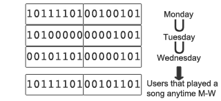

REDIS BITMAPS – FAST, EASY, REALTIME METRICS
---

- [1. Bài học sự cố trên Bitmap và Redis Bitmaps](#1-bài-học-sự-cố-trên-bitmap-và-redis-bitmaps)
  - [1.1. Bitmap (aka Bitset)](#11-bitmap-aka-bitset)
  - [1.2. Population Count (tổng số)](#12-population-count-tổng-số)
  - [1.3. Bitmap in Redis](#13-bitmap-in-redis)
  - [1.4. Ví dụ: Daily active user](#14-ví-dụ-daily-active-user)
  - [1.5. So sánh hiệu suất sử dụng 128 triệu người dùng](#15-so-sánh-hiệu-suất-sử-dụng-128-triệu-người-dùng)
  - [1.6. Optimizations](#16-optimizations)
  - [1.7. Sample code](#17-sample-code)
- [2. Reference](#2-reference)


Tại [Spool](http://www.getspool.com/), chúng ta tính toán số liệu theo thời gian thực. Theo truyền thống, số liệu được thực hiện bằng một khối các công việc (hàng ngày, hàng giờ, ..). Redis bitmap cho phép chúng ta thực hiện những tính toán như vậy trong thời gian thực và cực kỳ hiệu quả về mặt không gian. Trong một mô phỏng của 128 triệu người dùng, một thông số điển hình là 'những người dùng duy nhất hàng ngày' cần ít hơn 50ms trên máy Macbook Pro và chỉ cần 16MB bộ nhớ. Spool không có 128 triệu người dùng, nhưng thật tốt khi biết cách chúng ta sẽ mở rộng chúng. 

# 1. Bài học sự cố trên Bitmap và Redis Bitmaps

## 1.1. Bitmap (aka Bitset)

Bitmap hoặc Bitset là 1 mảng các số 0 hoặc 1. Một bit trong một Bitset có thể  là 0 hoặc 1, và mỗi vị trí trong mảng được tham chiếu như một phần bù (offset). Các hoạt động logic như AND, OR, XOR, ... và các thao tác bit khác là dùng được cho Bitmap (are fair game for Bitmap)

## 1.2. Population Count (tổng số)

Population count của một Bitmap là tổng số bit 1. Có 1 thuật toán hiệu qủa để tính toán population count. Ví dụ, population count của một Bitset được điền 90% chứa 1 tỉ bit mất 21,1 ms trên máy Macbook pro.

## 1.3. Bitmap in Redis

Redis cho phép binary keys và binary values. Bitmap thì không có gì nhưng binary values thì có. Hàm **setbit(key, offset, value)** mất O(1) thời gian, set value của 1 bit về 0 hoặc 1 với offset đã chỉ rõ của key đưa ra.

## 1.4. Ví dụ: Daily active user 

Để tính toán người dùng duy nhất đã đăng nhập ngày hôm nay, chúng ta cài đặt một Bitmap, trong đó, mỗi người dùng được nhận biết bằng một giá trị offset. Khi một người dùng đăng nhập một trang hoặc thực hiện một hành động, đảm bảo nó được đếm, set bit về 1 tại offset mô tả user id. Key của Bitmap là tên hành động người dùng thực hiện và timestamp


Trong ví dụ đơn giản này, mỗi khi một người dùng đăng nhập chúng ta thực hiện **redis.setbit(daily_active_users, user_id, 1)**. Nó lật offset tương ứng trong bitmap **daily_active_user** sang 1. Đây là một hành động O(1). Thực hiện population count với kết quả là 9 người dùng duy nhất đăng nhập hôm nay. lúc này key là **daily_active_users** và value là 1011110100100101, ta đếm được 9 bit 1.

Tất nhiên, số người dùng active hàng ngày sẽ thay đổi theo ngày và chúng ta cần 1 cách để tạo 1 Bitmap hàng ngày. Chúng ta thực hiện đơn giản bằng cách gắn ngày vào Bitmap key. Ví dụ, nếu chúng ta muốn tính toán số người dùng hàng ngày nghe ít nhất 1 bài hát trong music app trong một ngày đã cho, chúng ta đặt tên key là **play:yyyy-mm-dd**. Nếu chúng ta muốn tính toán số lượng người dùng nghe 1 bài hát mỗi giờ, chúng ta có thể đặt tên key là **play:yyyy-mm-dd-hh**. Trong những thảo luận tiếp theo chúng ta gắn với 'Số người dùng hàng ngày nghe 1 bài hát'. Để thu thập số liệu hàng ngày, chúng ta đơn giản set bit của người dùng đó sang 1 trong key **play:yyyy-mm-dd** bất cứ khi nào người đó nghe 1 bài hát. Đây là một hoạt động O(1)

```python
redis.setbit(play:yyyy-mm-dd, user_id, 1)
```

Số người dùng nghe nhạc hôm nay là population count của giá trị Bitmap được lưu trong key **play:yyyy-mm-dd**. Để tính toán số liệu hàng tuần hoặc hàng tháng, chúng ta đơn giản là hợp Bitmap hàng ngày trong 1 tuần hoặc 1 tháng, sau đó tính toán population count của Bitmap tổng đó.



Bạn cũng có thể trích ra được những số liệu phức tạp hơn rất dễ dàng. Ví dụ, 'tài khoản tính phí' giữ người dùng nghe 1 bài hát trong tháng 11 sẽ là:

```
(play:2011-11-01 ∪ play:2011-11-02 ∪...∪play:2011-11-30) ∩ premium:2011-11
```

## 1.5. So sánh hiệu suất sử dụng 128 triệu người dùng

Bảng dưới mô tả so sánh của Sự tính toán hành động hàng ngày, được tính toán trên 1 ngày, 7 ngày, 30 ngày cho 128 triệu người dùng. Số liệu 7 và 30 ngày được tính toán bằng cách kết hợp bitmap daily

| period  | time (ms) |
| :------ | :-------- |
| Daily   | 50.2      |
| Weekly  | 392.0     |
| Monthly | 1624.8    |

## 1.6. Optimizations

Trong ví dụ trên, chúng ta có thể tối ưu hóa sự tính toán hàng tuần và hàng tháng bằng cách caching tổng số được tính toán hàng ngày, hàng tuần, hàng tháng trong Redis.

Đây là cách tiếp cận mềm dẻo. Một phần thưởng (bonus) được thêm của caching là nó cho phép phân tích tập hợp nhanh chóng, ví dụ số người dùng đơn hàng tuần cũng là người dùng mobile, chính là giao của bitmap người dùng mobile với bitmap người dùng active hàng tuần. Hoặc chúng ta muốn tính toán số lương người dùng duy nhất trong vòng n ngày qua, thì tồng số người dùng hàng ngày được cached làm điều này dễ dàng, đơn giản là lấy n-1 ngày trước từ cache và hợp nó với số lượng thời gian thực hàng ngày, chỉ mất 50ms

## 1.7. Sample code

Code java phía dưới tính toán số lượng người dùng cho hành động được đưa ra và ngày.

```java
import redis.clients.jedis.Jedis;
import java.util.BitSet;
...
  Jedis redis = new Jedis("localhost");
...
  public int uniqueCount(String action, String date) {
    String key = action + ":" + date;
    BitSet users = BitSet.valueOf(redis.get(key.getBytes()));
    return users.cardinality();
  }
```

Đoạn code bên dưới tính toán số lượng người dùng cho hành động được đưa ra và một danh sách các ngày.

```java
import redis.clients.jedis.Jedis;
import java.util.BitSet;
...
  Jedis redis = new Jedis("localhost");
...
  public int uniqueCount(String action, String... dates) {
    BitSet all = new BitSet();
    for (String date : dates) {
      String key = action + ":" + date;
      BitSet users = BitSet.valueOf(redis.get(key.getBytes()));
      all.or(users);
    }
    return all.cardinality();
  }
```

# 2. Reference
[https://spoolblog.wordpress.com/2011/11/29/fast-easy-realtime-metrics-using-redis-bitmaps/](https://spoolblog.wordpress.com/2011/11/29/fast-easy-realtime-metrics-using-redis-bitmaps/)
or
[https://blog.getspool.com/2011/11/29/fast-easy-realtime-metrics-using-redis-bitmaps/](https://blog.getspool.com/2011/11/29/fast-easy-realtime-metrics-using-redis-bitmaps/)