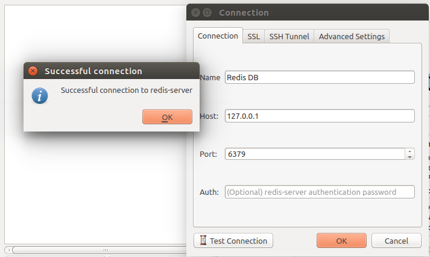
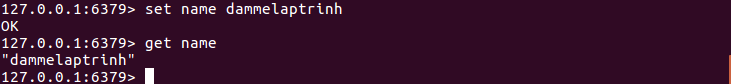
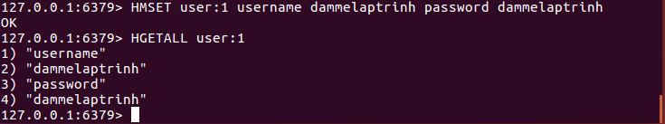
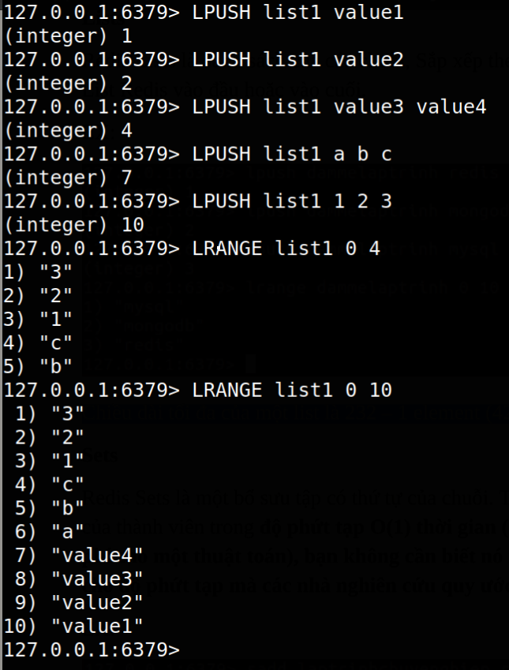
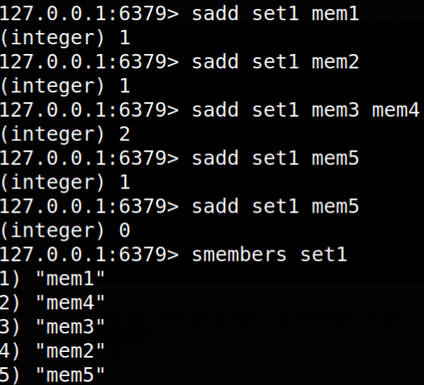
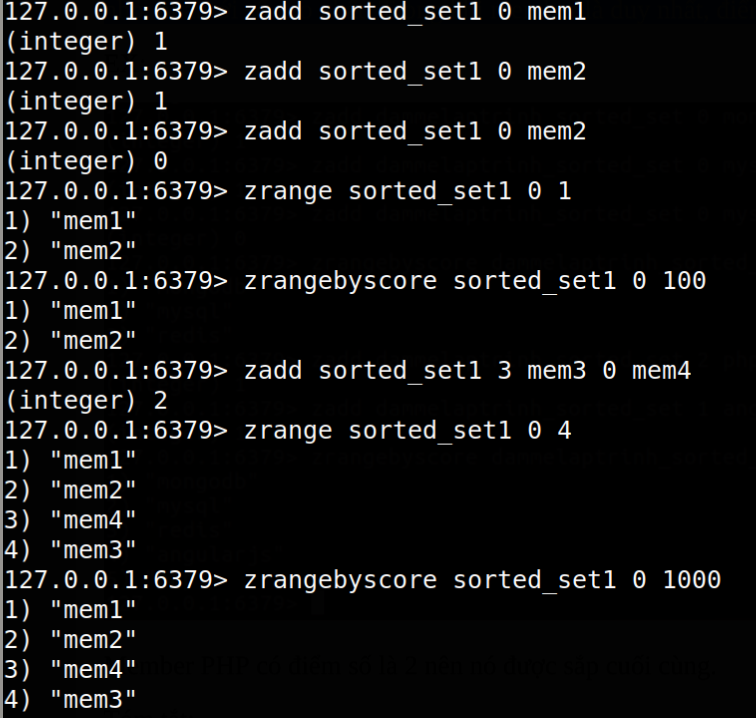

Redis
---

- [1. Introduction](#1-introduction)
  - [1.1. Advantages](#11-advantages)
  - [1.2. The differences with other key-value database](#12-the-differences-with-other-key-value-database)
- [2. Install](#2-install)
  - [2.1. Ubuntu](#21-ubuntu)
  - [2.2. Docker](#22-docker)
  - [2.3. redis-cli](#23-redis-cli)
  - [2.4. Install redis desktop manager](#24-install-redis-desktop-manager)
- [3. Configuration](#3-configuration)
- [4. Data types](#4-data-types)
  - [4.1. Strings](#41-strings)
  - [4.2. Hashes](#42-hashes)
  - [4.3. Lists](#43-lists)
  - [4.4. Sets](#44-sets)
  - [4.5. Sorted Sets](#45-sorted-sets)
- [5. Key commands](#5-key-commands)
- [6. String commands](#6-string-commands)
- [7. Hash command](#7-hash-command)
- [8. Reference](#8-reference)

# 1. Introduction

* Redis là một mã nguồn mở, lưu trữ dạng key-value và là giải pháp cho việc xây dựng hiệu suất và mở rộng ứng dụng web rất hiệu quả.
* Redis được viết bằng C.
* Redis có 3 đặc thù chính mà đặt nó ngoài sự cạnh tranh với cái khác:
  * Redis giữ toàn bộ cơ sở dữ liệu của nó trong bộ nhớ.
  * Redis có một bộ kiểu dữ liệu dồi dào khi so tới nhiều lưu trữ dữ liệu key-value.
  * Redis có thể backup dữ liệu tới bất kỳ số lượng đĩa phụ.

## 1.1. Advantages
* Nhanh một cách khác thường: Redis rất nhanh có thể thực hiện khoảng 110000 set dữ liệu trên giây, và 81000 get dữ liệu/giây.
* Hổ trợ giàu các kiểu dữ liệu: redis hổ trợ hầu hết các kiểu dữ liệu mà hầu hét các developer đã biết, giống như: list, set, sorted set, hashes. Cho nên dể dàng giải quyết các vấn đề đa dạng bởi vì chúng ta biết vấn đề nào có thể được xử lý tốt hơn với kiểu dữ liệu đó.
* Nhiều công cụ tiện ích: Redis là một công cụ đa tiện ích và có thể được sử dụng trong một số trường hợp sử dụng như bộ nhớ đệm, hàng đợi tin nhắn. Bất kỳ dữ liệu có đời sống ngắn trong ứng dụng của bạn như session, đếm số lượng khám phá web page…
* Các hoạt động là nguyên tử: Tất cả hoạt động của redis là nguyên tử, tức là một đơn vị nhỏ nhất như nguyên tử, do vậy nó bảo đảm rằng nếu có 2 khách hàng đồng thời truy cập server Redis thì sẽ nhận giá trị cập nhật.

## 1.2. The differences with other key-value database
* Redis là một con đường phát triển khác biệt trong key-value nơi mà value có thể chứa đựng nhiều kiểu dữ liệu phứt tạp, với các hoạt động nguyên tử được định nghĩa trên các kiểu dữ liệu đó.
* Redis nằm trên bộ nhớ, nhưng cũng bền vững như trên đĩa, vì thế nó ghi với tốc độ rất cao và tốc độ đọc đạt được với giới hạn của bộ dữ liệu đọc mà không thể lớn hơn bộ nhớ. Một lợi thế khác của cơ sở dữ liệu trong bộ nhớ là với cấu trúc dữ liệu phứt phạp thì nó làm tốt hơn nhiều với cấu trúc dữ liệu lưu trên đĩa, vì thế Redis có thể làm nhiều với độ phứt tạp bên trong ít nhất.

# 2. Install 
## 2.1. Ubuntu
```shell
sudo apt-get update
sudo apt-get install redis-server
```

## 2.2. Docker

```shell
docker run -d \
  -p 6379:6379 \
  --name my-redis \
  -v /home/xuananh/Downloads/redis-data:/data \
  amd64/redis
  # redis:alpine

docker exec -it my-redis bash
```

## 2.3. redis-cli

```shell
redis-cli
redis-cli -h host -p port -a password
# ex
redis-cli -h 127.0.0.1 -p 6379 -a “mypass”
```

Trong dấu nhắc 127.0.0.1 là địa chỉ ip của máy bạn và 6379 là port mà redis server đang chạy. Tiếp đến bạn gõ PING nếu trả về là PONG thì nghĩa là Redis đã cài đặt thành công trên máy bạn.


## 2.4. Install redis desktop manager

```shell
sudo snap install redis-desktop-manager
# run 
/snap/redis-desktop-manager/107/opt/redis-desktop-manager/rdm
```

Để kết nối vào Redis DB, bạn chọn connection to Redis Server. Rồi click test connect thử.



# 3. Configuration

Cú pháp cơ bản của cẩu lệnh CONFIG như sau:

```shell
127.0.0.1:6379> CONFIG GET CONFIG_SETTING_NAME
# get all config
127.0.0.1:6379> CONFIG GET *
# set config
127.0.0.1:6379> CONFIG SET CONFIG_SETTING_NAME NEW_CONFIG_VALUE
# ex:
127.0.0.1:6379> CONFIG SET loglevel “notice”
```
Để cập nhật cấu hình bạn có thể edit file **redis.conf** trực tiếp hoặc có thể cập nhật cấu hình theo đường lệnh CONFIG SET như trên

# 4. Data types
Redis hổ trợ 5 kiểu dữ liệu sau:

## 4.1. Strings

Chuỗi trong redis là một dãy bay liên tục. Chuỗi trong Redis là nhị phân, nghĩa là chúng có chiều dài không xác định bởi bất kỳ ký tự kết thúc đặc biệt, vì thế bạn có thể lưu trữ bất cứ thứ gì lên đến **512MB** trong một chuỗi.

Example:



Trong ví dụ trên **SET** và **GET** là lệnh của **redis**, **name**  là key đã sử dụng trong **redis** và **dammelaptrinh** là giá trị chuỗi được lưu trữ trong **redis**.

Lưu ý: Một giá trị chuỗi có thể đạt tới **512M** chiều dài.

## 4.2. Hashes

Một **Redis hash** là một tập hợp của cặp **key-value**. **Redis Hashes** được vẽ ra giữa **string field** và **string value**, vì vậy chúng thường sử dụng đại diện đối tượng.

Mổi **hash** có thể lưu trữ tới 232 -1 (chắc là 2 mũ 32 xong rồi trừ 1) cặp **key-value** (nhiều hơn 4 tỉ).

Cú pháp:

```shell
127.0.0.1:6379> HMSET key field value [field value ...]
127.0.0.1:6379> HGETALL key
127.0.0.1:6379> HGET key field
```

Example:



Trong ví dụ trên kiểu dữ liệu **hash** được sử dụng để lưu trữ đối tượng **user** mà chứa đựng thông tin cơ bản của user. Ở đây **HMSET**, **HGETALL** là các lệnh của **redis** và **user:1** là **key**.

## 4.3. Lists

**Redis Lists** là danh sách của các chuỗi, Sắp xếp theo thứ tự chèn vào. Bạn có thể thêm **element** tới một **List Redis** vào đầu hoặc vào cuối.

Chiều dài tối đa của một list là 232 – 1 element (4294967295, hơn 4 tỉ của các element/list).

Cú pháp:

```shell
127.0.0.1:6379> LPUSH key value [value ...]
127.0.0.1:6379> LRANGE key start stop
```

Example:



## 4.4. Sets

**Redis Sets** là một bổ sưu tập có thứ tự của chuỗi. Trong redis bạn có thể thêm, xóa và kiễm tra sự tồn tại của thành viên trong độ phứt tạp O(1) thời gian (cái này liên quan chút về cấu trúc dữ liệu, tính chi phí cho một thuật toán), bạn không cần biết nó như thế nào, chỉ hiểu là nó rất nhanh, O() là ký hiệu cho độ phứt tạp mà các nhà nghiên cứu quy ước.

Số lượng lớn nhất của member trong set là 232 – 1 (hơn 4 tỉ member/set).

Cú pháp:

```shell
127.0.0.1:6379> SADD key member [member ...]
127.0.0.1:6379> SMEMBERS key
```

Example:



Lưu ý: Trong ví dụ trên mem5 được thêm 2 lần nhưng vì thuộc tính duy nhất của set nó chỉ được thêm một lần.

## 4.5. Sorted Sets

**Redis Sorted Sets** là tương tự **Redis Sets**,  không lặp lại bộ sưu tập của chuỗi. Điểm khác nhau là mổi member của một **Sorted Set** liên kết với điểm số, điểm số đó được sử dụng để tạo sorted set có thứ tự, từ nhỏ  nhất tới số cao nhất. Trong khi member là duy nhất, điểm số thì có thể lặp đi lặp lại.

Cú pháp:

```shell
127.0.0.1:6379> ZADD key [NX|XX] [CH] [INCR] score member [score member ...]
127.0.0.1:6379> ZRANGE key start stop [WITHSCORES]
127.0.0.1:6379> ZRANGEBYSCORE key min max [WITHSCORES] [LIMIT offset count]
```

Example:



Member mem3 có điểm số là 3 nên nó được sắp cuối cùng.

# 5. Key commands

Redis keys command được sử dụng cho việc quản lý keys trong redis.

Cú pháp:

```shell
127.0.0.1:6379> COMMAND KEY_NAME
#EX:
127.0.0.1:6379> SET dammelaptrinh redis
OK
127.0.0.1:6379> DEL dammelaptrinh
(integer) 1
```

Trong ví dụ trên DEL là một command, trong khi dammelaptrinh là key. Nếu key bị xóa, thì output của command sẽ là (integer) 1, mặt khác nó sẽ (integer) 0.

Một số command cơ bản liên quan đến key:


| Command                              | Description                                                                                                                                    |
| :----------------------------------- | :--------------------------------------------------------------------------------------------------------------------------------------------- |
| DEL key                              | xóa key nếu tồn tại                                                                                                                            |
| DUMP key                             | trả về một phiên bản serialize của giá trị được lưu trữ ở key xác định, ví dụ trả về: <br> "\x00\rdammelaptrinh\b\x00\x96e\xe2\xb9P\x97\x13\n" |
| EXIST key                            | kiểm tra key tồn tại hay không. Trả về 1 nếu có, ngược lại 0                                                                                   |
| EXPIRE key seconds                   | set xác định thời gian hết hạn của key theo giây                                                                                               |
| EXPIREAT key timestamp               | set xác định thời gian hết hạn của key theo dạng Unix timestamp <br> ví dụ: 1293840000                                                         |
| PEXPIRE key milliseconds             | set xác định thời gian hết hạn của key theo mili giây                                                                                          |
| PEXPIREAT key milliseconds-timestamp | Set hết hạn key trong unix timestamp xác định như millisecond                                                                                  |
| PERSIST key                          | Xóa hết hạn cho key                                                                                                                            |
| PTTL key                             | Lấy thời gian còn lại của key hết hạn trong millisecond                                                                                        |
| TTL key                              | Lấy thời gian còn lại của key hết hạn <br> -1 nếu key không có set expire <br> -2 key không tồn tại                                            |
| KEYS pattern                         | Tìm tất cả key khớp với pattern chỉ định <br> ví dụ lấy hết key: KEYS *                                                                        |
| MOVE key db                          | Di chuyển một key tới db khác                                                                                                                  |
| RANDOMKEY                            | Trả về key ngẩu nhiên từ redis                                                                                                                 |
| RENAME key newkey                    | Đổi tên key                                                                                                                                    |
| RENAMENX key newkey                  | Đổi tên key, nếu key mới không tồn tại <br> tên mới đã có rồi sẽ không thực hiện được                                                          |
| TYPE key                             | Trả về kiểu dữ liệu của giá trị đã lưu trữ trong key.                                                                                          |

# 6. String commands

Redis strings commands được sử dụng để quản lý giá trị chuỗi trong redis.

```shell
COMMAND KEY_NAME
# ex:
SET dammelaptrinh redis
GET dammelaptrinh
```

| command                                              | descriptions                                                                             |
| :--------------------------------------------------- | :--------------------------------------------------------------------------------------- |
| SET KEY VALUE [EX seconds] [PX milliseconds] [NX/XX] | set giá trị vào key chỉ định, giải thích bên dưới                                        |
| GET KEY_NAME                                         | Lấy giá trị của một key                                                                  |
| GETRANGE KEY_NAME start end                          | Lấy một chuỗi con của một chuỗi đã lưu ở một key                                         |
| GETSET KEY_NAME VALUE                                | Set giá trị chuỗi của một key và trả về giá trị cũ của nó, nếu key không tồn tại thì nil |
| GETBIT KEY_NAME OFFSET                               | Trả về một giá trị bit tại vị trí trong chuỗi đã lưu ở key                               |
| MGET KEY1 KEY2 .. KEYN                               | Lấy các giá trị của tất cả key                                                           |
| SETBIT key offset value                              | Set  bit ở vị trí trong chuỗi lưu ở key                                                  |
| SETEX KEY_NAME TIMEOUT VALUE                         | Set giá trị hết hạn của một key                                                          |
| SETNX KEY_NAME VALUE                                 | Set giá trị của một key, nếu key không tồn tại                                           |
| SETRANGE key offset value                            | Ghi đè một phần của chuỗi trong key, bắt đầu từ vị trí offset.                           |
| STRLEN KEY_NAME                                      | Lấy chiều dài giá trị lưu trữ trong một key                                              |
| MSET key1 value1 key2 value2 .. keyN valueN          | Set nhiều keys tới nhiều values                                                          |
| MSETNX key1 value1 key2 value2 .. keyN valueN        | set nhiều keys tới nhiều values nếu key không tồn tại                                    |
| PSETEX key1 EXPIRY_IN_MILLISECONDS value1            | Set giá trị và hết hạn mili giây của một key                                             |
| INCR KEY_NAME                                        | Tăng giá trị số nguyên của key kiểu số lên 1                                             |
| INCRBY KEY_NAME INCR_AMOUNT                          | Tăng giá trị số nguyên của key kiểu số lên một số lượng chỉ định                         |
| INCRBYFLOAT KEY_NAME INCR_AMOUNT                     | Tăng giá trị số thực của key lên số lượng chỉ định                                       |
| DECR KEY_NAME                                        | Giảm giá trị số nguyên của key 1 đơn vị                                                  |
| DECRBY KEY_NAME DECREMENT_AMOUNT                     | Giảm giá trị số nguyên của một key bằng số lượng chỉ định                                |
| APPEND KEY_NAME NEW_VALUE                            | gắn tiếp vào giá trị của một key                                                         |

SET KEY VALUE [EX seconds] [PX milliseconds] [NX/XX]
  * **EX seconds** – set thời gian hết hạn bằng giây
  * **PX milliseconds** – set thời gian hết hạn bằng milli giây
  * **NX** – Chỉ set key nếu nó không tồn tại<br>
  * **XX** – Chỉ set key nếu nó đã tồn tại.

# 7. Hash command
* Redis Hashes vẽ ra một đối tượng giữa string field và string values, vì thế chúng là kiểu dữ liệu hoàn hảo tới các đối tượng tương ứng.
* Trong redis mổi hash có thể lưu trử tới hơn 4 tỷ cặp field-value.

| command                                  | description                                                      |
| :--------------------------------------- | :--------------------------------------------------------------- |
| HDEL key field2 [field2]                 | Xóa một hoặc nhiều field hash                                    |
| HEXISTS key field                        | Xác định field hash có tồn tại hay không                         |
| HGET key field                           | Lấy giá trị của một field hash đã lưu trữ ở key xác định         |
| HGETALL key                              | Lấy tất cả field và value đã lưu trong một hash của key xác định |
| HINCRBY key field increment_num          | Tăng giá trị số nguyên của field hash lên một số chỉ định        |
| HINCRBYFLOAT key field increment_num     | Tăng giá trị số thực của field hash bởi giá trị được cho         |
| HKEYS key                                | Lấy tất cả field trong một hash                                  |
| HLEN key                                 | Lấy số field trong một hash                                      |
| HMGET key field1 [field2]                | Lấy tất cả giá trị của các hash field                            |
| HMSET key field1 value1 [field2 value2 ] | Set nhiều hash field tới nhiều giá trị                           |
| HSET key field value                     | Set giá trị chuỗi của field hash                                 |
| HSETNX key field value                   | Set giá trị của field hash, chỉ set nếu field không tồn tại      |
| HVALS key                                | Lấy tất cả giá trị trong một hash                                |
|                                          |

# 8. Reference
[http://dammelaptrinh.com/category/redis-tutorial](http://dammelaptrinh.com/category/redis-tutorial)