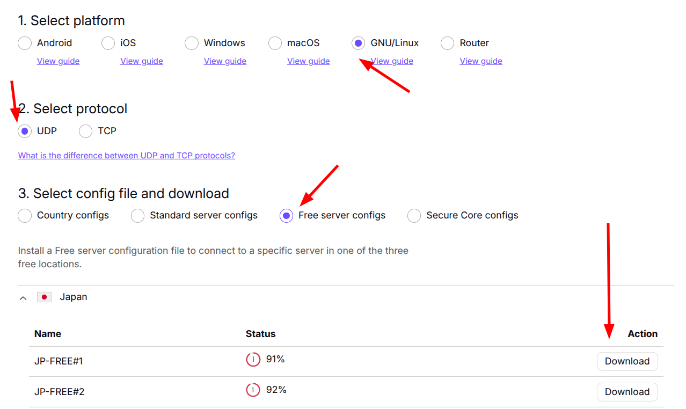
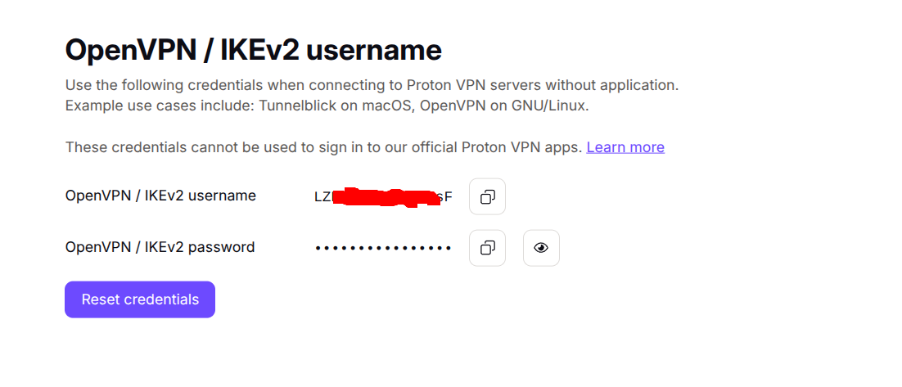

- [1. support openvpn](#1-support-openvpn)
  - [1.1. protonvpn](#11-protonvpn)
- [2. don't support openvpn](#2-dont-support-openvpn)
  - [2.1. windscribe](#21-windscribe)


# 1. support openvpn

## 1.1. protonvpn

1. Create new account
2. Download openvpn: https://account.protonvpn.com/downloads

3. Get account: https://account.protonvpn.com/account-password

4. Create new file: account.txt with with two lines:
```
account
password
```
5. Update vpn file: 
```
auth-user-pass path/to/account.txt.txt
```
6. Connect as normal

# 2. don't support openvpn
## 2.1. windscribe

https://windscribe.com/
