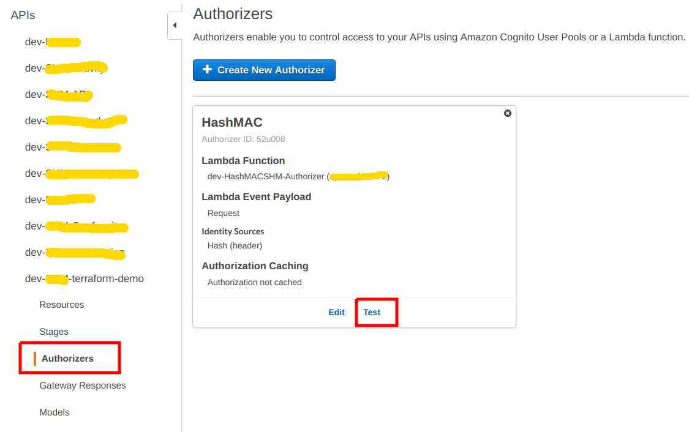
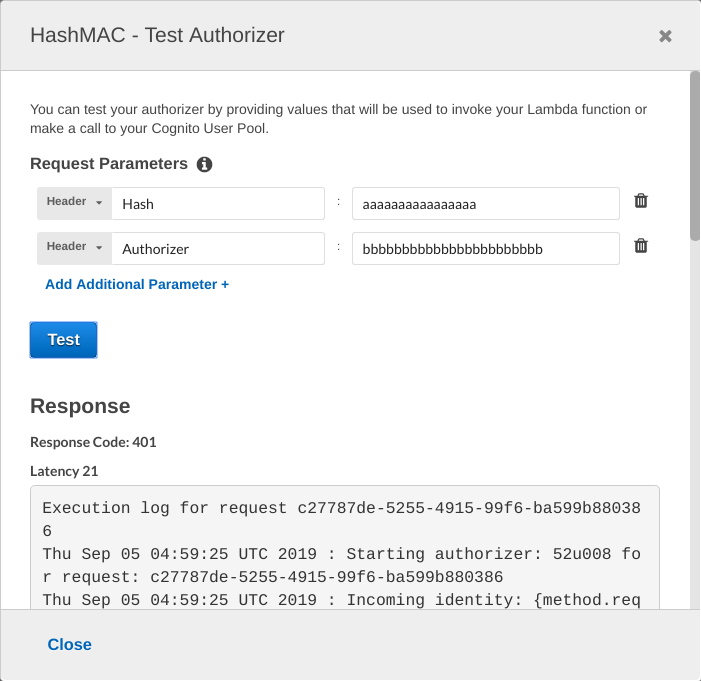
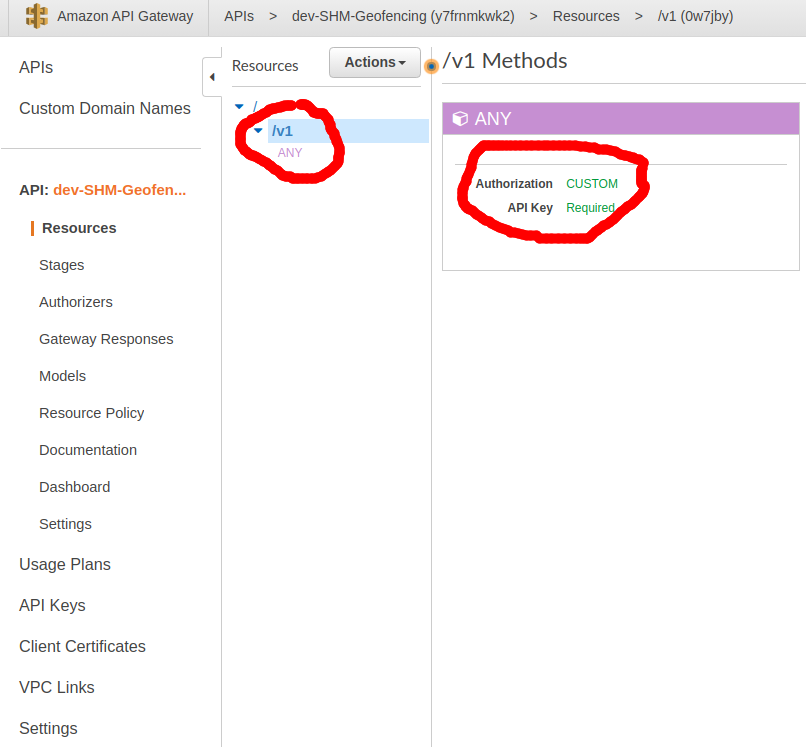
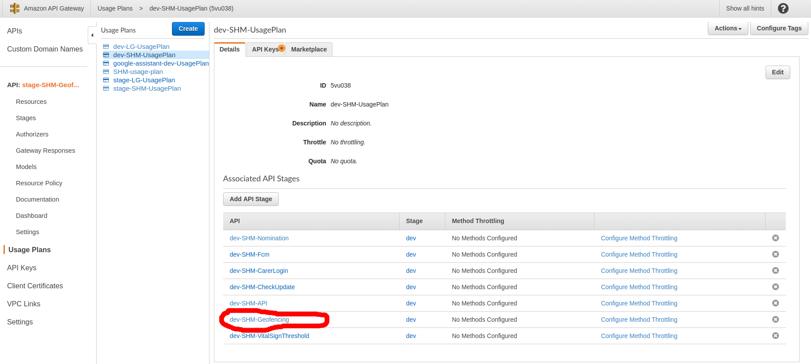
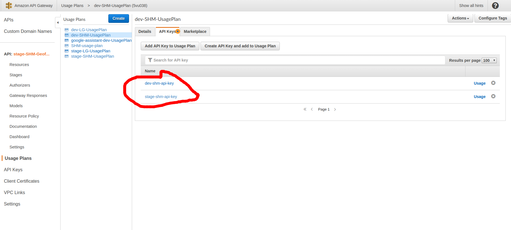

Summary debug experience in aws
---

- [1. Api gateway](#1-api-gateway)
  - [1.1. Custome authorizer](#11-custome-authorizer)
    - [1.1.1. AuthorizerConfigurationException](#111-authorizerconfigurationexception)
  - [1.2. 403 Forbidden](#12-403-forbidden)
    - [1.2.1. If API Key Required is set to True](#121-if-api-key-required-is-set-to-true)
    - [1.2.2. User Custom Domain Names but forget to set Base Path Mappings, or set wrong path, wrong api, wrong stage.](#122-user-custom-domain-names-but-forget-to-set-base-path-mappings-or-set-wrong-path-wrong-api-wrong-stage)
    - [1.2.3. Check if you are passing data in request body on a GET operation](#123-check-if-you-are-passing-data-in-request-body-on-a-get-operation)
    - [1.2.4. Forget to deploy API](#124-forget-to-deploy-api)
    - [1.2.5. If use Custom Authorizer, check return **Resource** is valid in region, account id, api id, stage, method, resour, - for example of return policy is below:](#125-if-use-custom-authorizer-check-return-resource-is-valid-in-region-account-id-api-id-stage-method-resour---for-example-of-return-policy-is-below)
    - [1.2.6. If use **Custom Authorizer**, and recieved message:](#126-if-use-custom-authorizer-and-recieved-message)

# 1. Api gateway

## 1.1. Custome authorizer

### 1.1.1. AuthorizerConfigurationException

Các bước kiểm tra:

**Step 1**:

- Vào phần **Authorizer** của api gateway, chọn test



- Nó hiện nên 1 cái khung, điền thông tin authenticate vào, click **Test** button:



- Kiểm tra Response phía bên dưới, mấy dòng cuối cùng sẽ cho chúng ta biết lỗi là tại sao, các lỗi thường gặp:
  - api gateway không có permission call authorizer
  - api gateway không lấy được thông tin authentication để truyền cho authorizer lambda, thường là trong kiểu **TOKEN**, request gửi lên thiếu header authorizor

Ví dụ response:

```shell
Execution log for request 29d2b4df-26da-4cae-aeca-f9ef6c338d88
Thu Sep 05 04:56:39 UTC 2019 : Starting authorizer: 52u008 for request: 29d2b4df-26da-4cae-aeca-f9ef6c338d88
Thu Sep 05 04:56:39 UTC 2019 : Incoming identity: {method.request.header.Hash=********aaaaaa}
Thu Sep 05 04:56:39 UTC 2019 : Endpoint request URI: https://lambda.ap-southeast-2.amazonaws.com/2015-03-31/functions/arn:aws:lambda:ap-southeast-2:654888109795:function:dev-HashMACSHM-Authorizer/invocations
Thu Sep 05 04:56:39 UTC 2019 : Endpoint request headers: {x-amzn-lambda-integration-tag=29d2b4df-26da-4cae-aeca-f9ef6c338d88, Authorization=*****************************************************************************************************************************************************************************************************************************************************************************************************************************90bbd8, X-Amz-Date=20190905T045639Z, x-amzn-apigateway-api-id=ja8pdvfjf6, X-Amz-Source-Arn=arn:aws:execute-api:ap-southeast-2:654888109795:ja8pdvfjf6/authorizers/52u008, Accept=application/json, User-Agent=AmazonAPIGateway_ja8pdvfjf6, X-Amz-Security-Token=AgoJb3JpZ2luX2VjEIT//////////wEaDmFwLXNvdXRoZWFzdC0yIkYwRAIgCkxUvmlK4pek5Kf9JdqmC1WAjCXPJxGxnQs/QqUZMTECIADU7x1dxGhWE8ksTe8cteV6L7oed/i0kgbXOMeagp8gKuQDCD0QARoMNzk4Mzc2MTEzODUzIgz2RnLXV0YHF+BRamEqwQPjDfrp6FsFpfLWnKy1AwzgMALKA3qYi0oJMbSCo7ZDDTA+S1UojEzp7cJ0BxIQJUzyWWj7X9jbrwQlhVWjzHg4jXMld/i23tGLcMFz+BhcchHdRu+uu5d9KDrWnIJsTSV0qnv85uOHCelj5O [TRUNCATED]
Thu Sep 05 04:56:39 UTC 2019 : Endpoint request body after transformations: {"type":"REQUEST","methodArn":"arn:aws:execute-api:ap-southeast-2:654888109795:ja8pdvfjf6/ESTestInvoke-stage/GET/","resource":"/","path":"/","httpMethod":"GET","headers":{"Authorizer":"bbbbbbbbbbbb","Hash":"aaaaaaaaaaaaaa"},"multiValueHeaders":{"Authorizer":["bbbbbbbbbbbb"],"Hash":["aaaaaaaaaaaaaa"]},"queryStringParameters":{},"multiValueQueryStringParameters":{},"pathParameters":{},"stageVariables":{},"requestContext":{"resourceId":"test-invoke-resource-id","resourcePath":"/","httpMethod":"GET","extendedRequestId":"fhxNLG5IywMFrSw=","requestTime":"05/Sep/2019:04:56:39 +0000","path":"/","accountId":"654888109795","protocol":"HTTP/1.1","stage":"test-invoke-stage","domainPrefix":"testPrefix","requestTimeEpoch":1567659399581,"requestId":"29d2b4df-26da-4cae-aeca-f9ef6c338d88","identity":{"cognitoIdentityPoolId":null,"cognitoIdentityId":null,"apiKey":"test-invoke-api-key","principalOrgId":null,"cognitoAuthenticationType":null,"userArn":"arn:aws:iam::654888109795:user/an [TRUNCATED]
Thu Sep 05 04:56:39 UTC 2019 : Sending request to https://lambda.ap-southeast-2.amazonaws.com/2015-03-31/functions/arn:aws:lambda:ap-southeast-2:654888109795:function:dev-HashMACSHM-Authorizer/invocations
Thu Sep 05 04:56:39 UTC 2019 : Unauthorized request: 29d2b4df-26da-4cae-aeca-f9ef6c338d88
Thu Sep 05 04:56:39 UTC 2019 : Unauthorized
```

**Step 2**: 

- Nếu đã check ổn thỏa rồi thì, kiểm tra lại authorizer lambda, check log của nó, có thể là logic code bị sai
- Call api mà check log của authorizer lambda mà không thấy gì thì khả năng là thiếu header Authorizer

## 1.2. 403 Forbidden

Check below points:

### 1.2.1. If API Key Required is set to True 
  


  - Check **Usage Plan** for **API Key**



  
  - **API Key** had to be created




  - add **x-api-key** to header of request
  

### 1.2.2. User Custom Domain Names but forget to set Base Path Mappings, or set wrong path, wrong api, wrong stage.

### 1.2.3. Check if you are passing data in request body on a GET operation

### 1.2.4. Forget to deploy API

### 1.2.5. If use Custom Authorizer, check return **Resource** is valid in region, account id, api id, stage, method, resour, - for example of return policy is below:

```json
{
    "context": {
        "bool": true,
        "key": "value",
        "number": 1
    },
    "policyDocument": {
        "Statement": [
            {
                "Action": "execute-api:Invoke",
                "Effect": "Allow",
                "Resource": [
                    "arn:aws:execute-api:ap-southeast-1:6542728881795:ork26mq0q3/dev/GET/v1"
                ]
            }
        ],
        "Version": "2012-10-17"
    },
    "principalId": null
}
```

### 1.2.6. If use **Custom Authorizer**, and recieved message:

```json
{
  "message": "User is not authorized to access this resource"
}
```
There are 2 ways to fix it:
  
  1. Set TTL for customer authorizer to 0
  2. Set custom authorizer policy resource as "*"
  3. Reference here: https://stackoverflow.com/questions/50331588/aws-api-gateway-custom-authorizer-strange-showing-error