- [1. When to use ImprovMX instead of Cloudflare](#1-when-to-use-improvmx-instead-of-cloudflare)
- [2. Prerequisites](#2-prerequisites)
- [3. Create ImprovMX account](#3-create-improvmx-account)
- [4. Add the domain in ImprovMX](#4-add-the-domain-in-improvmx)
- [5. DNS records to add](#5-dns-records-to-add)
- [6. Add the records in iNET (OnePortal)](#6-add-the-records-in-inet-oneportal)
- [7. Verify the domain is Active](#7-verify-the-domain-is-active)
- [8. Aliases and catch-all](#8-aliases-and-catch-all)
- [9. End-to-end test](#9-end-to-end-test)
- [10. Gotchas](#10-gotchas)
- [11. Free tier limits](#11-free-tier-limits)

Worked example in this note: `admin@mail.eztax.vn` -> `phungxuananh272@gmail.com`,
domain DNS hosted at iNET, done 2026-07-31.

# 1. When to use ImprovMX instead of Cloudflare

Cloudflare Email Routing is the better product (free, 200 rules / 200 destination
addresses, stronger infra) but it **requires the zone to be on Cloudflare DNS** —
you must move the domain's nameservers. See the Cloudflare variant:
[setup_forward_email.md](../setup_forward_email.md).

Use ImprovMX when you **cannot move the nameservers**, typically:

- The domain belongs to someone else and you only got *record-level* delegation
  (e.g. iNET "Cập nhật bản ghi" permission on a domain owned by another account).
- The domain is production and already serves a lot of records / a real mail
  provider on the apex, so repointing NS has a huge blast radius.

Do **not** try to put only the subdomain on Cloudflare: subdomain-as-its-own-zone
is Enterprise-only (Free / Pro / Business = No).

Key property that makes this safe: **MX is per-hostname**. Putting MX on
`mail.example.com` does not affect mail for `example.com`. So you can add a
working mailbox on a subdomain without touching the company's Google Workspace /
M365 mail on the apex.

# 2. Prerequisites

- Permission to add DNS records for the zone (no NS change needed).
- A destination mailbox that already works (Gmail etc.).
- Decide the subdomain, e.g. `mail.<domain>`.

Check first that the subdomain has no records yet:

```bash
dig +short MX mail.eztax.vn @8.8.8.8
dig +short TXT mail.eztax.vn @8.8.8.8
# and record what the apex currently is, so you can prove you did not break it
dig +short MX eztax.vn @8.8.8.8
```

# 3. Create ImprovMX account

https://app.improvmx.com/signup — email + password, no Google sign-in.

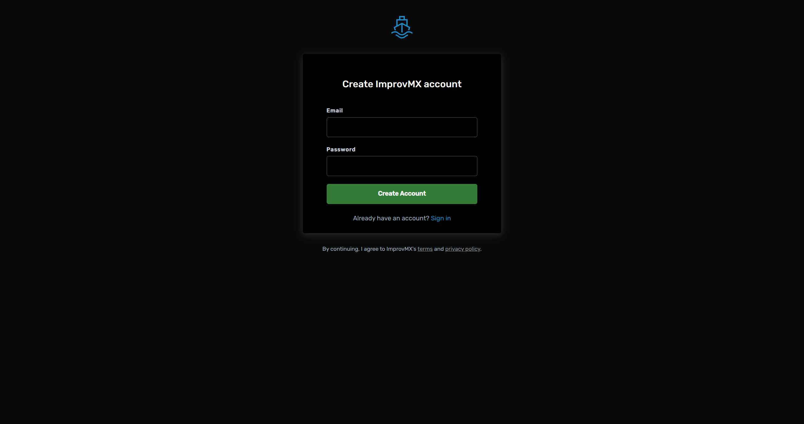

It sends a confirmation mail, but the account is usable immediately (you can log
in and add a domain before clicking anything in the mail).

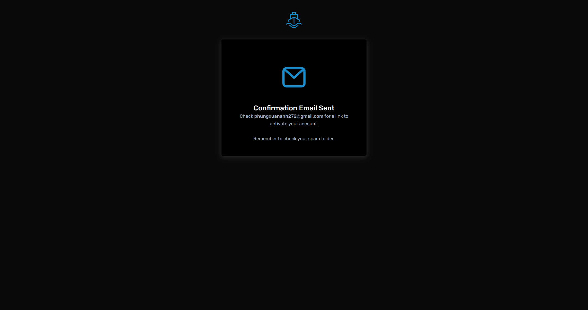

# 4. Add the domain in ImprovMX

Dashboard starts empty:

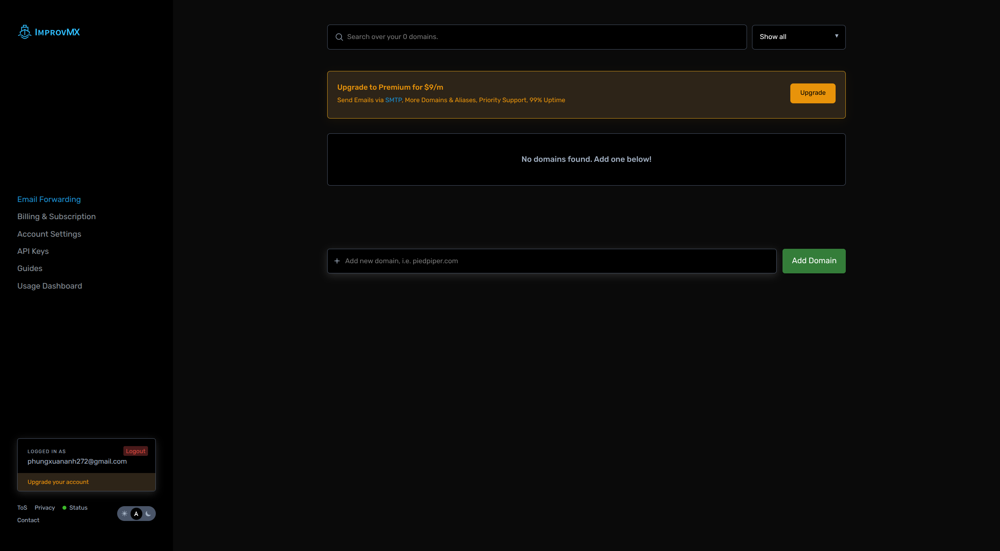

Type the **subdomain** in "Add new domain" (`mail.eztax.vn`, not `eztax.vn`) and
click Add Domain. ImprovMX creates a catch-all `*@mail.eztax.vn` automatically and
shows a red **Setup** badge until DNS is verified.

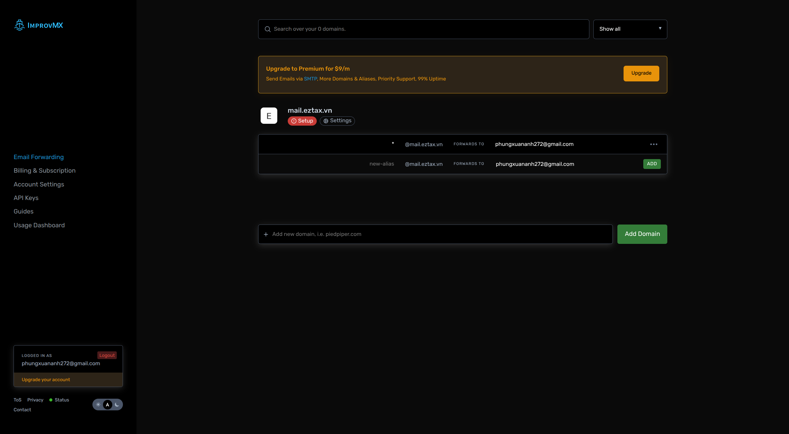

# 5. DNS records to add

| Type | Host   | Value                                  | Priority |
| ---- | ------ | -------------------------------------- | -------- |
| MX   | `mail` | `mx1.improvmx.com`                     | 10       |
| MX   | `mail` | `mx2.improvmx.com`                     | 20       |
| TXT  | `mail` | `v=spf1 include:spf.improvmx.com ~all` | -        |

ImprovMX docs say "delete all previous MX entries" — that applies **only to the
hostname you are configuring**. Since `mail.<domain>` is empty there is nothing to
delete, and you must leave the apex MX alone.

# 6. Add the records in iNET (OnePortal)

If the domain was shared with you: `Phân quyền` > `Phân quyền cho tôi` > open the
domain > `Cập nhật bản ghi`.


Search `mail` first to confirm nothing exists on that hostname (0 records here):

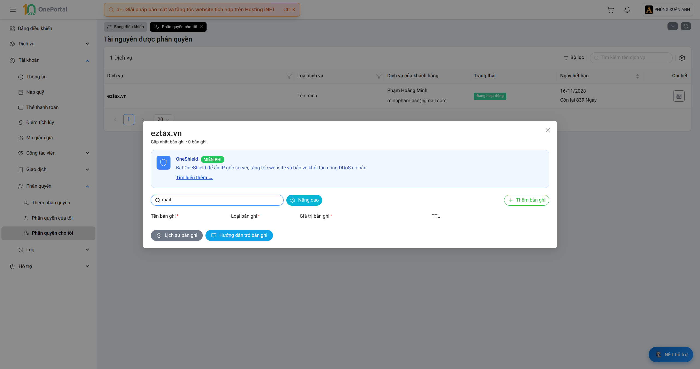

Clear the search, click `+ Thêm bản ghi`. Only the new row is editable — every
existing row is `disabled`, so you cannot overwrite a production record by accident.

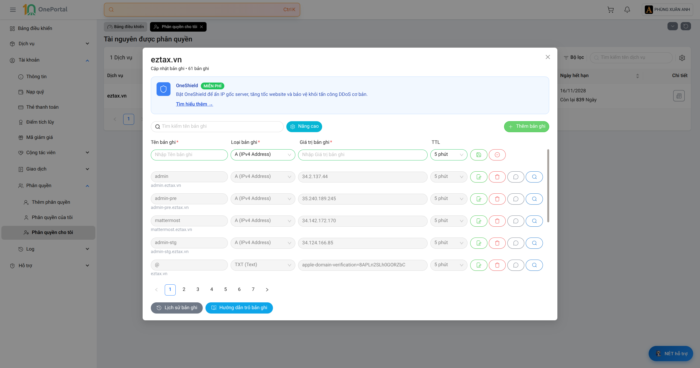

Set `Tên bản ghi` = `mail`, then `Loại bản ghi` = `MX (Mail Exchange)`. The
priority field (`Nhập Ưu tiên, 0 là ưu tiên cao nhất`) only appears **after** you
pick MX:

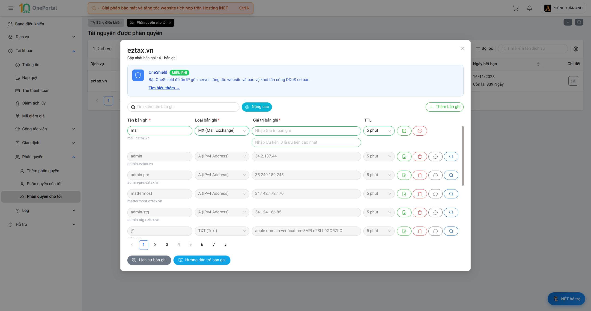

Fill value + priority. The hint under the name field must read `mail.eztax.vn`:

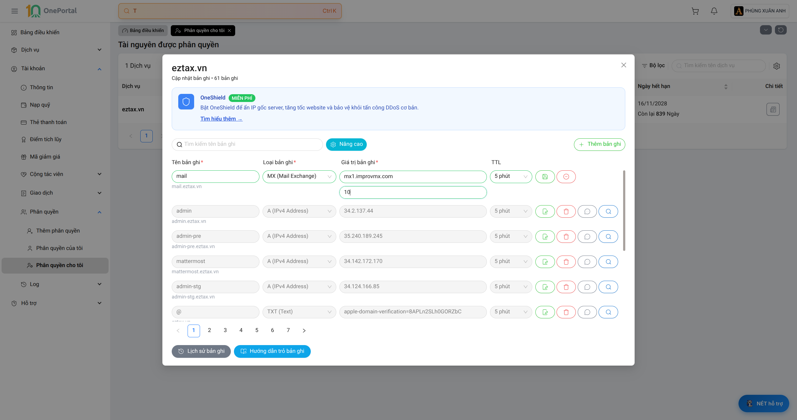

Save with the green disk icon on that row. The record counter increments (61 -> 62):

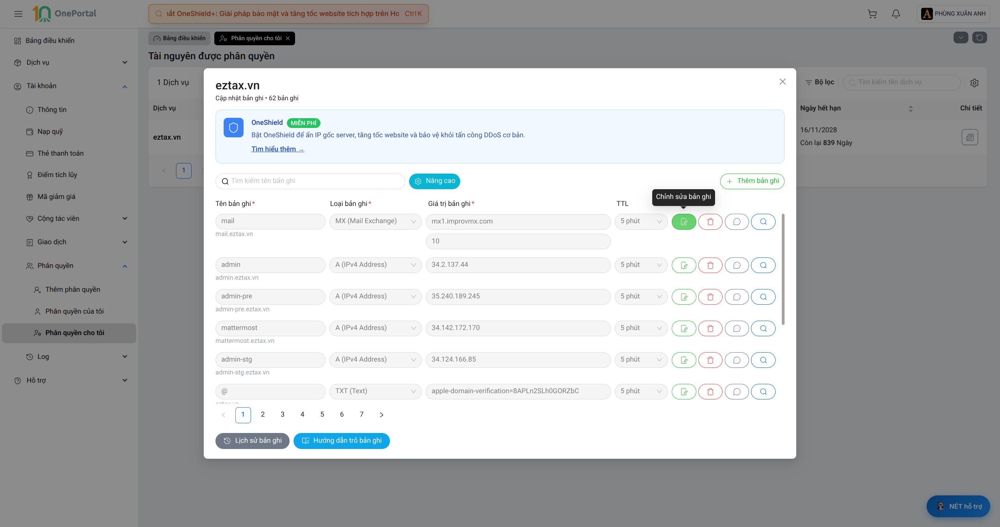

Repeat for `mx2.improvmx.com` priority 20:


Then the TXT/SPF record:

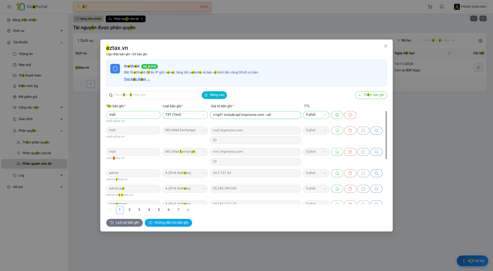

All three saved (61 -> 64):

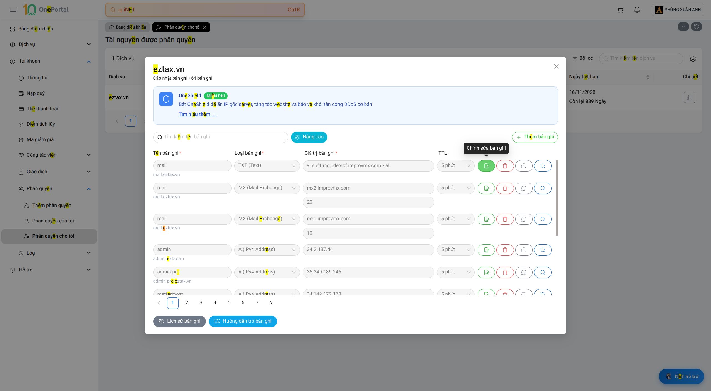

Verify from the command line, including that the apex is untouched:

```bash
dig +short MX  mail.eztax.vn @8.8.8.8   # 10 mx1.improvmx.com. / 20 mx2.improvmx.com.
dig +short TXT mail.eztax.vn @8.8.8.8   # "v=spf1 include:spf.improvmx.com ~all"
dig +short MX  eztax.vn      @8.8.8.8   # 1 SMTP.GOOGLE.COM.   <- must be unchanged
```

iNET propagated within seconds in this case despite the 5-minute TTL.

# 7. Verify the domain is Active

Back in ImprovMX, click the red `Setup` badge -> `DNS Records`. All rows should have
a green check and the badge becomes **Active**:

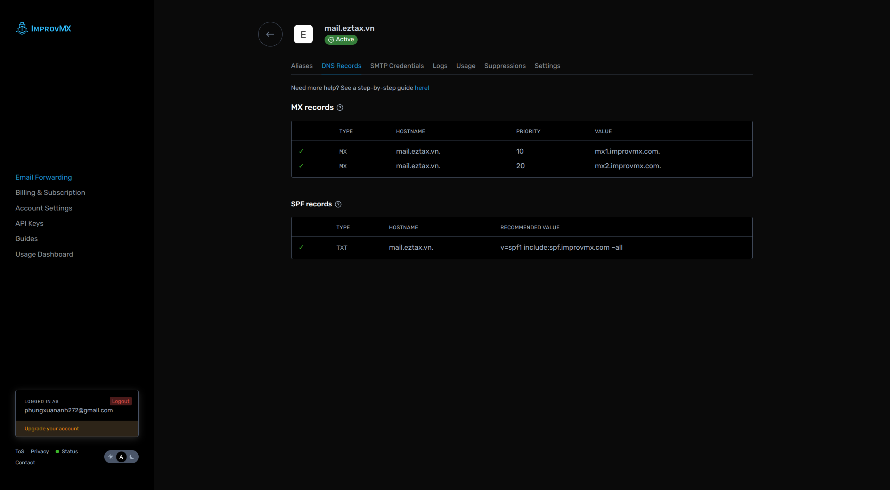

# 8. Aliases and catch-all

`Aliases` tab. ImprovMX already created the catch-all `*`; add explicit aliases in
the bottom row (type the local part, click `ADD`):

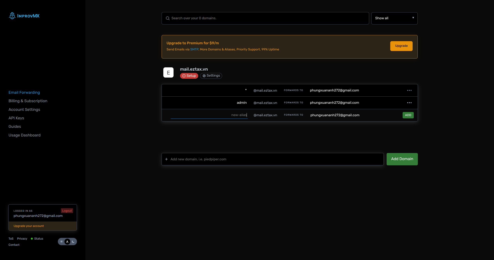

The catch-all means *every* address at `mail.<domain>` reaches your inbox — handy,
but it is a spam surface. Delete it via the `...` menu if you only need one address.

Careful in this UI: the first row **is** the catch-all in inline-edit mode, not an
"add" row. Typing into it renames the catch-all. The add row is the last one, the
one with the green `ADD` button.

# 9. End-to-end test

Send a mail to the new address, then check `Logs`:

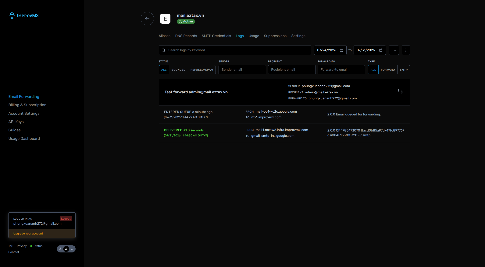

```
SENDER     phungxuananh272@gmail.com
RECIPIENT  admin@mail.eztax.vn
FORWARD TO phungxuananh272@gmail.com
ENTERED QUEUE  11:44:29  from mail-oo1-xc2c.google.com -> mx1.improvmx.com
DELIVERED      11:44:30  (+1.0s) -> gmail-smtp-in.l.google.com  "2.0.0 OK ... gsmtp"
```

The `Logs` tab is the reliable proof. Gmail collapses a self-addressed test into the
sent thread, so the inbox alone is not conclusive.

# 10. Gotchas

- **Host field**: `mail`, never `@`. `@` would replace the apex MX and cut off the
  whole company's mail.
- Duplicate DOM ids in the iNET editor (`id="type"`, `id="ttl"` repeat per row), so
  automating it by id hits 11 matches. The editable row uses
  `form_item_records_0_{name,data,priority}`.
- Free-tier ForwardEmail was rejected as an alternative because its free plan puts
  the alias -> destination mapping in a public TXT record, i.e. your personal
  address becomes publicly resolvable. ImprovMX keeps it in the dashboard.
- A subdomain address (`admin@mail.example.com`) can be refused by services that
  match the email domain against the company domain, or that blocklist free
  forwarders. If you need the exact apex address, ask the Workspace admin for a
  Google Group instead — 2 minutes on their side, no DNS work.

# 11. Free tier limits

- 1 domain, 25 aliases, catch-all included.
- Receive/forward only. Sending *as* the alias over SMTP needs Premium ($9/mo).
- No uptime commitment on free.
