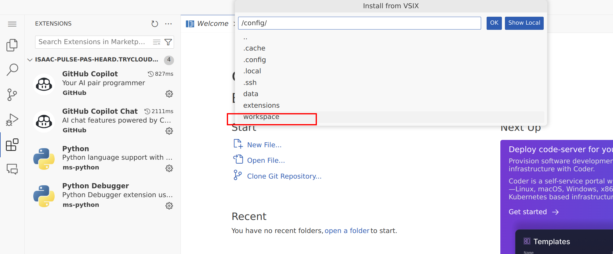
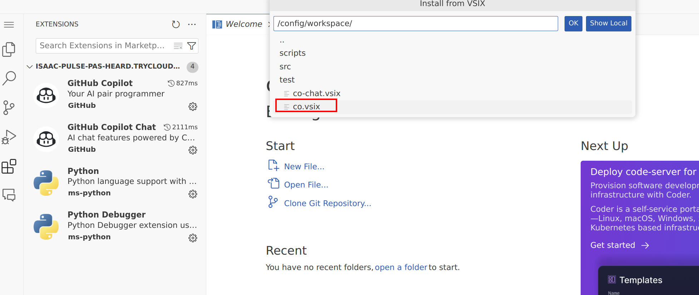
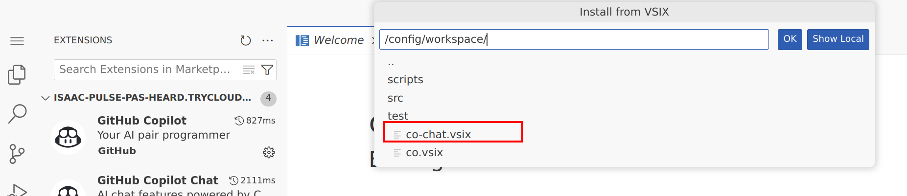
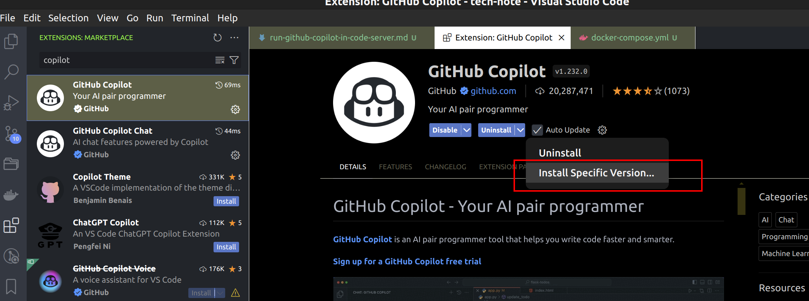

- [1. preprare workspace](#1-preprare-workspace)
- [2. start code server](#2-start-code-server)
- [3. setup copilot](#3-setup-copilot)
- [4. Troubeshot](#4-troubeshot)

# 1. preprare workspace

copy these files to your repo

- docker-compose.yml
- copilot-1.222.0_vsixhub.com.vsix
- copilot-chat-0.18.2024072603_vsixhub.com.vsix

# 2. start code server

docker compose up -d

# 3. setup copilot

Access code server in this link: http://localhost:8443

Install copilot from VSIX file as below image:

install copilot first, and then install copilot chat

# 4. Troubeshot

You can encountered the incompatible version between code server with copilot extension, or between copilot extension with copilot chat extension

Check version of code, code server, copilot extension, copilot chat extension as below images

and then go to these link to search the right version of them to install

https://www.vsixhub.com/s.php?s=GitHub+Copilot+chat#gsc.tab=0&gsc.q=GitHub%20Copilot%20chat&gsc.page=1

https://www.vsixhub.com/vsix/145948/

https://www.vsixhub.com/vsix/144782/

https://github.com/coder/code-server/discussions/5063

