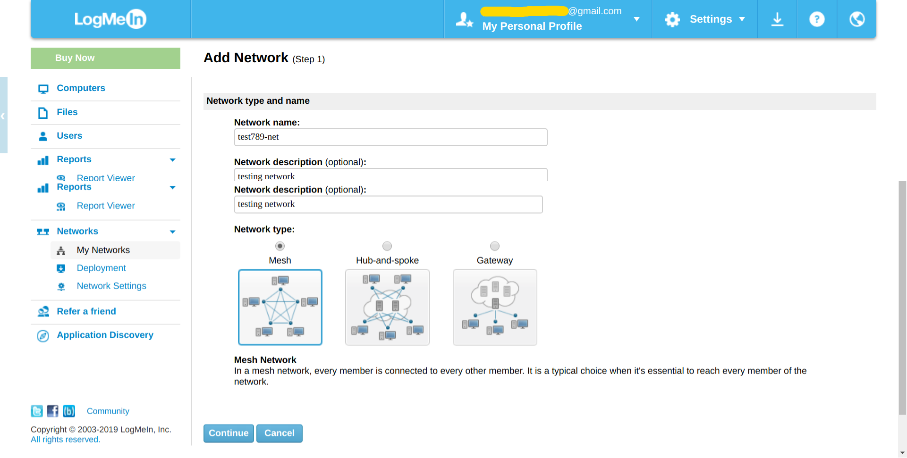
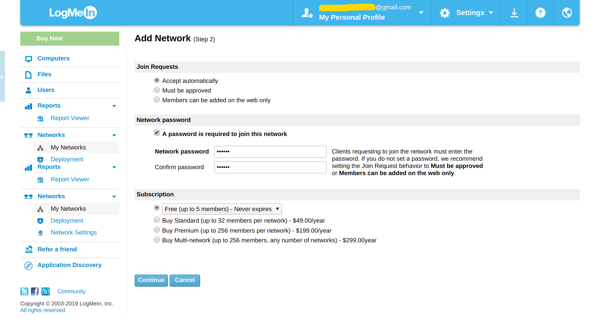
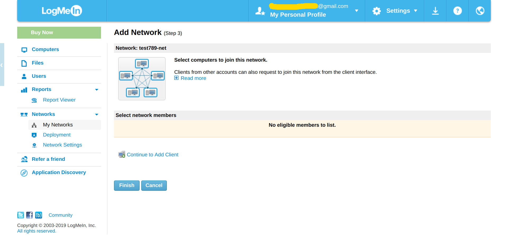
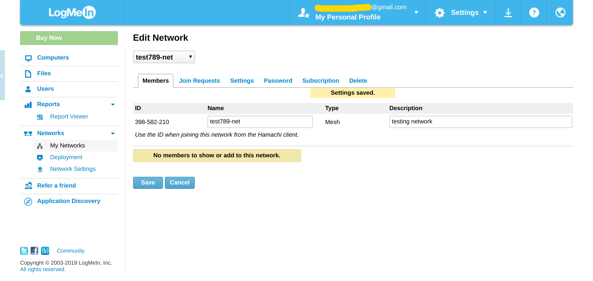
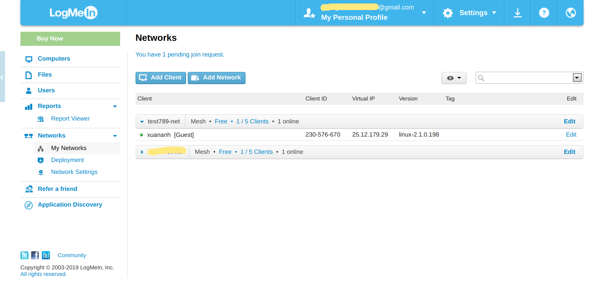

- [1. Giới thiệu](#1-giới-thiệu)
- [2. Đăng ký và tạo mạng](#2-Đăng-ký-và-tạo-mạng)
- [3. Cài đặt hamchi client](#3-cài-đặt-hamchi-client)
  - [3.1. Trực tiếp](#31-trực-tiếp)
  - [3.2. Dùng Docker](#32-dùng-docker)
- [4. Connect to network](#4-connect-to-network)
- [5. Giao diện Hamachi](#5-giao-diện-hamachi)

# 1. Giới thiệu

Tool này giúp tạo mạng riêng ảo VPN, free cho 5 máy kết nối vào mạng cùng lúc.

# 2. Đăng ký và tạo mạng

Đăng ký tại địa chỉ [https://www.logmein.com/](https://www.logmein.com/)

Tạo mạng:
- Vào Network -> My Networks, click Add Network
- Điền thông tin mạng, click Continue

- Điền các setup khác như bên dưới, click Continue

- Click Finish

- Ta được thông tin mạng đã cài đặt như bên dưới, chú ý đến ID là `398-582-210
`. Thông tin này cần để join vào mạng này.


Để kết nối đến mạng này ta phải cài đặt hamchi client, chuyển sang bước 3 để làm tiếp

# 3. Cài đặt hamchi client

## 3.1. Trực tiếp
Tải bộ cài đặt tại [https://www.vpn.net/linux](https://www.vpn.net/linux)

Chạy lệnh `sudo dpkg -i logmein-hamachi_*_amd64.deb`

## 3.2. Dùng Docker

[demo](../../sample/devops/hamachi)

# 4. Connect to network

Login trước khi join vào network, nhưng mà nó không yêu cầu thông tin login.

```shell
sudo hamachi login

Logging in .......... ok
```

Join vào network, sử dụng ID của network đã tạo ở trên

```shell

➜  ~ hahamachi join 398-582-210

Password: 
Joining 398-582-210 .. ok
```

Để kiểm tra kết nối:

```shell
➜  ~ hahamachi  

  version    : 2.1.0.198
  pid        : 25585
  status     : logged in
  client id  : 230-321-123
  address    : 25.12.123.12    1234:9b::190c:b31d
  nickname   : test-name
  lmi account: example@gmail.com (pending)
```

Hoặc kiểm tra trên web:


Kiểm tra chi tiết thông tin mạng đã kết nối:

```shell
➜  ~ hamachi list
 * [398-581-422]test789-net  capacity: 2/5, subscription type: Free, owner: example@gmail.com
     * 123-123-123   client-hostname   25.17.123.123     alias: not set  1234:9b::1234:89a5  direct      UDP  178.128.123.123:53035
```

Attach vào 1 email, cái này chắc để quản lý mạng, chưa dùng bao giờ:

```shell
sudo hamachi attach  [email@example.com]
```

# 5. Giao diện Hamachi

Cài đặt giao diện điều khiển Hamachi bằng lệnh:

```shell
sudo add-apt-repository -y ppa:webupd8team/haguichi
sudo apt update
sudo apt install -y haguichi
```