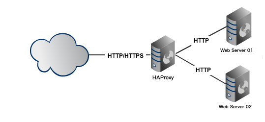
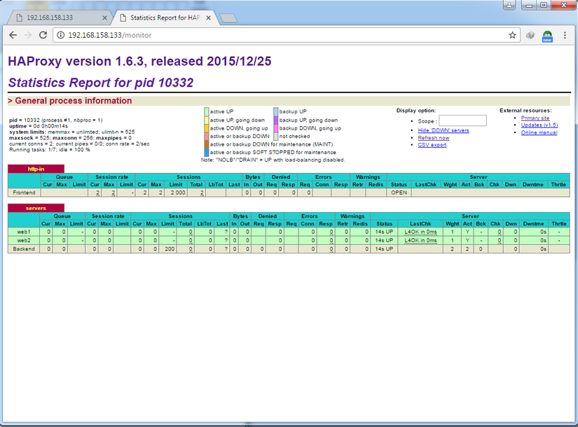

- [1. Phân loại](#1-phân-loại)
  - [1.1. Loadbalancer mềm](#11-loadbalancer-mềm)
  - [1.2. Loadbalancer cứng](#12-loadbalancer-cứng)
- [2. Thực hành](#2-thực-hành)
  - [2.1. Create servers](#21-create-servers)
  - [2.2. Không dùng docker](#22-không-dùng-docker)
  - [2.3. Haproxy monitor](#23-haproxy-monitor)


# 1. Phân loại

## 1.1. Loadbalancer mềm 

Xây dựng một loadbalancer thông qua việc cấu hình hệ điều hành hoặc các phần mềm chia tải. Giải pháp này có ưu điểm là chi phí rẻ, nhưng lại mắc các khuyết điểm như: hiệu năng xử lý phân tải , tốc độ xử lý và chuyển tiếp gói tin chậm hơn so với các loadbalancer cứng chuyên dụng.

Một số phần mềm hay sử dụng làm loadbalancer như Nginx, Apache, HAproxy...

## 1.2. Loadbalancer cứng 

Sử dụng các thiết bị chuyển mạch ứng dụng chuyên dụng. Đặc điểm của giải pháp này là trang bị các thiết bị phần cứng chuyên dụng với giá thành tương đối cao. Tuy nhiên hiệu năng xử lý và công nghệ áp dụng vượt xa so với phương pháp cân bằng tải bằng phần mềm.

Các hãng sản xuất các thiết bị loadbalancer như Foundry, Nortel (Alteon) hay Cisco CSS (Arrowpoint), Cisco Local Director...

# 2. Thực hành

## 2.1. Create servers

Trong bài viết này, mình sẽ dùng ứng dụng HAproxy được cài đặt trên một máy chủ Ubuntu đóng vai trò là một Loadbalancer. Mô hình triển khai như sau :

```ini
– Load Balancer
Hostname: haproxy
OS: Ubuntu + haproxy
Private IP: 192.168.1.230

– Web Server 1
Hostname: webser01
OS: Ubuntu + Apahce2
Private IP: 192.168.1.231

– Web Server 2
Hostname: webserver02
OS: Ubuntu + Apache2
Private IP: 192.168.1.232
```



Tạo 3 server bằng vagrantfile như sau:

Load balancer:

```conf
# -*- mode: ruby -*-
# vi: set ft=ruby :

Vagrant.configure("2") do |config|
  config.vm.network "public_network", ip:"192.168.1.230", bridge: "wlp3s0"
  config.vm.box = "ubuntu/xenial64"
  config.disksize.size = '30GB'
  config.vm.hostname = "load-balancer"
  config.vm.provider "virtualbox" do |vb|
    vb.memory = "1024"
  end

end

```

Web server 1:

```conf
# -*- mode: ruby -*-
# vi: set ft=ruby :

Vagrant.configure("2") do |config|
  config.vm.network "public_network", ip:"192.168.1.231", bridge: "wlp3s0"
  config.vm.box = "ubuntu/xenial64"
  config.disksize.size = '30GB'
  config.vm.hostname = "webserver1"
  config.vm.provider "virtualbox" do |vb|
    vb.memory = "1024"
  end

end

```

Web server 2:

```conf
# -*- mode: ruby -*-
# vi: set ft=ruby :

Vagrant.configure("2") do |config|
  config.vm.network "public_network", ip:"192.168.1.232", bridge: "wlp3s0"
  config.vm.box = "ubuntu/xenial64"
  config.disksize.size = '30GB'
  config.vm.hostname = "webserver2"
  config.vm.provider "virtualbox" do |vb|
    vb.memory = "1024"
  end

end

```

## 2.2. Không dùng docker

**Bước 1** : Cài đặt và cấu hình 2 con web server.

Cài đặt apache2 trên cả 2 con webserver:

```shell
sudo apt-get update
sudo apt-get install apache2 -y
```

Trên mỗi con webserver, chúng ta sẽ tạo một trang index.html mới như sau :

*Webserver 01*

```shell
echo 'web1' | sudo tee /var/www/html/index.html
# hoặc gắn vào file có sẵn
echo 'web1' | sudo tee --append /var/www/html/index.html
```

*Webserver 02*

```shell
echo 'web2' | sudo tee /var/www/html/index.html
# hoặc gắn vào file có sẵn
echo 'web2' | sudo tee --append /var/www/html/index.html
```

Để kiểm tra 2 webserver trên đã hoạt động, truy cập địa chỉ của chúng:
[http://192.168.1.231](http://192.168.1.231)
[http://192.168.1.232](http://192.168.1.232)

**Bước 2**: Cài đặt và cấu hình HAproxy.

```shell
sudo apt-get update
sudo apt-get install haproxy
```

Dùng lệnh `haproxy -v` để xem kết quả.


**Bước 3** : Cấu hình HAproxy.

File cấu hình là file **haproxy.cfg** lưu ở `/etc/haproxy/`. Trước khi tác động đến nó các bạn có thể lưu backup để dành tham khảo nhé. Bây giờ mở nó lên nào.

```shell
sudo vim /etc/haproxy/haproxy.cfg
```

Sau khi đã xóa trắng file, với mục đích chỉ config load balancing đơn giản cho 2 webserver, mình sẽ điền như sau :

```s
global
    daemon
    maxconn 256

defaults
    mode http
    timeout connect 5000ms
    timeout client 50000ms
    timeout server 50000ms

frontend http-in
    bind *:80
    default_backend webservers

backend webservers
    balance roundrobin
    option forwardfor
    http-request set-header X-Forwarded-Port %[dst_port]
    http-request add-header X-Forwarded-Proto https if { ssl_fc }
    server webserver1 192.168.1.231:80 check
    server webserver2 192.168.1.232:80 check
```

Cấu hình trên là cấu hình basic cho một load balancer, bạn chỉ cần quan tâm đến phần:

```conf
backend servers
    balance roundrobin
    server webserver1 192.168.1.231:80 check
    server webserver2 192.168.1.232:80 check
```

Nếu có nhiều node apache server, các bạn chỉ cần khai báo thêm vào là được. Lưu ý với khai báo **balance roundrobin**, các bạn có thể thay đổi thuật toán load balancing nếu thích.

Restart haproxy service:

```shell
sudo service haproxy restart
```

Thế là đã xong một mô hình load balancing đơn giản với HAproxy. Bạn có thể truy cập vào IP của load balancer và xem kết quả: [http://192.168.1.230](http://192.168.1.230)


Sau khi F5 :


## 2.3. Haproxy monitor

Thêm vào file cấu hình phần defaults các thông số  `stats` như sau :

```s
defaults
    mode http
    timeout connect 5000ms
    timeout client 50000ms
    timeout server 50000ms
    stats enable
    stats uri /myhaproxymonitor
    stats auth admin:admin
```

**Lưu ý** : 2 khai báo `stats uri /` và `stats auth` các bạn điền tham số tùy ý nhé. Ở đây mình đặt tên trang monitor là `myhaproxymonitor` với `user/pass` dùng login là `admin:admin`

Truy cập vào thử nào, của mình là [http://192.168.1.230/myhaproxymonitor](http://192.168.1.230/myhaproxymonitor)


