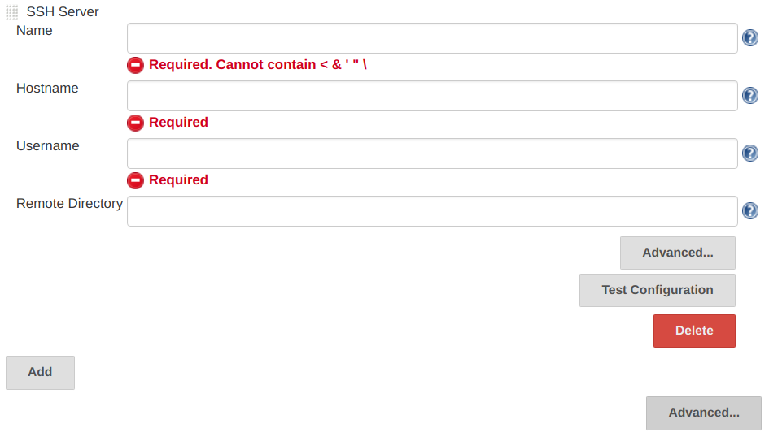
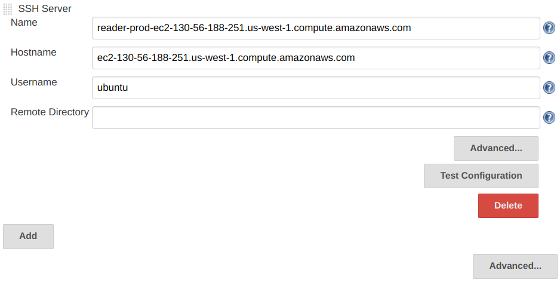

Jenkins: Add SSH remote hosts
---

Access **Manage Jenkins**, then **Configure System**:

In **SSH remote hosts** part, click **Add**, then fill a field as below:

Click **Test Configuration** for test

