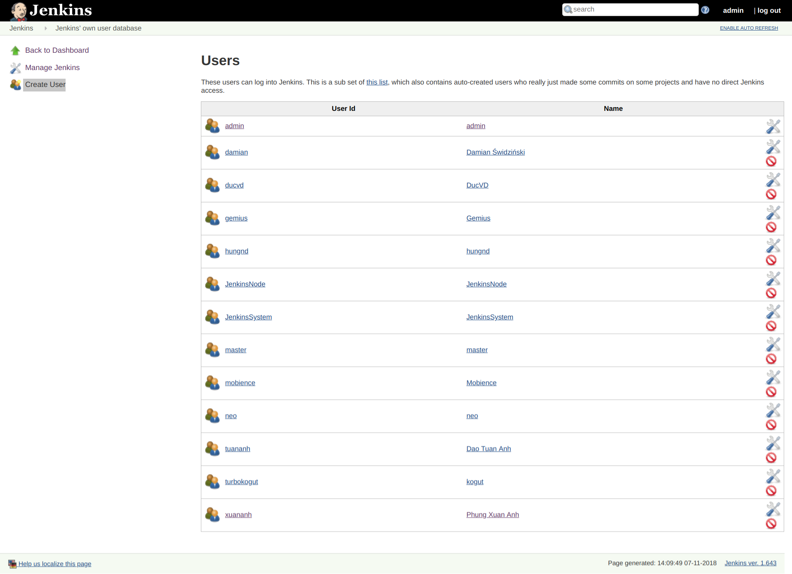
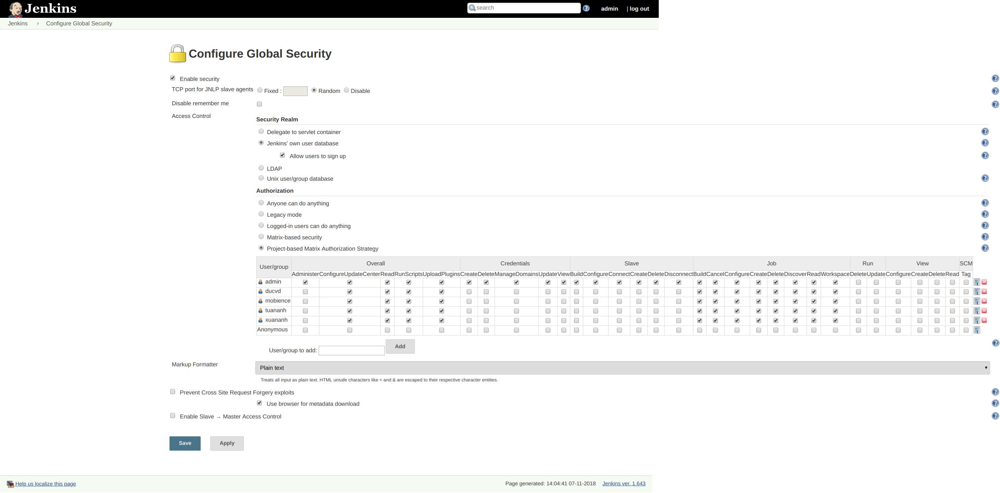

Jenkins: Add user and configure security
---

- [1. Add username](#1-add-username)
- [2. Configure security](#2-configure-security)

# 1. Add username

Access **Manage Jenkins**, then click **Manage Users**, then click **Create User** at top left:

# 2. Configure security

Access **Manage Jenkins**, then click **Configure Global Security**, then fill as below:

