Jenkins: Configuration jenkins notification
--------------------------------------------------
- [1. Slack Notification](#1-slack-notification)
  - [1.1. Lây slack token](#11-lây-slack-token)
  - [1.2. Thêm slack credentials vào Jenkins global](#12-thêm-slack-credentials-vào-jenkins-global)
  - [1.4. Thêm cấu hình cho riêng từng project](#14-thêm-cấu-hình-cho-riêng-từng-project)
  - [1.5. Bật notification](#15-bật-notification)
- [2. Email Notification](#2-email-notification)
  - [2.1. Cài đặt plugin Email Extension Plugin](#21-cài-đặt-plugin-email-extension-plugin)
  - [2.2. Cấu hình mail server](#22-cấu-hình-mail-server)
  - [2.3. Cấu hình notify mail cho project](#23-cấu-hình-notify-mail-cho-project)

# 1. Slack Notification

## 1.1. Lây slack token

Đăng nhập vào slack và truy cập vào phần quản lí app:

[https://slack.com/apps/manage](https://slack.com/apps/manage)

Search app **Jenkins CI** để cài đặt:

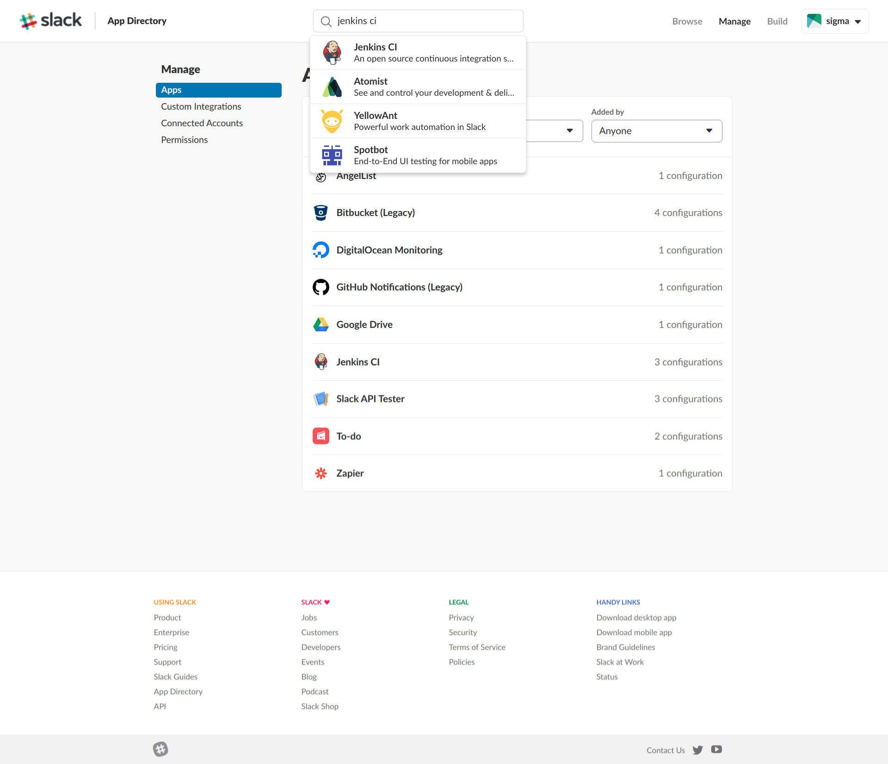

Click **Add Configuration**

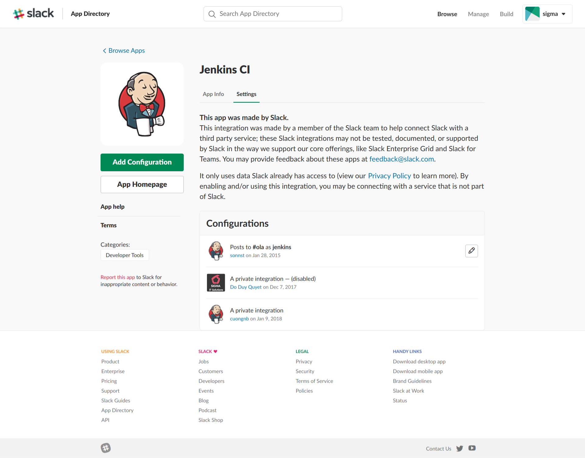

Choose channel

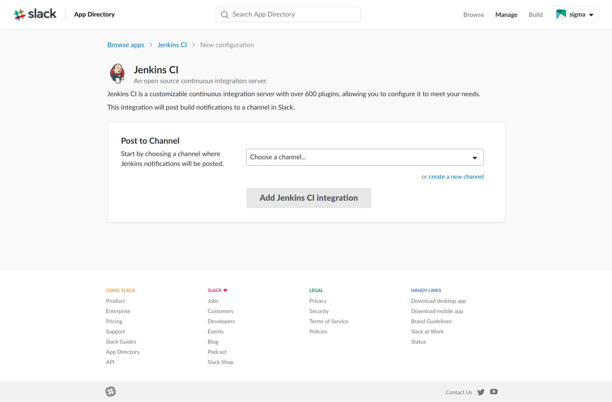

Click **Add Jenkins CI integration**

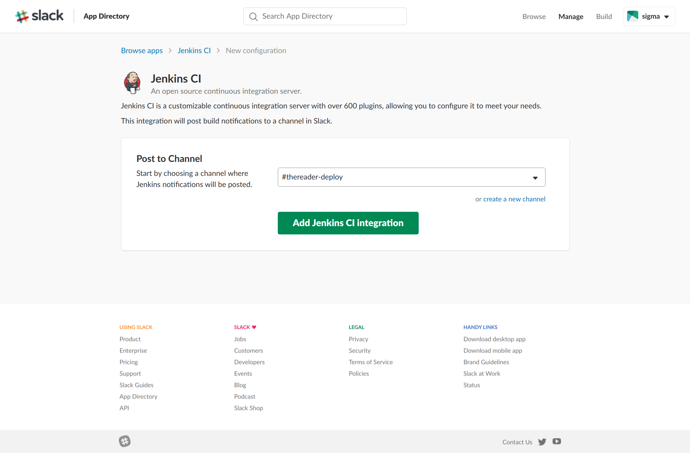

Trang tiếp theo hiện ra, làm theo hướng dẫn trong trang này, tham khảo phần thực hành thực tế bên dưới []:

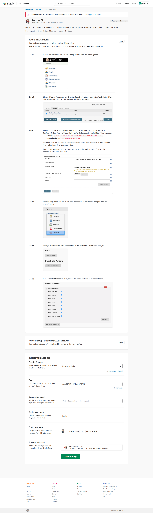

## 1.2. Thêm slack credentials vào Jenkins global 

Trước tiên phải Cài đặt plugin Slack Notification Plugin

Sau đó, Vào **Manager Jenkins** -> **Configure System**, tìm phần **Slack**, làm theo hình dưới:

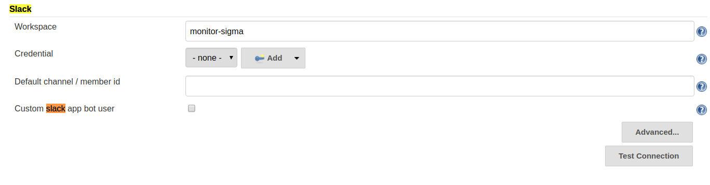

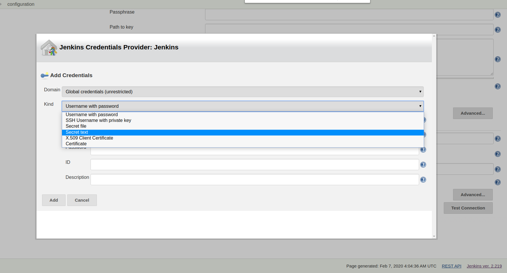
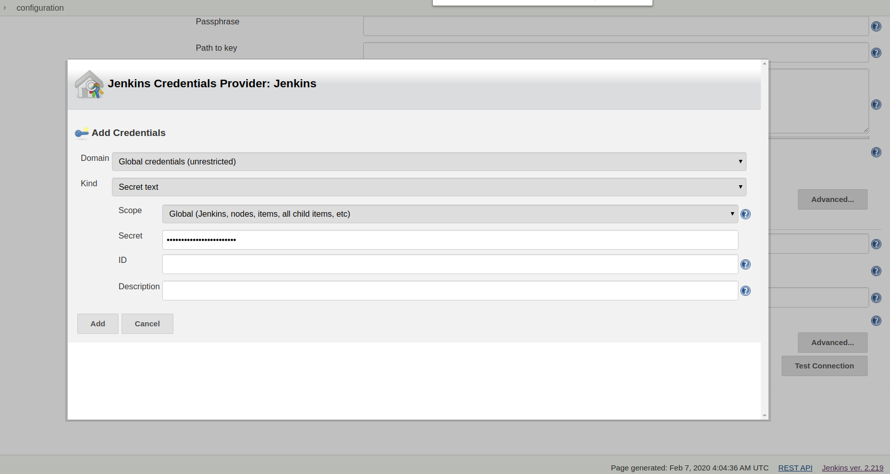
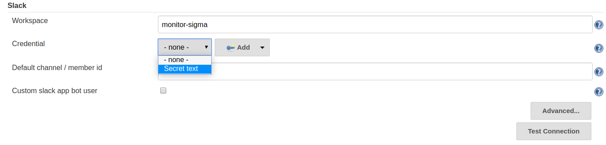

Bấm **Test connection**, nó sẽ gửi message đến channel tương ứng trên slack

Các giá trị trên cấu hình cho toàn bộ project ở jenkins, nếu muốn custom riêng cho từng project làm theo bên dưới, các cấu hình này sẽ khi đè cấu hình global

Tham khảo:

https://plugins.jenkins.io/slack

https://jenkins.io/doc/pipeline/steps/slack/

## 1.4. Thêm cấu hình cho riêng từng project

Truy cập vào Configure của project:

Tại mục **Slack Notifications**

- Chọn các status muốn notify
- Nếu muốn cấu hình lại các thông tin về slack (channel, token ) thì click vào Advanced, các mục này sẽ ghi đè các thông tin đã được cấu hình global

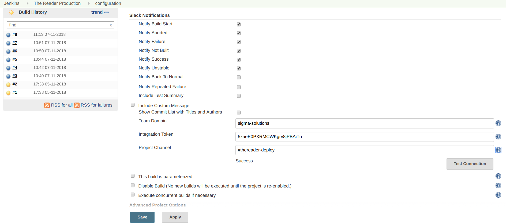

Bấm **Test connection**, nó sẽ gửi message đến channel tương ứng trên slack

Save lại.

## 1.5. Bật notification

Tại mục **Post-build Actions**, click **Add post-build action**, rồi chọn **Slack Notification**

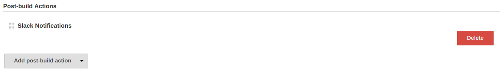

# 2. Email Notification

## 2.1. Cài đặt plugin Email Extension Plugin

Chú ý ta nên cấu hình Manage Jenkins > Configure System > Jenkins Location trước để mail hiển thị sender

## 2.2. Cấu hình mail server

Truy cập: Manage Jenkins > Configure System > Extended E-mail Notification
Config các giá trị:

SMTP server : smtp.gmail.com
Click Advanced -> chọn Use SMTP Authentication
User Name / Password tương ứng
Nếu sử dụng gmail: chọn Use SSL, SMTP port: 465

Truy cập: Manage Jenkins > Configure System > E-mail Notification
Cấu hình tương tự

## 2.3. Cấu hình notify mail cho project

Truy cập vào Configure của project:
Add post-build action > Editable Email Notification

Cấu hình các giá trị:
Project Recipient List: list các email muốn gửi (cách nhau bằng dấu phẩy)
Attach Build Log: Attach Build Log

Click Advanced Settings, chọn phần Triggers:
Add Triggers tương ứng, ví dụ: Always, Sau đó chọn danh sách email được send. (Chọn từ danh sách có sẵn như Recipient List – danh sách cấu hình ở trên hoặc tùy chọn).
