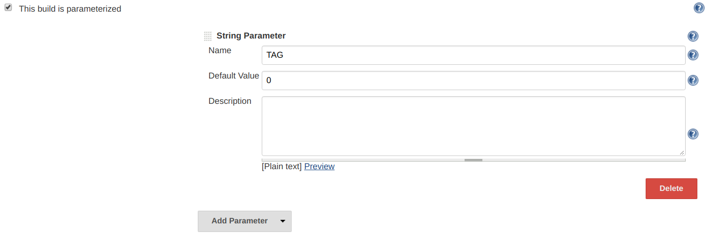
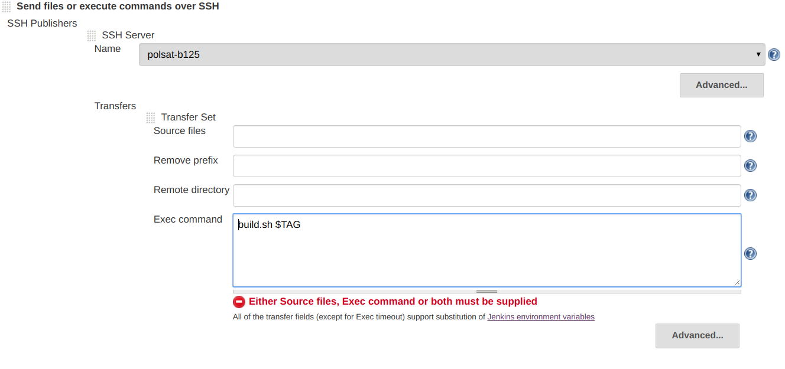

Jenkins: Project Configuration
------------------------------------
- [1. Build with Parameters](#1-build-with-parameters)

# 1. Build with Parameters

Access **Configuration** of project, click **This build is parameterized**, then click **Add Parameter**, choose type **String Parameter** or any type you want, for example, I set param named TAG below

Using parameter in build command:

