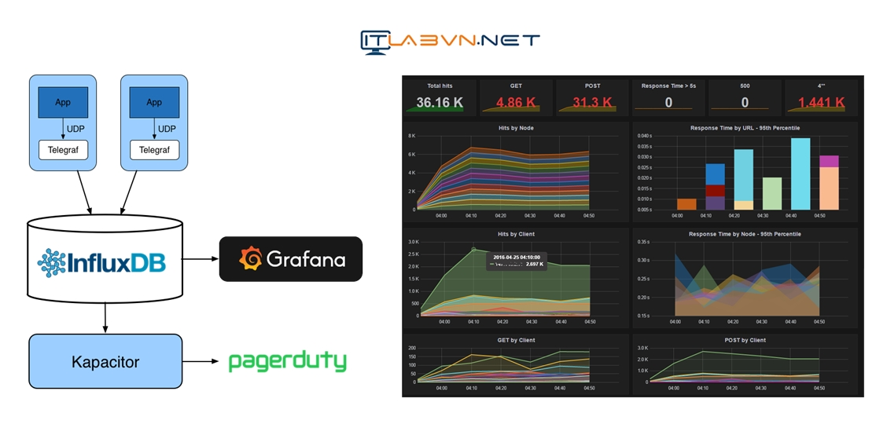
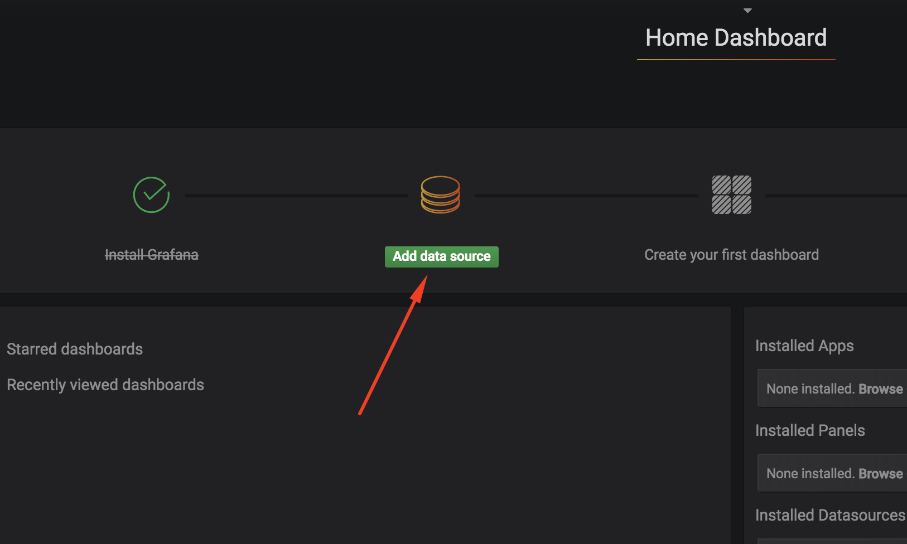
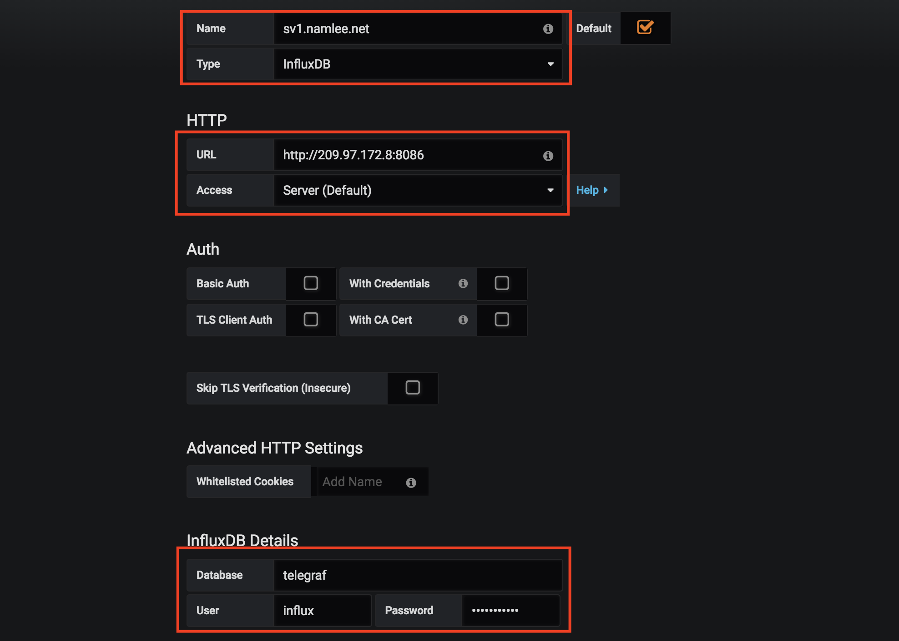
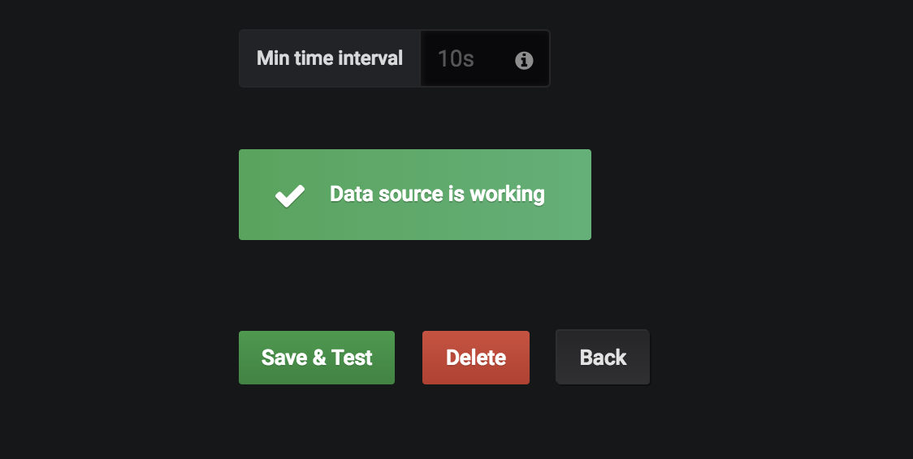
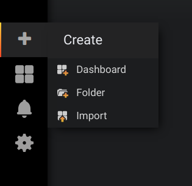
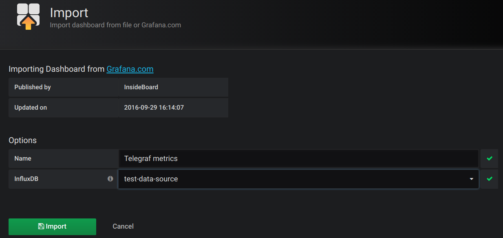
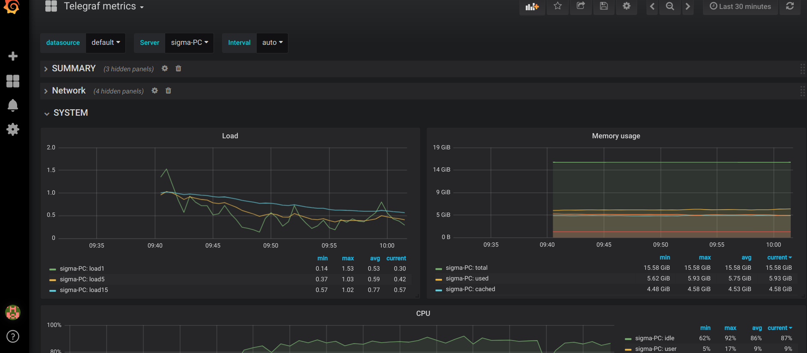

Setup Telegraf/Cadvisor - Influxdb - Grafana to monitor all container and host

- [1. Architecture](#1-architecture)
- [2. Telegraf](#2-telegraf)
  - [2.1. telegraf config](#21-telegraf-config)
  - [2.2. Prepare before deploy](#22-prepare-before-deploy)
  - [2.3. Deploy using docker compose only](#23-deploy-using-docker-compose-only)
  - [2.4. Deploy using docker swarm](#24-deploy-using-docker-swarm)
- [3. Cadvior](#3-cadvior)
- [4. Usage grafana dashboard](#4-usage-grafana-dashboard)
- [References](#references)
- [Sample](#sample)


# 1. Architecture




# 2. Telegraf

## 2.1. telegraf config

All configuration in file [telegraf.conf](/telegraf/telegraf.conf), 
- change url of  `[[outputs.influxdb]]` appropriate. In this case, deploy using docker-compose or using docker swarm, service **influxdb** was resolved by docker DNS, so we dont' need to change this url

## 2.2. Prepare before deploy

When using dashboard [https://grafana.com/dashboards/61](https://grafana.com/dashboards/61), it need **piechart-panel** plugin to show Docker chart, to use that plugin:
    - Uncomment line `./plugins/piechart-panel:/var/lib/grafana/plugins/piechart-panel` in `docker-compose.yml`
    - Run: `make clone-plugin

## 2.3. Deploy using docker compose only

```shell
cd telegraf
make up
make down
make ps
```

Go to part [Usage grafana dashboard](#usage-grafana-dashboard) to use Grafana

## 2.4. Deploy using docker swarm

In file [docker-compose.swarm.yml](/telegraf/docker-compose.swarm.yml) service telegraf is deploy in **global** mode, it means this service will run on all node.
And **hostname** of this service is set using replaceholder template: **{{.Node.Hostname}}-{{.Service.Name}}**. For more detail, read: https://docs.docker.com/engine/reference/commandline/service_create/#create-services-using-templates

1. Clone repo to all nodes of swarm
2. Build or pull images at all nodes
3. Deploy stack

```shell
cd telegraf
make stack-deploy
make stack-rm
```
4. Go to part [Usage grafana dashboard](#usage-grafana-dashboard) to use Grafana


# 3. Cadvior

TODO

# 4. Usage grafana dashboard

1. Access grafana web: admin/admin
2. Add data source
   

   Add config data source as below

   

   Click **Save & Test**, if OK you will see

   

3. Import dashboard 
   
   


   Add dashboard id: 61 (See: [https://grafana.com/dashboards/61](https://grafana.com/dashboards/61)) to box **Grafana.com Dashboard** and wait, it will load dashboard and show:

   

   In **Option** part, choose InfluxDB is **test-data-source** which we created in earlier step as above image, then click **Import**, and result:

   

# References
https://itlabvn.net/he-thong/cai-dat-he-thong-monitoring-telegraf-influxdb-grafana-kapacitor


# Sample

[sample](../../sample/devops/monitor/docker-grafana-influxdb-telegraf-or-cardvior-master)