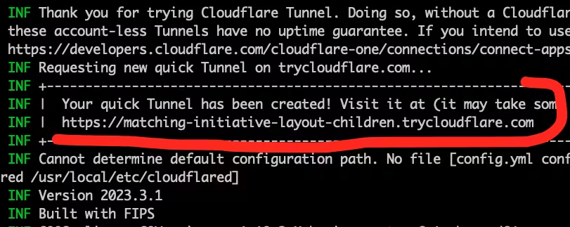

- [1. Ngrok and same tools](#1-ngrok-and-same-tools)
  - [1.1. Install](#11-install)
  - [1.2. Add token](#12-add-token)
  - [1.3. sample how to run](#13-sample-how-to-run)
  - [1.4. Configuration file](#14-configuration-file)
  - [1.5. Ngrok api client](#15-ngrok-api-client)
  - [1.6. ngrok python](#16-ngrok-python)
  - [1.7. Document](#17-document)
- [2. Other services sample ngrok](#2-other-services-sample-ngrok)
  - [2.1. cloudflare](#21-cloudflare)
    - [2.1.1. install](#211-install)
    - [2.1.2. using](#212-using)
    - [2.1.3. tunnel a tcp port](#213-tunnel-a-tcp-port)
    - [2.1.4. tunnel any tcp ports](#214-tunnel-any-tcp-ports)
      - [2.1.4.1. in marchine A](#2141-in-marchine-a)
      - [2.1.4.2. in machine B](#2142-in-machine-b)
      - [2.1.4.3. Example of using proxy and how it works](#2143-example-of-using-proxy-and-how-it-works)
  - [2.2. staqlab-tunnel](#22-staqlab-tunnel)
    - [2.2.1. Install](#221-install)
    - [2.2.2. Using](#222-using)
  - [2.3. localtunnel](#23-localtunnel)
  - [2.4. Other](#24-other)


# 1. Ngrok and same tools

You can share everything using ngrok, see this link: https://ngrok.com/blog-post/everything-you-can-tunnel-with-ngrok

## 1.1. Install

Se in file: new-os-install.sh

## 1.2. Add token

Get token from [here](https://dashboard.ngrok.com/get-started/your-authtoken)

`ngrok config add-authtoken $YOUR_AUTHTOKEN`

Or add to [ngrok.yml](https://ngrok.com/docs/agent/config/v3/#example-configuration-files)

## 1.3. sample how to run


```shell
ngrok tcp 5432                              # forword TCP traffic to port 5432 in localhost 
ngrok http 8080                             # forward ngrok subdomain to port 80
ngrok http example.com:9000                 # forward traffic to example.com:9000
ngrok http --url=bar.ngrok.dev 80           # request url name: 'bar.ngrok.dev'
ngrok http --url=example.com 1234           # request endpoint 'example.com' (DNS CNAME)
ngrok http --basic-auth='falken:joshua' 80  # enforce basic auth on tunnel endpoint
ngrok http --host-header=example.com 80     # rewrite the Host header to 'example.com'
ngrok http file:///var/log                  # serve local files in /var/log
ngrok http https://localhost:8443           # forward to a local https server
```

## 1.4. Configuration file

https://ngrok.com/docs/agent/config/v3/#example-configuration-files

**NOTE**: you cannot run 2 ngrok commands at the same time because it will create 2 agents, the free account is limitted to 1 agents to overcome this, we can use ngrok config file to define multiple endpoints/tunnels in one agent

or if your configuration file content as below:

```yml
# Version of the ngrok Agent Configuration file. Required.
version: 3

# Agent Configuration
agent:
  authtoken: 4nq9771bPxe8ctg7LKr_2ClH7Y15Zqe4bWLWF9p

# Endpoint Definitions
endpoints:
  - name: basic
    url: basic.ngrok.app
    upstream:
      url: 8080
  - name: httpbin
    url: https://alan-httpbin.ngrok.dev
    upstream:
      url: 8080
  - name: demo
    url: https://demo.inconshreveable.com
    upstream:
      url: 8181
  - name: ssh
    url: tcp://1.tcp.ngrok.io:12345
    upstream:
      url: 22
  - name: demo-2
    url: tls://myexample.ngrok.app
    upstream:
      url: 443
```

you can start endpoint named `basic` by command: `ngrok start basic`

## 1.5. Ngrok api client

https://github.com/PhungXuanAnh/python-note/blob/master/ngrok_sample/ngrok_client_api.py

https://ngrok.com/docs#client-api

## 1.6. ngrok python

https://github.com/PhungXuanAnh/python-note/blob/master/ngrok_sample/pyngrok_sample.py

## 1.7. Document

https://ngrok.com/docs

# 2. Other services sample ngrok

## 2.1. cloudflare

### 2.1.1. install 

Download deb file and install here: https://developers.cloudflare.com/cloudflare-one/connections/connect-networks/downloads/#linux

### 2.1.2. using

```shell
cloudflared tunnel --url http://localhost:3000

# or run in background

cloudflared tunnel --url http://localhost:8443 & disown
```

Visit the generated link and then do as guiden in this page to access your real page

refer: 

- https://developers.cloudflare.com/pages/how-to/preview-with-cloudflare-tunnel/#start-a-cloudflare-tunnel
- https://developers.cloudflare.com/cloudflare-one/connections/connect-networks/get-started/create-local-tunnel/

### 2.1.3. tunnel a tcp port

Download [websocat](https://github.com/vi/websocat/releases/download/v1.13.0/websocat.x86_64-unknown-linux-musl) in server and PC

```
chmod +x websocat.x86_64-unknown-linux-musl
mv websocat.x86_64-unknown-linux-musl ~/.local/bin/websocat
```

Open new terminal.

On the server behind the firewall:

```
### Start a WS <-> TCP forwarder
websocat -E -b ws-l:127.0.0.1:40008 tcp:127.0.0.1:22 &
### Create a free CF Tunnel:
cloudflared tunnel --url http://localhost:40008 --no-autoupdate

```

The CF tunnel will show you an URL similar to this one:



On your workstation:

```
### Start a TCP <-> WS forwarder to above URL
websocat -E -b tcp-l:127.0.0.1:2222 ws://<YourUrlFromAbove>.trycloudflare.com &
### Connect using SSH:
ssh -p 2222 root@127.0.0.1
```

https://iq.thc.org/tunnel-via-cloudflare-to-any-tcp-service

### 2.1.4. tunnel any tcp ports


Download [websocat](https://github.com/vi/websocat/releases/download/v1.13.0/websocat.x86_64-unknown-linux-musl) in server and PC

#### 2.1.4.1. in marchine A

Install `gost`

```shell
sudo snap install core
sudo snap install gost
```

Run below command. This command instructs gost to listen on port 40009 using the mws protocol, waiting for incoming connections from clients that support the WebSocket-based MWS protocol.

```shell
gost -L mws://:40009
```

Continue run below command to expose a local service to the internet securely through Cloudflare's network

```shell
cloudflared tunnel --url http://localhost:40009 --no-autoupdate
```

#### 2.1.4.2. in machine B

Install `gost` and `proxychains`

```shell
sudo snap install core
sudo snap install gost
sudo apt -y install proxychains
```

Run below command to create a proxy on a different computer (say, Computer B) and connect it to the Cloudflare Tunnel that was set up earlier on Computer A

```
gost -L :1080 -F 'mwss://<YourUrlFromAbove>.trycloudflare.com:443'
```

Create a ProxyChains configuration, to use created proxy in the previous command

```
echo -e "[ProxyList]\nsocks5 127.0.0.1 1080" >pc.conf
```

Now, you can use `proxychains -f pc.conf -q <command>` to make any traffic from Machine B appear as if it comes from Machine A.


```shell
# SSH to 192.168.1.1 via the tunnel
proxychains -f pc.conf -q ssh root@192.168.1.1  # remove -q if you don't want to run in quite mode

# open a web in chrome via the tunnel
google-chrome --proxy-server="socks5://127.0.0.1:1080" "https://web.dev.showheroes.com/app/backoffice/video-adsources/"
```

#### 2.1.4.3. Example of using proxy and how it works

1. Computer A (Machine A): You are running the gost proxy on this machine, and you expose it via a Cloudflare Tunnel. Computer A has knowledge of Machine C's IP (192.168.1.1), meaning it can directly communicate with Machine C over the local network or within the same environment.

2. Computer B (Machine B): You're trying to initiate an SSH connection to Machine C from Computer B, but Computer B doesn't know Machine C's IP. It only knows how to connect to the Cloudflare Tunnel set up by Machine A.

3. The flow of traffic:

- When you run the ssh command from Computer B with proxychains (which uses the SOCKS5 proxy), the traffic will first go to Computer B's local gost proxy (on port 1080).
- gost on Computer B then forwards this traffic through the Cloudflare Tunnel established by Machine A.
- Once the traffic reaches Machine A, the gost proxy there forwards the SSH request to Machine C (which it can directly access on 192.168.1.1).
- Machine C then responds to the SSH request through the same path (via Machine A and the Cloudflare Tunnel) back to Computer B.

**Summary of your flow:**

- Machine A (through the Cloudflare Tunnel and gost) acts as a middleman to forward traffic between Machine B (which initiates the SSH request) and Machine C (which is the destination machine).
- Machine B's SSH traffic appears to come from Machine A, and Machine C sees the request as coming from Machine A via the Cloudflare Tunnel, not directly from Machine B.

## 2.2. staqlab-tunnel

https://tunnel.staqlab.com/

### 2.2.1. Install

```shell
# ubuntu
rm -rf ~/.local/bin/staqlab-tunnel*
wget https://raw.githubusercontent.com/abhishekq61/tunnel-client/master/linux/staqlab-tunnel.zip -P ~/.local/bin
unzip staqlab-tunnel.zip
chmod +x ~/.local/bin/staqlab-tunnel
rm -rf staqlab-tunnel.zip

# mac
rm -rf ~/.local/bin/staqlab-tunnel
wget https://raw.githubusercontent.com/cocoflan/Staqlab-tunnel/master/mac/staqlab-tunnel -P ~/.local/bin
unzip staqlab-tunnel.zip
chmod +x ~/.local/bin/staqlab-tunnel
rm -rf staqlab-tunnel.zip
```

### 2.2.2. Using

```shell
staqlab-tunnel <port> hostname=<desired-domain>
# ex:
staqlab-tunnel 8000 hostname=my-domain
# output domain:
https://my-domain.staqlab-tunnel.com/
```

## 2.3. localtunnel

https://github.com/localtunnel/localtunnel

## 2.4. Other

https://www.softwaretestinghelp.com/ngrok-alternatives/

