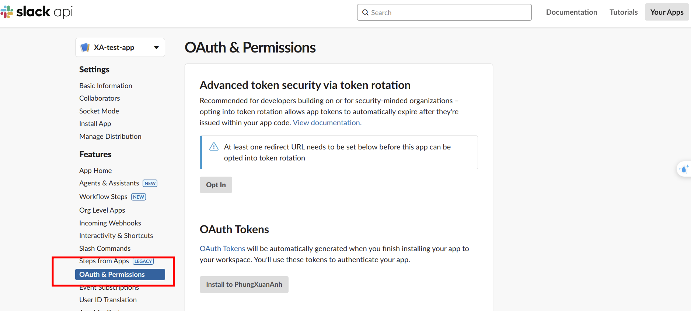
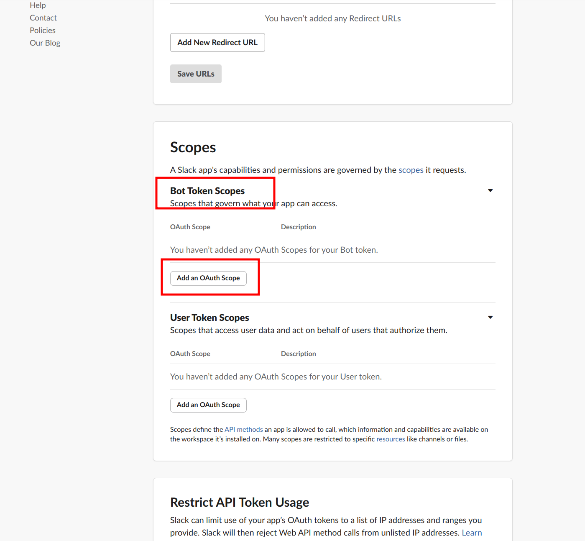
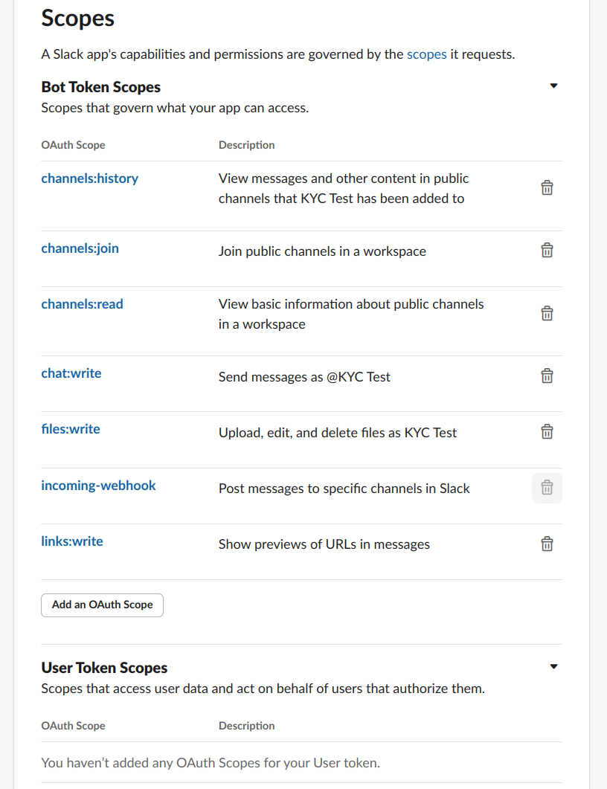
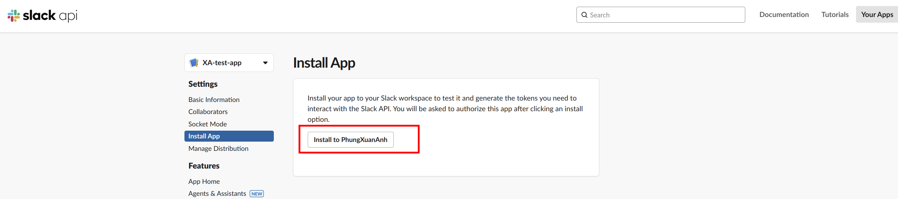
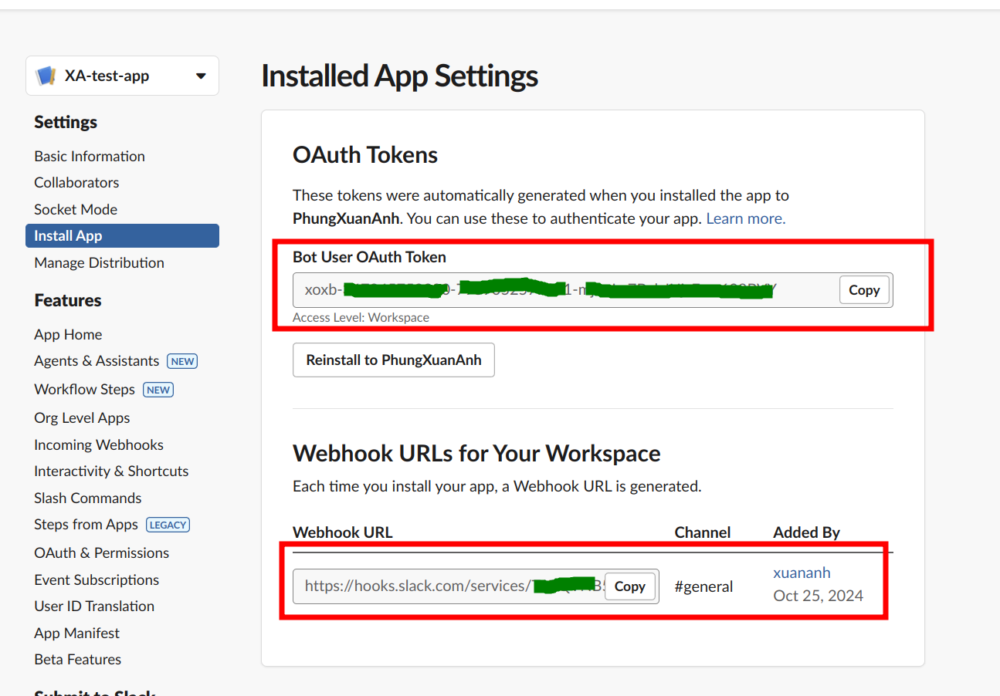
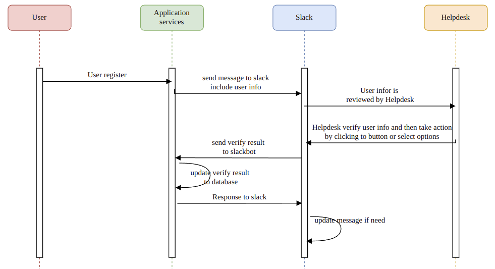
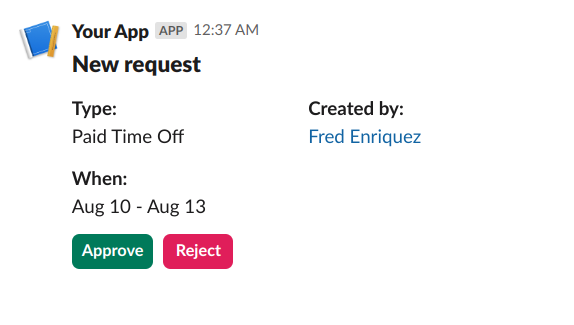
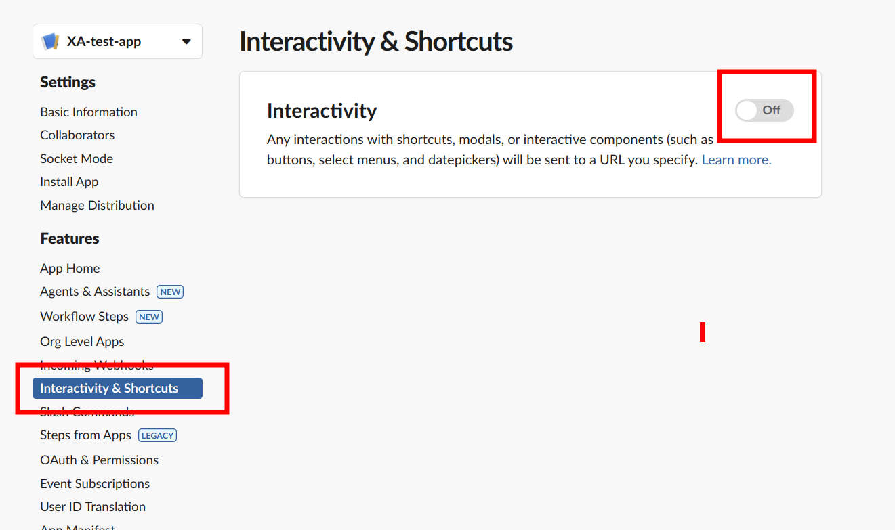
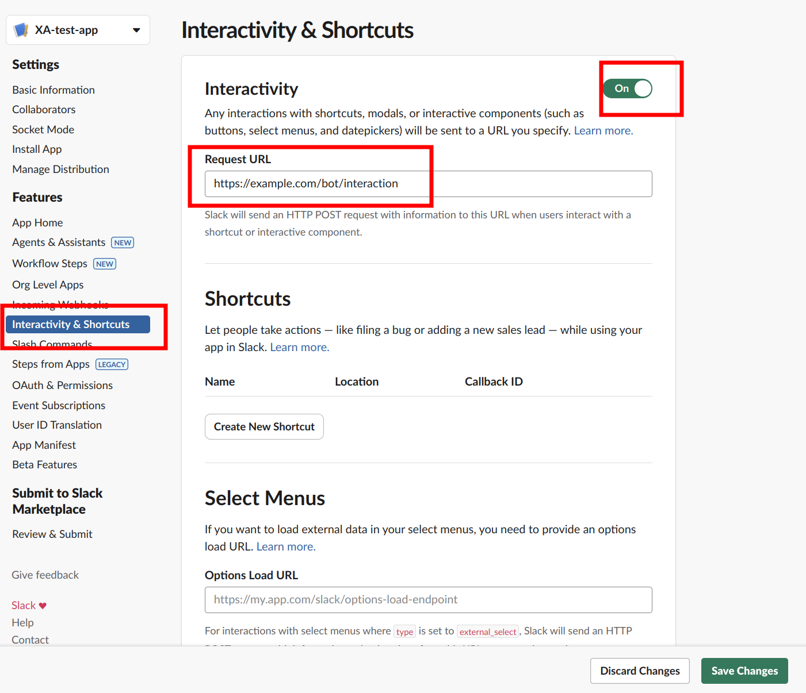
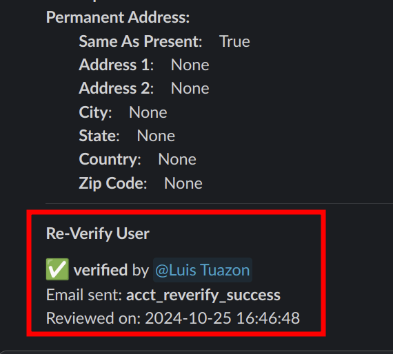

Steps to integrate slackbot to your application

- [1. Prepare your slack app](#1-prepare-your-slack-app)
  - [1.1. Create slack app](#11-create-slack-app)
  - [1.2. Add permission scope for your workspace](#12-add-permission-scope-for-your-workspace)
  - [1.3. Install slack app to a workspace](#13-install-slack-app-to-a-workspace)
- [2. Integrate slackbot to your application](#2-integrate-slackbot-to-your-application)
  - [2.1. commonly usecase](#21-commonly-usecase)
  - [2.2. Create API](#22-create-api)
    - [2.2.1. send a simple message](#221-send-a-simple-message)
    - [2.2.2. send an interactive message](#222-send-an-interactive-message)
    - [2.2.3. handling payload from slack](#223-handling-payload-from-slack)
    - [2.2.4. respond to slack](#224-respond-to-slack)
- [3. Reference](#3-reference)


# 1. Prepare your slack app

## 1.1. Create slack app

Go to this link: https://api.slack.com/apps and then click Create New App


Click to your created app and then do all the next steps in your app

## 1.2. Add permission scope for your workspace

Click to OAuth & Permissions



Scroll down and click to Add an OAuth Scope in Bot Token Scopes



You can choose scopes the same as below image



## 1.3. Install slack app to a workspace

Go to Install App and click Install to <Workspace>



Choose channel that you want to install your app


After install your app to the channel of the workspace it will generate token and webhook url



# 2. Integrate slackbot to your application

## 2.1. commonly usecase




## 2.2. Create API

Based on the above sequence diagram, after the user registers to the system through Application services, Application services will send a message to slack including the user info, to do it we use python slack sdk

install slack sdk using command: `pip install slackclient`

initialize slack client

```python
self.__slack_client = slack.WebClient(token=config('SLACK_BOT_TOKEN'))
```

SLACK_BOT_TOKEN is obtained from the previous step after you installed your app to a channel in your workspace

### 2.2.1. send a simple message

to send a message to a slack channel, we use the following code

```python
self.__slack_client.chat_postMessage(
    channel=channel_id,
    blocks=[
        {
            "type": "section",
            "text": {
                "type": "mrkdwn",
                "text": "This is message to send",
                "verbatim": False
            }
        }
    ],
    thread_ts=message_ts # if you want to send message to a thread, you add the thread id here
)
```

### 2.2.2. send an interactive message

In the above case, we will need Helpdesk interacts with our slack message, so instead of sending a  pure text message, you have to send an interactivity message, in that, it contains a button or select box, anything else that Helpdesk can interact with it. To send an interactive message, do like this

```python
block = {
  "channel": "C123ABC456",
  "text": "New Paid Time Off request from Fred Enriquez",
  "blocks": [
    {
      "type": "header",
      "text": {
      "type": "plain_text",
        "text": "New request",
        "emoji": true
      }
    },
    {
      "type": "section",
      "fields": [
        {
          "type": "mrkdwn",
          "text": "*Type:*\nPaid Time Off"
        },
        {
          "type": "mrkdwn",
          "text": "*Created by:*\n<example.com|Fred Enriquez>"
        }
      ]
    },
    {
      "type": "section",
      "fields": [
        {
          "type": "mrkdwn",
          "text": "*When:*\nAug 10 - Aug 13"
        }
      ]
    },
    {
      "type": "actions",
      "elements": [
        {
          "type": "button",
          "text": {
            "type": "plain_text",
            "emoji": true,
            "text": "Approve"
          },
          "style": "primary",
          "value": "click_me_123"
        },
        {
          "type": "button",
          "text": {
            "type": "plain_text",
            "emoji": true,
            "text": "Reject"
          },
            "style": "danger",
            "value": "click_me_123"
        }
      ]
    }
  ]
}

self.__slack_client.chat_postMessage(channel=channel, blocks=blocks)
```

it will send a block like this:



or you can access [Block Kit Builder](https://app.slack.com/block-kit-builder/T9CSVKE4Q#%7B%22blocks%22:%5B%7B%22type%22:%22header%22,%22text%22:%7B%22type%22:%22plain_text%22,%22text%22:%22New%20request%22,%22emoji%22:true%7D%7D,%7B%22type%22:%22section%22,%22fields%22:%5B%7B%22type%22:%22mrkdwn%22,%22text%22:%22*Type:*%5CnPaid%20Time%20Off%22%7D,%7B%22type%22:%22mrkdwn%22,%22text%22:%22*Created%20by:*%5Cn%3Cexample.com%7CFred%20Enriquez%3E%22%7D%5D%7D,%7B%22type%22:%22section%22,%22fields%22:%5B%7B%22type%22:%22mrkdwn%22,%22text%22:%22*When:*%5CnAug%2010%20-%20Aug%2013%22%7D%5D%7D,%7B%22type%22:%22actions%22,%22elements%22:%5B%7B%22type%22:%22button%22,%22text%22:%7B%22type%22:%22plain_text%22,%22emoji%22:true,%22text%22:%22Approve%22%7D,%22style%22:%22primary%22,%22value%22:%22click_me_123%22%7D,%7B%22type%22:%22button%22,%22text%22:%7B%22type%22:%22plain_text%22,%22emoji%22:true,%22text%22:%22Reject%22%7D,%22style%22:%22danger%22,%22value%22:%22click_me_123%22%7D%5D%7D%5D%7D) of the slack to build your own interactive message


to know more on how to create interactive message, see this link: https://api.slack.com/messaging/interactivity#components 

Continue with the above use case, after Helpdesk interacts with slack message, for example clickt to Approve or Reject button, then slack will send this information to Application services. To do that, we need to prepare an API, so slack can call this API to send this information. 

For example, our API url is https://example.com/bot/interaction

You need to add this URL to slack. In your app page, click to Interactivity & Shortcuts

Click to switch button to enable this fucntion 



and then enter this URL in Request URL input box



Then click to Save Changes button


### 2.2.3. handling payload from slack

Regarding the handling slack payment in your API, you can refer to this link: 

https://api.slack.com/interactivity/handling#payloads


### 2.2.4. respond to slack

After handling the payload of the slack request, API needs to respond to this request, you can refer to this docs on how to repond to a slack message: https://api.slack.com/interactivity/handling#responses

Basically, after slack receives the response from your API, it can do nothing, or it can update the message in the slack channel, for example: if Helpdesk click to Approve button, this button will be removed, and slack will replace by a footer with a Checked sign under the original message as below image




# 3. Reference

https://api.slack.com/messaging/interactivity
