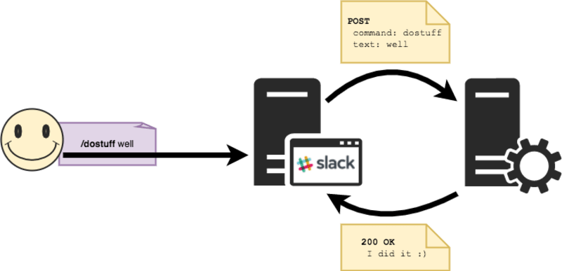
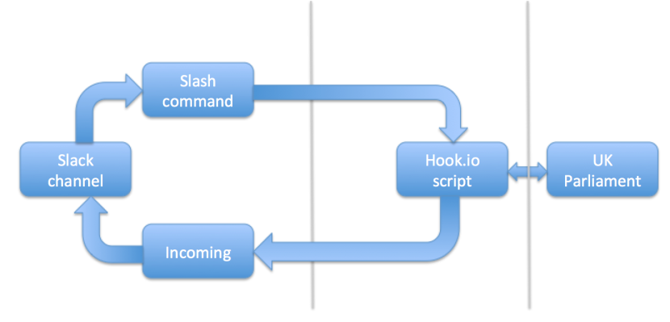
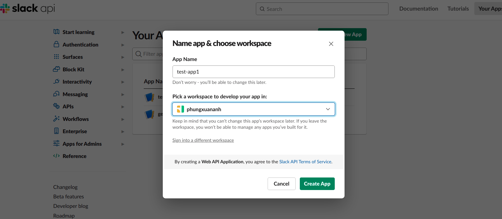
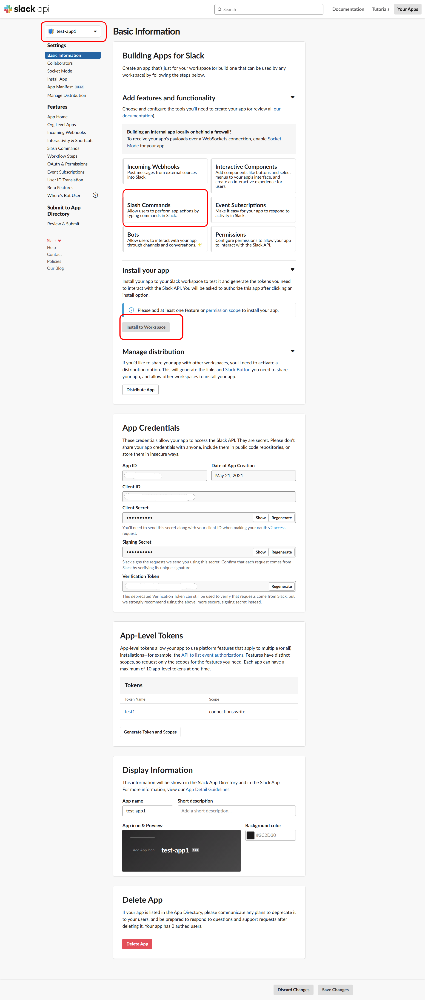
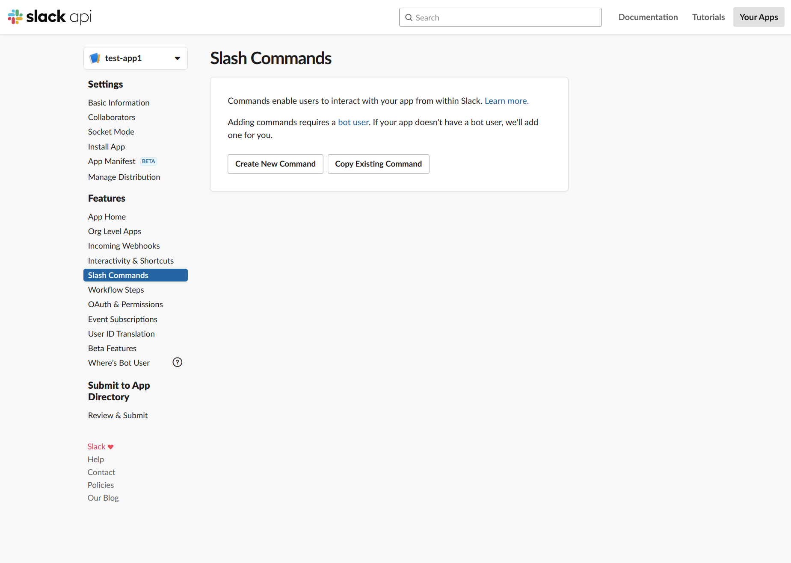
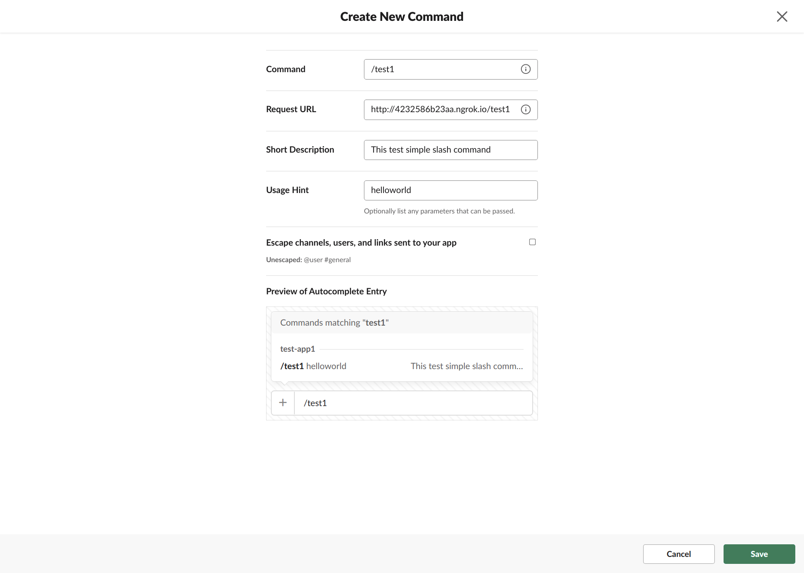
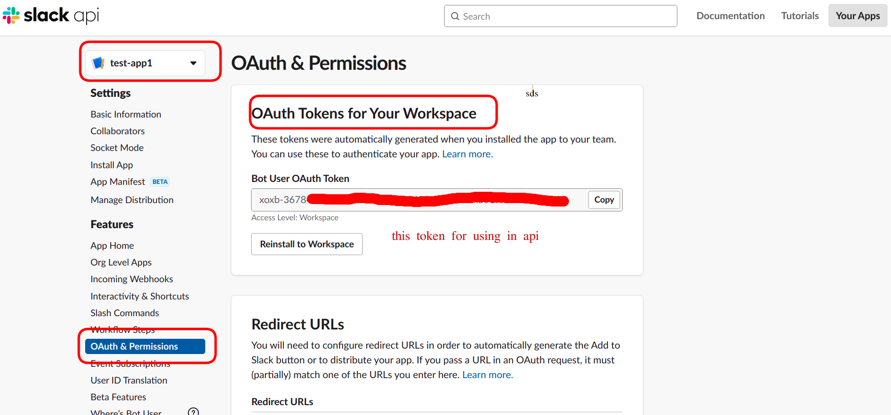
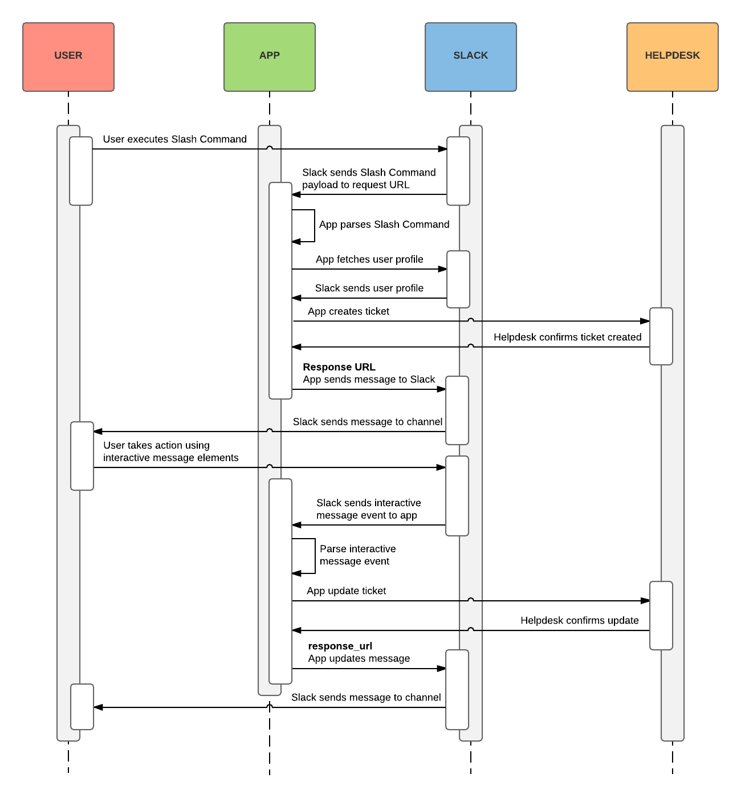
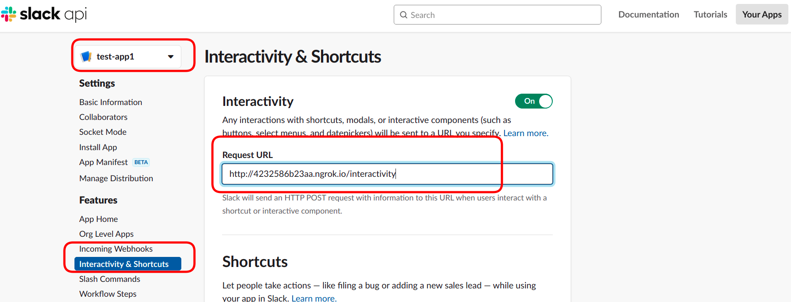
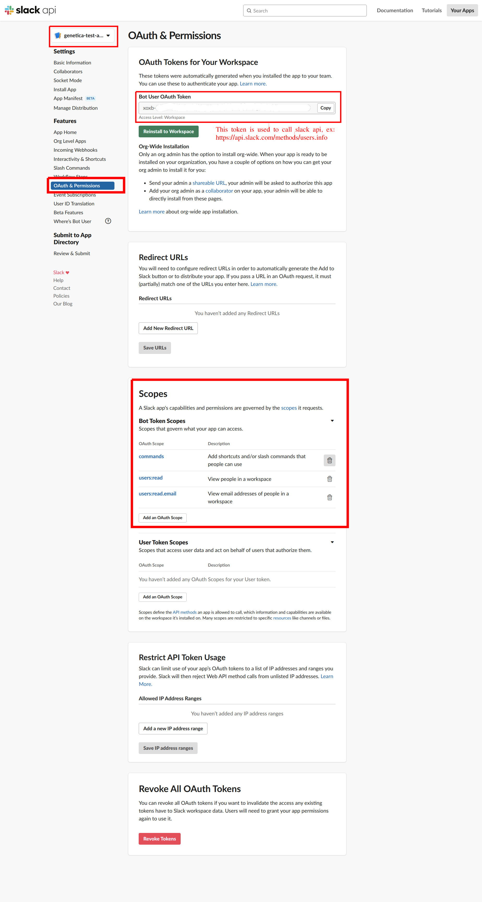

Slack slash command
---

Step by step to setup slack slash command, and integrate with slack dialog or integrate with slack view, and test on local

- [1. Slash working flow](#1-slash-working-flow)
- [2. Test1 command - a most simple slask command](#2-test1-command---a-most-simple-slask-command)
  - [2.1. setup api server](#21-setup-api-server)
  - [2.2. Setup slash command](#22-setup-slash-command)
    - [2.2.1. Create slash command using dedicated app (note recommended)](#221-create-slash-command-using-dedicated-app-note-recommended)
    - [2.2.2. create slash command using shared app](#222-create-slash-command-using-shared-app)
      - [2.2.2.1. Create slack share apps](#2221-create-slack-share-apps)
      - [2.2.2.2. Create slash command inside app](#2222-create-slash-command-inside-app)
      - [2.2.2.3. Install share app to a workspace](#2223-install-share-app-to-a-workspace)
  - [2.3. Test](#23-test)
- [3. Test2 command - Using slash command with slack dialog](#3-test2-command---using-slash-command-with-slack-dialog)
  - [3.1. setup api server](#31-setup-api-server)
  - [3.2. setup slash command with share app](#32-setup-slash-command-with-share-app)
    - [3.2.1. Setup slack shared app interactivity](#321-setup-slack-shared-app-interactivity)
  - [3.3. reference about dialog](#33-reference-about-dialog)
- [4. Test3 command - Using slash command with slack modals](#4-test3-command---using-slash-command-with-slack-modals)
  - [4.1. setup api server](#41-setup-api-server)
  - [4.2. setup slash command](#42-setup-slash-command)
  - [4.3. list of element types supported by slack view](#43-list-of-element-types-supported-by-slack-view)
- [5. Slack app scope](#5-slack-app-scope)


# 1. Slash working flow






Base on the above image, we need at less 2 part to implement slask command : 

    1. App : an api server for handle data which recieved from slack
    2. Slack : (slack server, slack app, slack user) it mean we need an slack workspace, and setup slask command of this workspace to point to above api server
   

Base on above explain we need atless 2 step:

    1. setup api server for get data from slack
    2. setup slask command to send data to api server


Read example about how to setup slash command `test1` for understand this flow

# 2. Test1 command - a most simple slask command

## 2.1. setup api server

start server: `python sample/slash_command_test.py`

then using `ngrok` to expose this server to slack : `ngrok http 8002`, ignore this step if you deploy this api server to cloud

output of ngrok :

```shell
Session Status                online                                                                          
Account                       Phung Xuân Anh (Plan: Free)                                                     
Update                        update available (version 2.3.40, Ctrl-U to update)                             
Version                       2.3.35                                                                          
Region                        United States (us)                                                              
Web Interface                 http://127.0.0.1:4040                                                           
Forwarding                    http://4232586b23aa.ngrok.io -> http://localhost:8002                           
Forwarding                    https://4232586b23aa.ngrok.io -> http://localhost:8002                          
                                                                                                              
Connections                   ttl     opn     rt1     rt5     p50     p90                                     
                              0       0       0.00    0.00    0.00    0.00 
```

save this link `http://4232586b23aa.ngrok.io` to setup slash command at next step 

## 2.2. Setup slash command

There are 2 way to create an app in slack.

1. Create a dedicated app inside a workspace, this app is only using for this workspace (**note recommended**)
2. Create an shared app, this app can add more feature and functionality of dedicated app and can be share between workspace and also can compose with api from slack

See more detail below

### 2.2.1. Create slash command using dedicated app (note recommended)

Access : https://phungxuananh.slack.com/apps

Search `slash command` or access https://phungxuananh.slack.com/apps/A0F82E8CA-slash-commands

click Add to Slack to add new slash command, then configure as below, change URL to your api or your webhook url (or go to already created command, named `test1` at [this link](https://phungxuananh.slack.com/services/B01UW7FMS0L))

Enter ngrok url get from step 1 to URL box (**NOTE**: don't forget to add endpoint `test1` to this url)

then click **Save Integration**


### 2.2.2. create slash command using shared app

#### 2.2.2.1. Create slack share apps

Access here : https://api.slack.com/apps, Then **Create New App**



Slack app detail



#### 2.2.2.2. Create slash command inside app

From above image create Slash command inside this app





#### 2.2.2.3. Install share app to a workspace

From above image install this app to a workspace




## 2.3. Test

Enter `/test1` on any channel, slack will send data represent on **Outgoing Data** (see above image) to URL (your webhook or your api)

Outgoing Data explain

    token= slack token 
    team_id= id of team or company workspace
    team_domain= domain of team or company workspace
    channel_id= id of channel that you enter slash command
    channel_name= name of channel that you enter slash command
    user_id= id of user who enter slash command
    user_name= user name of user who enter slash command
    command= which command is run
    text= any text after slash command
    response_url= webhook of channel where you enter slash command

example:

    token:fEqVqEWbW12321312312321313
    team_id:TGG524NKT
    team_domain:geneticavietnam
    channel_id:C01V2FZ1WV7
    channel_name:test1
    user_id:U01UPB7EYHH
    user_name:anh.phung
    command:/test1
    text:aaaaaaa
    is_enterprise_install:false
    response_url:https://hooks.slack.com/commands/1234/5678


**NOTE:** your api can hander this message then send back to this channel any data that you want through `response_url`


# 3. Test2 command - Using slash command with slack dialog

[explain working flow in this link](https://api.slack.com/best-practices/blueprints/slash-command-and-dialogs)




## 3.1. setup api server

Update some constant in this file: [sample/common.py](sample/common.py)

    APP_TOKEN: get `OAuth & Permissions` when installed app to a workspace
    SLACK_VERIFICATION_TOKEN: get `Basic Information` of app
    SLACK_TEAM_ID: access this url: https://app.slack.com/client, it will redirect to https://app.slack.com/client/TEAM_ID/CHANNEL_ID, refer: https://stackoverflow.com/a/57246565/7639845

Then run command : 

```shell
python slash_command_test2.py
ngrok http 8002
```

## 3.2. setup slash command with share app

NOTE: using dialog only work with slash command setup from share app

Setup all step as in `test1` command, then go to next step

### 3.2.1. Setup slack shared app interactivity

Add api url as below :




this is api is called when submit dialog/view, or click any button that inside this app

## 3.3. reference about dialog

[Implement slash-command-and-dialogs with python](https://github.com/slackapi/python-dialog-example)

https://api.slack.com/methods/dialog.open

https://api.slack.com/best-practices/creating-useful-dialogs

https://api.slack.com/dialogs#submit__input-validation


# 4. Test3 command - Using slash command with slack modals

Dialog is restricted than modals in slack

## 4.1. setup api server

Do all step in `test2` command, then

Then run command : 

```shell
python slash_command_test3.py
ngrok http 8002
```

## 4.2. setup slash command

same as `test2` command

## 4.3. list of element types supported by slack view

https://app.slack.com/block-kit-builder


# 5. Slack app scope

To using slack app token to call slack api or do something else, you have to add capabilities and permission by [the scopes](https://api.slack.com/scopes)

To add scopes, see below image.


