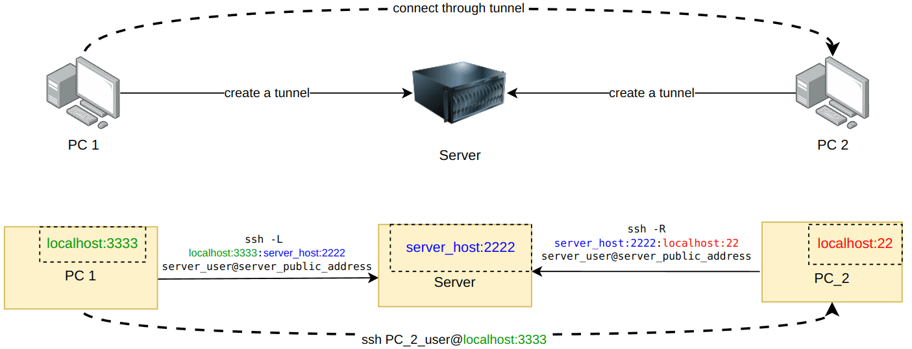

- [1. Diagram](#1-diagram)
- [2. Remote Forwarding](#2-remote-forwarding)
- [3. Local Forwarding](#3-local-forwarding)
- [4. reference](#4-reference)

# 1. Diagram



[Link to this flow](https://drive.google.com/file/d/1128e6AAZQdWvPZPdr9xcEj1-A9HLOnC_/view?usp=drive_link)

In the above flow, after create ssh tunnels from PC1 and PC2 to remote server, then we can ssh from PC1 to PC2 through these tunnels by command `ssh PC_2_user@localhost:3333`. See below explanation

# 2. Remote Forwarding

Remote Forwarding allows anyone on the remote server to connect to TCP port 22 of PC2 through port 2222 on the remote server. [See more here](https://www.ssh.com/academy/ssh/tunneling-example#remote-forwarding)

```shell
PC2_HOST=localhost
PC2_PORT=22
SERVER_HOST=localhost # any address that is accessible on server, 
                         # if not sepcify this addess, its default is localhost
SERVER_PORT=2222
SERVER_PUBLIC_ADDRESS=public.example.com
SERVER_USER=user
ssh $SERVER_USER@$SERVER_PUBLIC_ADDRESS \
    -fN \
    -R $SERVER_HOST:$SERVER_PORT:$PC2_HOST:$PC2_PORT

# or simply 
ssh -R 2222:localhost:22 ubuntu@3.210.251.138
```

# 3. Local Forwarding

Local forwarding is used to forward a port from the client machine to a port on the server machine. In this example we are forwording traffic from port 3333 in PC1 to port 2222 in the server. [See more here](https://www.ssh.com/academy/ssh/tunneling-example#local-forwarding)

```shell
PC1_HOST=localhost
PC1_PORT=3333
SERVER_HOST=localhost # any address that is accessible on server, 
                         # if not sepcify this addess, its default is localhost
SERVER_PORT=2222
SERVER_PUBLIC_ADDRESS=public.example.com
SERVER_USER=user
ssh $SERVER_USER@$SERVER_PUBLIC_ADDRESS \
    -o ExitOnForwardFailure=yes \
    -o UserKnownHostsFile=/dev/null \
    -o StrictHostKeyChecking=no \
    -fN \
    -L $PC1_PORT:$SERVER_HOST:$SERVER_PORT

# or specify local host
ssh $SERVER_USER@$SERVER_PUBLIC_ADDRESS \
    -o ExitOnForwardFailure=yes \
    -o UserKnownHostsFile=/dev/null \
    -o StrictHostKeyChecking=no \
    -fN \
    -L $PC1_HOST:$PC1_PORT:$SERVER_HOST:$SERVER_PORT
    
# test:
telnet localhost $PC1_PORT <<EOF
ls
EOF
```

example

```shell
ssh xuananh@localhost \
    -o ExitOnForwardFailure=yes \
    -o UserKnownHostsFile=/dev/null \
    -o StrictHostKeyChecking=no \
    -fN \
    -L 8001:ubuntu.com:80
# now access: http://localhost:8001 it will redirect to http://ubuntu.com:80
```

you can open tunnel for multiple destination server, ex:

```shell
ssh xuananh@localhost \
    -o ExitOnForwardFailure=yes \
    -o UserKnownHostsFile=/dev/null \
    -o StrictHostKeyChecking=no \
    -fN \
    -L 12345:github.com:443 \
    -L 12346:ubuntu.com:443 \
    -L 12347:www.ubuntuforums.org:443 \
    -L 12348:google.com:443 \
    -L 12349:google.com:80

# now access: https://localhost:12345 it will redirect to https://github.com:443
# now access: https://localhost:12346 it will redirect to https://ubuntu.com:443
# now access: https://localhost:12347 it will redirect to http://httpbin.org:80
# now access: https://localhost:12348 it will redirect to https://google.com:443
# now access: http://localhost:12349 it will redirect to http://google.com:80

```

# 4. reference

https://www.ssh.com/academy/ssh/tunneling

https://www.ssh.com/academy/ssh/tunneling/example

https://www.ssh.com/academy/ssh/sshd_config#port-forwarding

https://transang.me/cach-tao-duong-ham-qua-ssh/

https://kipalog.com/posts/Tu-tao-SSH-tunnel-de-forward-port-ra-remote-server

https://tech.miichisoft.net/remote-port-forwarding-voi-ssh-tunnel/

https://bizflycloud.vn/tin-tuc/cac-ky-thuat-huu-ich-khi-su-dung-ssh-307.htm#2tunnelling