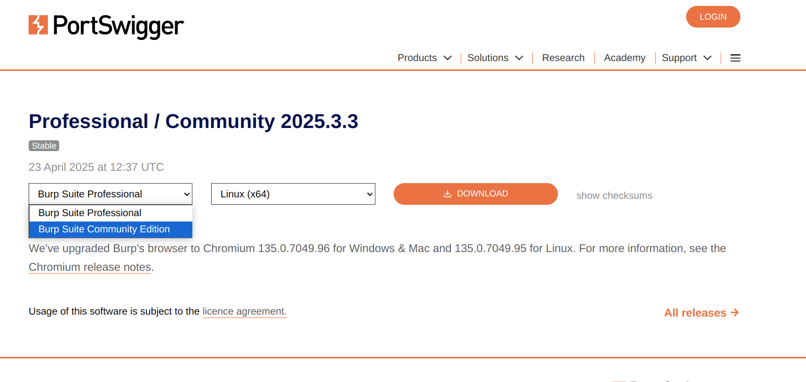
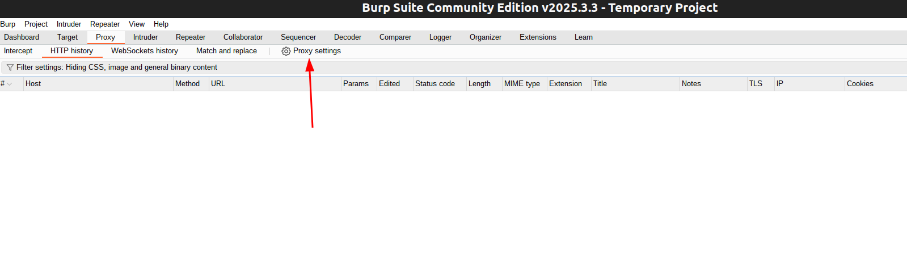
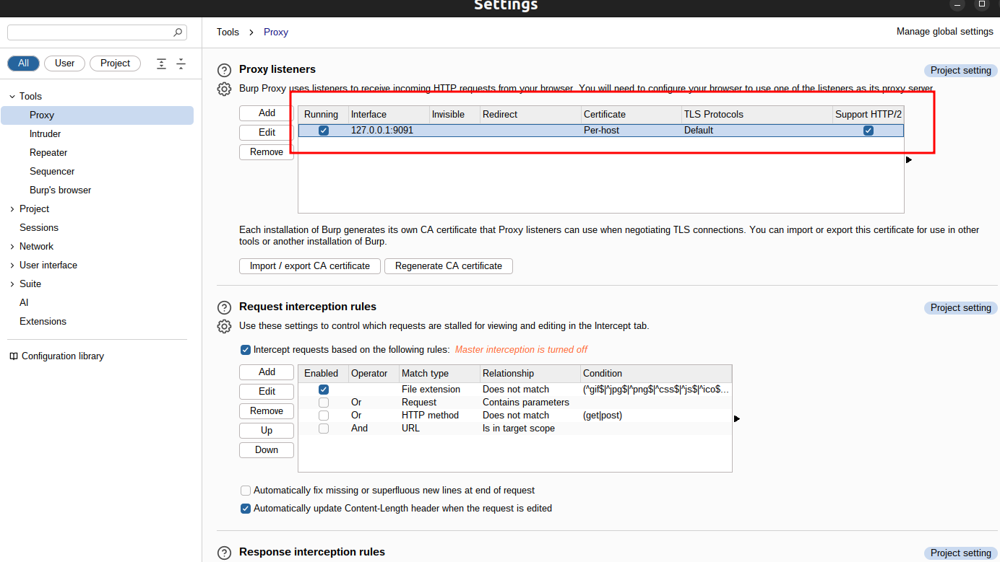
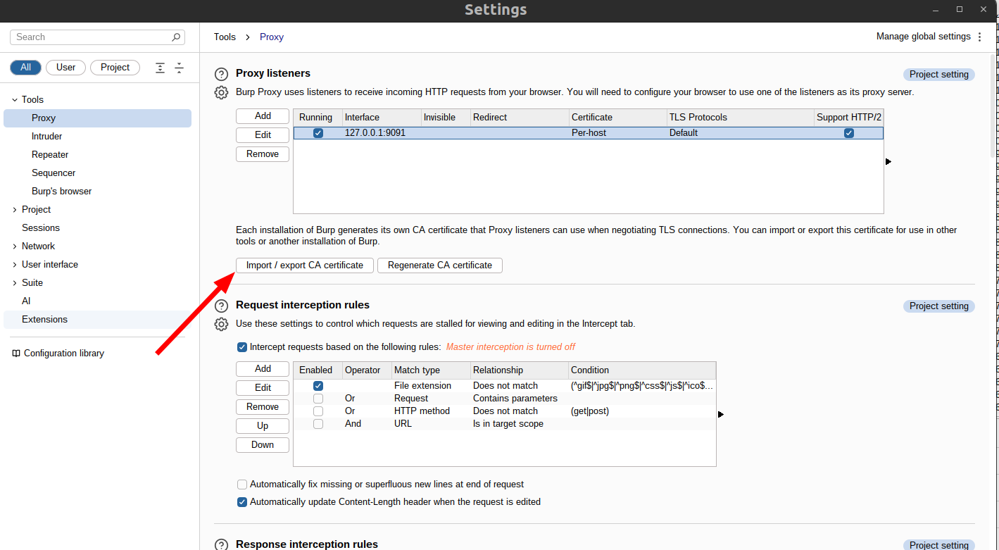
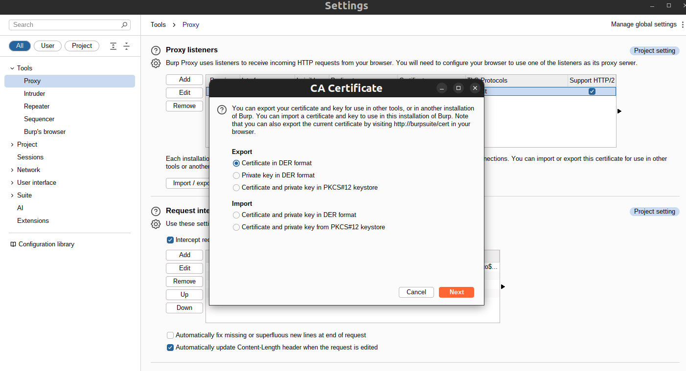
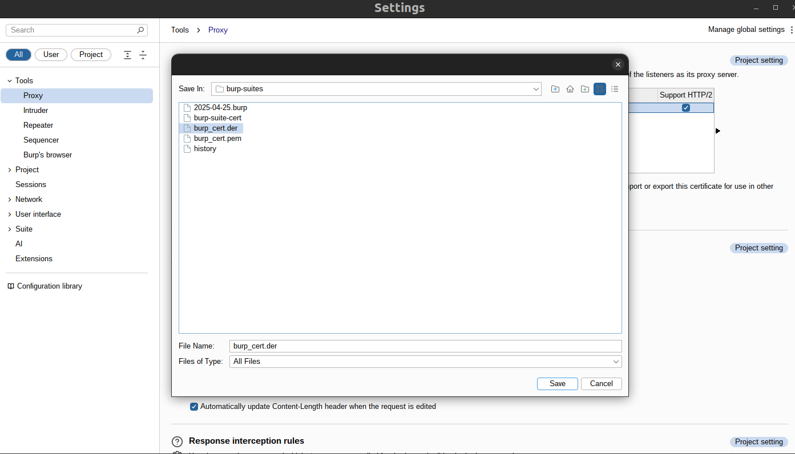

- [1. Install burp suite community](#1-install-burp-suite-community)
- [2. Setup proxy](#2-setup-proxy)
- [3. Setup burp suite certificate](#3-setup-burp-suite-certificate)
- [4. Run app with burp suite proxy](#4-run-app-with-burp-suite-proxy)
  - [4.1. App natively support proxy setting](#41-app-natively-support-proxy-setting)
  - [4.2. App doesn't natively support proxy setting](#42-app-doesnt-natively-support-proxy-setting)
    - [4.2.1. using http\_proxy and https\_proxy environment variables](#421-using-http_proxy-and-https_proxy-environment-variables)
    - [4.2.2. using proxychains](#422-using-proxychains)
- [5. Android device](#5-android-device)
  - [5.1. Installing Burp's CA certificate android](#51-installing-burps-ca-certificate-android)
  - [5.2. sample bypass ssl pinning for any application on android](#52-sample-bypass-ssl-pinning-for-any-application-on-android)
  - [5.3. bypass ssl pinning for Facebook on android Facebook](#53-bypass-ssl-pinning-for-facebook-on-android-facebook)

# 1. Install burp suite community

Download **Community version** from this link : https://portswigger.net/burp/releases/community/latest


```shell
chmod +x burpsuite_community_linux_v*.sh
./burpsuite_community_linux_v*.sh
```

# 2. Setup proxy



# 3. Setup burp suite certificate




Step 1: Export Burp’s Certificate

In Burp:

    Go to Proxy → Options → Import / export CA certificate

    Choose “Export certificate in DER format”

    Save as: burp_cert.der



Step 2: Convert to PEM (Linux prefers PEM)

```shell
openssl x509 -inform DER -in burp_cert.der -out burp_cert.pem
```

Step 3: Install to system CA store

```shell
sudo cp burp_cert.pem /usr/local/share/ca-certificates/burp_cert.crt
sudo update-ca-certificates
```

# 4. Run app with burp suite proxy

## 4.1. App natively support proxy setting

Example: chrome

```shell
google-chrome-stable --proxy-server="127.0.0.1:8080"
```

## 4.2. App doesn't natively support proxy setting

App doesn't natively support proxy setting or it hard to use app's proxy settings

### 4.2.1. using http_proxy and https_proxy environment variables

```shell
export http_proxy=http://127.0.0.1:9091
export https_proxy=http://127.0.0.1:9091
~/.Cursor-0.49.2-x86_64/AppRun
```

### 4.2.2. using proxychains

you're going for the Proxychains + Burp Suite + Privoxy setup to make SOCKS-only apps work with Burp. This is a powerful combo that lets you:

    Use proxychains to route apps through SOCKS5 (like Tor)

    Use Privoxy to bridge SOCKS5 → HTTP

    Use Burp Suite as the final HTTP proxy for interception

Here’s how to set that up step-by-step on Ubuntu:

1. Install the tools

```shell
sudo apt update
sudo apt install proxychains4 privoxy
```

2. Configure Burp Suite
    Open Burp Suite

    Go to Proxy → Options

    Make sure you have a listener on 127.0.0.1:8080

    You don't need to configure any upstream proxy inside Burp (Privoxy handles that)

3. Configure Privoxy to forward to Burp
Edit the Privoxy config:

```shell
sudo vim /etc/privoxy/config
```

Scroll to the bottom and add:

```shell
forward / 127.0.0.1:8080 .
```

This tells Privoxy to forward all HTTP/S requests to Burp on port 8080.

Restart Privoxy:

```shell
sudo systemctl restart privoxy
```

Now Privoxy is listening on `127.0.0.1:8118` by default and forwarding to Burp.

4. Configure Proxychains to use Privoxy

Create a new pc.conf file with this content

```shell
[ProxyList]
http 127.0.0.1 8118
```

Run your app with proxy

```shell
proxychains -f pc.conf ~/.Cursor-0.46.8-x86_64/AppRun1
```

# 5. Android device

## 5.1. Installing Burp's CA certificate android

**NOTE**: to get certificates, android devices must be connected to burp proxy, as guide here : https://portswigger.net/support/configuring-an-android-device-to-work-with-burp

how to get certificates here : https://portswigger.net/support/installing-burp-suites-ca-certificate-in-an-android-device

## 5.2. sample bypass ssl pinning for any application on android

sample setup burp suite certificates for android genymotion and bypass ssl pinning here

[../../sample/devops/ssl/frida-ssl-pinning-bypass/Readme.md](../../sample/devops/ssl/frida-ssl-pinning-bypass/Readme.md)

## 5.3. bypass ssl pinning for Facebook on android Facebook

**NOTE: require ROOTED device or you can using device run on Genymotion**

To intercept request from facebook, first, you have to patch `so` file of facebook as guide here [../../sample/devops/ssl/FBUnpinner/README.md](../../sample/devops/ssl/FBUnpinner/README.md) or here : https://github.com/tsarpaul/FBUnpinner

summary command : 

```shell
# below command using android vm run on Genymotion
alias adb=/opt/genymobile/genymotion/tools/adb

# mobile
adb devices
adb shell
ls /data/data/com.facebook.katana/lib-xzs/libcoldstart.so
cp /data/data/com.facebook.katana/lib-xzs/libcoldstart.so /data/local/tmp/libcoldstart.so

# pc
cd ~/repo/tech-note/sample/devops/ssl/FBUnpinner/
pip install pyelftools

adb pull /data/local/tmp/libcoldstart.so .
python patch.py libcoldstart.so libcoldstart-patched.so
adb push libcoldstart-patched.so /data/local/tmp/libliger-patched.so

# mobile
rm -rf /data/data/com.facebook.katana/lib-xzs/libcoldstart.so
cp /data/local/tmp/libliger-patched.so /data/data/com.facebook.katana/lib-xzs/libcoldstart.so
chmod 777 /data/data/com.facebook.katana/lib-xzs/libcoldstart.so
```

restart facebook app or restart your virtual device
