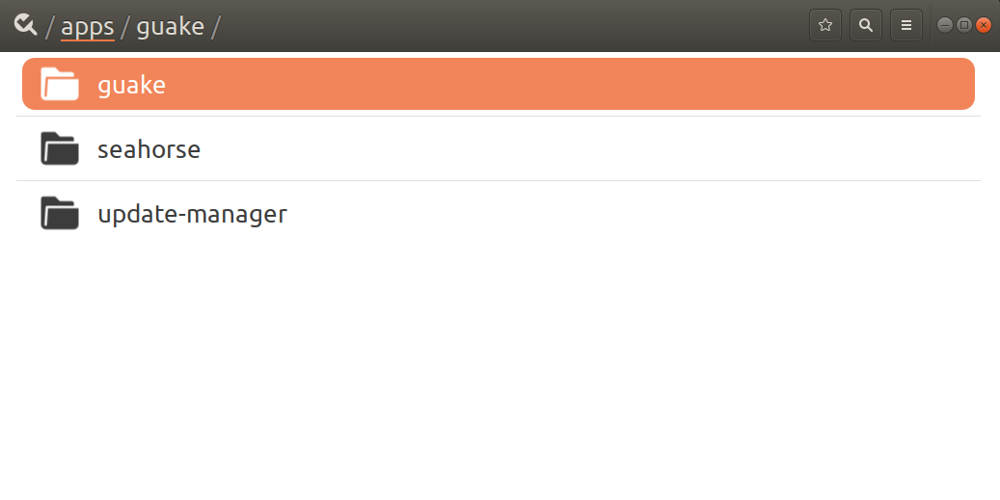
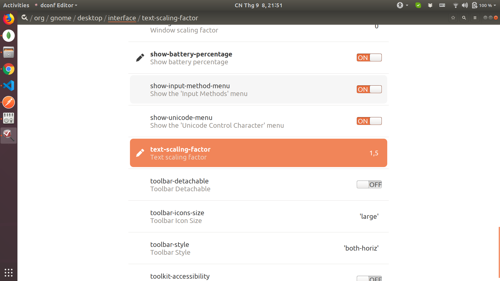
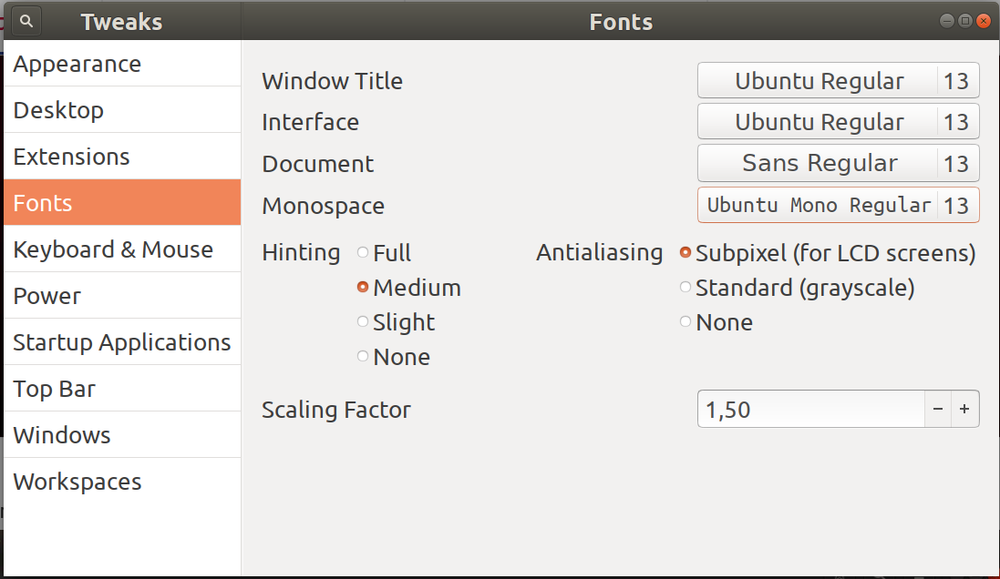

Các thiết lập sau khi cài đặt mới ubuntu
---

- [1. dconf](#1-dconf)
  - [1.1. Command line](#11-command-line)
  - [1.2. dconf-editor](#12-dconf-editor)
  - [1.3. tweaks](#13-tweaks)

# 1. dconf

Có nhiều app lưu các thiết lập trong dconf, ví dụ: **guake**, **terminal**, hay các thiết lập **font**

Các công cụ để chỉnh sửa thiết lập này: **command line**, **dconf-editor**, **tweaks**


## 1.1. Command line

```shell
# list các app hay các thiết lập của các app đó
dconf list /apps/guake/
dconf list /org/gnome/
dconf list /org/gnome/desktop/interface/

# backup 
dconf dump / > saved_settings.dconf
# restore
dconf load / < saved_settings.dconf


# chỉ backup và restore một app cụ thể nào đó, ví dụ guake
# backup guake
dconf dump /apps/guake/ > ${HOME}/Dropbox/Work/Other/conf.d/guake/config.ini
# restore guake
dconf reset -f /apps/guake/
dconf load /apps/guake/ < ${HOME}/Dropbox/Work/Other/conf.d/guake/config.ini
```

## 1.2. dconf-editor

**NOTE:** tool này chỉnh sửa khá mạo hiểm, có thể gây ra lỗi hệ thông

**Install dconf-editor**

```shell
sudo apt-get install dconf-editor -y
```






## 1.3. tweaks

Tool này chỉnh sửa an toàn hơn:

```shell
sudo apt-get install tweaks -y
```




