- [1. Install](#1-install)
- [2. Some concepts in PulseAudio](#2-some-concepts-in-pulseaudio)
  - [2.1. PulseAudio concepts](#21-pulseaudio-concepts)
  - [2.2. Describe PulseAudioControl GUI tabs](#22-describe-pulseaudiocontrol-gui-tabs)
- [3. Make Schemas to setup audio streams](#3-make-schemas-to-setup-audio-streams)
- [4. Set up base on Schemas](#4-set-up-base-on-schemas)
  - [4.1. Create virtual output device (null sink)](#41-create-virtual-output-device-null-sink)
  - [4.2. Stream audio of Applications to Real devices through Virtual devices](#42-stream-audio-of-applications-to-real-devices-through-virtual-devices)
    - [4.2.1. List all current sinks in the system to use in next step](#421-list-all-current-sinks-in-the-system-to-use-in-next-step)
    - [4.2.2. Using module-combine-sink](#422-using-module-combine-sink)
    - [4.2.3. Using module-loopback](#423-using-module-loopback)
  - [4.3. Create virtual input device from Virtual outpu device](#43-create-virtual-input-device-from-virtual-outpu-device)
  - [4.4. Setup client applications audio](#44-setup-client-applications-audio)
    - [4.4.1. Setup directly in client application](#441-setup-directly-in-client-application)
    - [4.4.2. Setup using PulseAudio GUI](#442-setup-using-pulseaudio-gui)
  - [4.5. Other commands for troubleshooting](#45-other-commands-for-troubleshooting)
- [5. Permanently above setup](#5-permanently-above-setup)
- [6. Reference](#6-reference)


# 1. Install

```shell
sudo apt install pulseaudio -y
# Install pulseaudio GUI
sudo apt install pavucontrol -y
```

# 2. Some concepts in PulseAudio

## 2.1. PulseAudio concepts

- **Client**: slack, skype, GStreamer, MPlayer,...
- **Sinks**: imply output devices, That includes real sink(speaker, headphones) and virtual (null) sinks that are created using command `pactl load-module module-null-sink`...
- **Sources**: imply input devices, that includes real devices(built-in microphone, headphone's microphone), virtual microphone that are created using command `pactl load-module module-virtual-source` or `pactl load-module module-remap-source`, ...
- Only the device drivers/audio interfaces can be either sources or sinks (they are often hardware in- and out-puts).
- A `loopback device` is a virtual device created with the `module-loopback` of pulseaudio
    - A loopback has exactly one input and one output.
    - loopback device always forward audio from a input to output
    - input source can be a `source` or a `sink` as described above
    - output source is always a `sink`
    - loopback devices are used to connect `sinks/sources` with `sink` regardless they are real or virtual sinks/sources

References: 

https://unix.stackexchange.com/questions/260981/what-do-the-sink-and-source-keywords-mean-in-pulseaudio


## 2.2. Describe PulseAudioControl GUI tabs

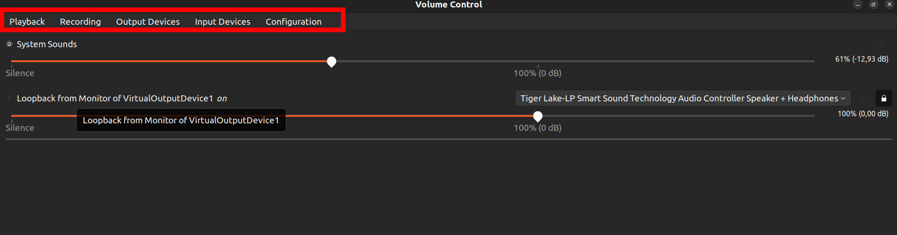

- Output devices: List all available `sinks` (output devices) in the system, including real sinks and virtual sinks.
- Input devices: List all available input devices in the system, including real input devices and virtual input devices  
- Playback: List all running processes (skype, slack, google meeting running in chrome, youtube running in chrome,...) that are playing audio and which Output devices those processes are emitting audio to. This tab also lists all `loopback devices`
- Recording: List all processes that are recording audio (skype, slack, google meet, audio recorder software,...) and which Input device those processes are capturing from. This tab also lists all `loopback devices` 

# 3. Make Schemas to setup audio streams

Purpose of this setup is to redirect audio from video conference applications (slack, skype, google meet) to 2 destinations:
- redirect google docs voice typing function to automatically transcript audio of video conference applications
- redirect to real output devices (speaker, headphones) to be able to hear audio of video conference applications

To do that we have to create a virtual output device to receive audio from video conference applications, then using this new created virtual output device to redirect audio to 2 above destinations

Using module-combine-sink (**recommended**)
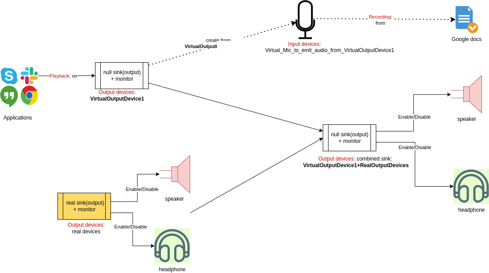

Using module-loopback


link to above image : https://app.diagrams.net/#G1DWy-Qx-jM86YOKDeggqrN43ccsJEKw5K#%7B%22pageId%22%3A%22U9tqt51FlupvkOq0WFdn%22%7D

# 4. Set up base on Schemas

Based on above schema, we need to create 3 components

## 4.1. Create virtual output device (null sink)

create a virtual output device to receive audio output from an application (in this case, it's zoom or gg meet)

```shell
pactl load-module module-null-sink \
    sink_name=VirtualOutputDevice1 \
    sink_properties=device.description="VirtualOutputDevice1"
```

it will be shown in GUI as below


## 4.2. Stream audio of Applications to Real devices through Virtual devices

There are 2 method to do that:
- Using module-combine-sink (recommended method)
- Using module-loopback (not recommended, do not understood completely, sometimes sound of application also be streamed to all Input devices, I don't know why)

### 4.2.1. List all current sinks in the system to use in next step

```shell
# using this command to list out all sinks (output devices)
pactl list short sinks
# output :
# 0	alsa_output.pci-0000_00_1f.3-platform-skl_hda_dsp_generic.HiFi__hw_sofhdadsp__sink	module-alsa-card.c	s16le 2ch 48000Hz	IDLE
# 1	VirtualOutputDevice1	module-null-sink.c	s16le 2ch 44100Hz	IDLE
```

### 4.2.2. Using module-combine-sink 

```shell
# slaves list of sinks id or sinks name that are listed in above commands

# using sink id
pactl load-module module-combine-sink sink_name=VirtualOutputDevice1+RealOutputDevices sink_properties=device.description="VirtualOutputDevice1+RealOutputDevices" slaves=0,1

# using sink name
pactl load-module module-combine-sink sink_name=VirtualOutputDevice1+RealOutputDevices sink_properties=device.description="VirtualOutputDevice1+RealOutputDevices" slaves=alsa_output.pci-0000_00_1f.3-platform-skl_hda_dsp_generic.HiFi__hw_sofhdadsp__sink,VirtualOutputDevice1
```

The above command with create a new virtual output device that combine of VirtualOutputDevice1 and RealOutputDevice

it will be shown in GUI as below

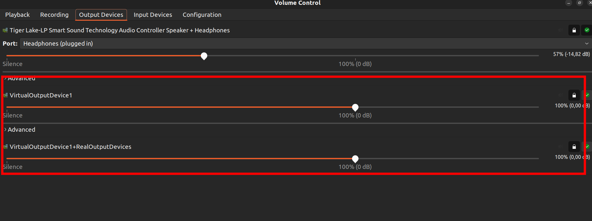

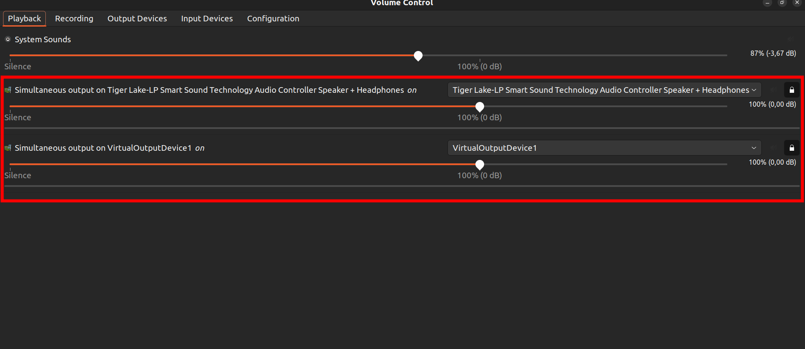

### 4.2.3. Using module-loopback

```shell
# to get speaker name using above command
SPEAKERS=alsa_output.pci-0000_00_1f.3-platform-skl_hda_dsp_generic.HiFi__hw_sofhdadsp__sink

pactl load-module module-loopback \
    source=VirtualOutputDevice1.monitor \
    sink="${SPEAKERS}" latency_msec=1
```

it will be shown in GUI as below

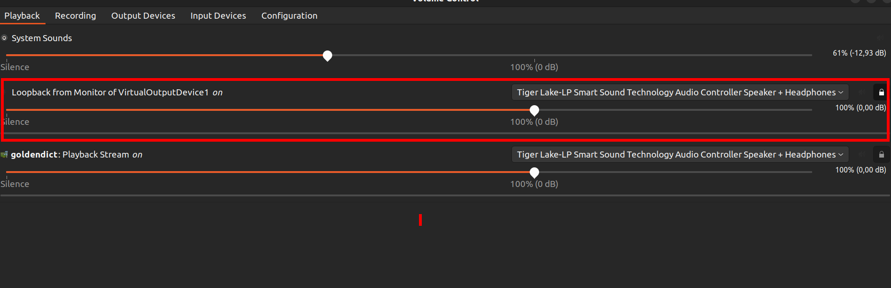
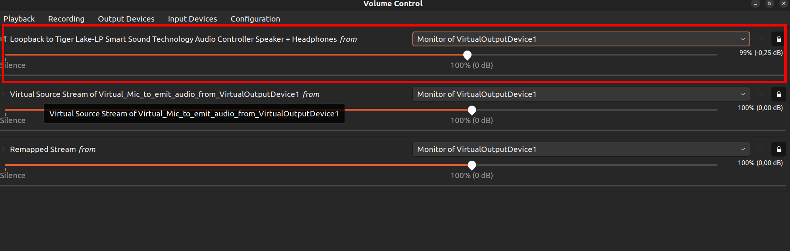


## 4.3. Create virtual input device from Virtual outpu device

create an virtual input device to send audio from virtual output device created above to this input device, then an application (google docs voice typing) can using this virtual input device to receive audio from another application

application1 -> virtual output device -> virtual input device -> application 2

using this command to create a virtual input device

```shell
pactl load-module module-virtual-source \
    source_name=VirtualMicrophone \
    master=VirtualOutputDevice1.monitor \
    source_properties=device.description="Virtual_Mic_to_emit_audio_from_VirtualOutputDevice1"
```

other command to create a virtual input device

```shell
pactl load-module module-remap-source \
    source_name=VirtualMicrophone1 \
    master=VirtualOutputDevice1.monitor \
    source_properties=device.description="Virtual_Mic1_to_emit_audio_from_VirtualOutputDevice1"
```

it will be shown in GUI as below

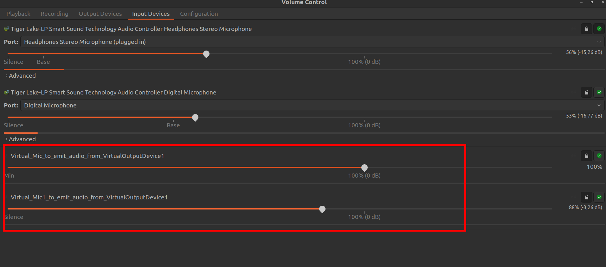

## 4.4. Setup client applications audio

Setup client applications to redirect audio to right output and input device

There are 2 methods to setup client applications audio

### 4.4.1. Setup directly in client application

Restart all client applications

setup google meet or skype or slack to output audio to virtual output device


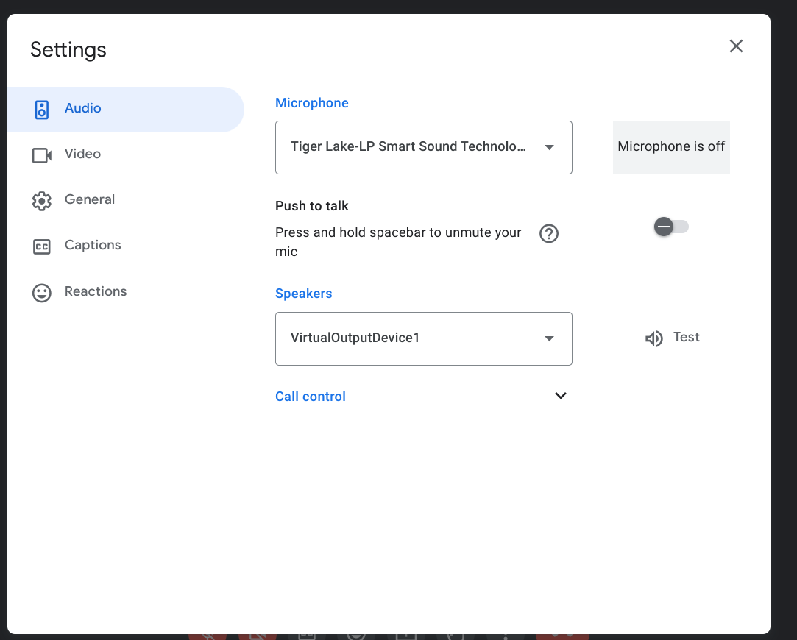

setup google docs voice typing to choose virtual input device

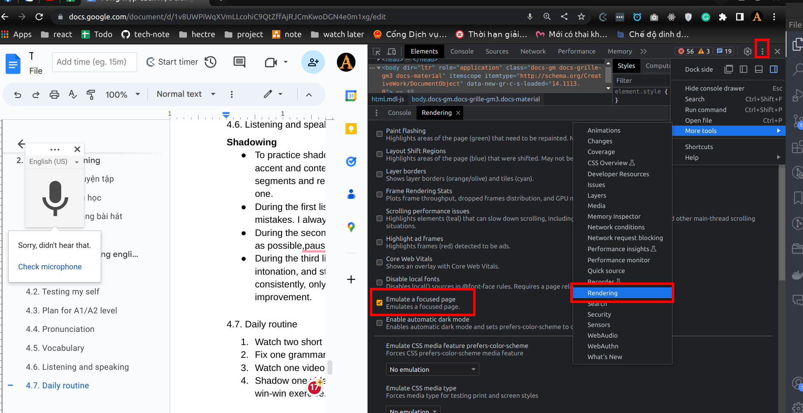

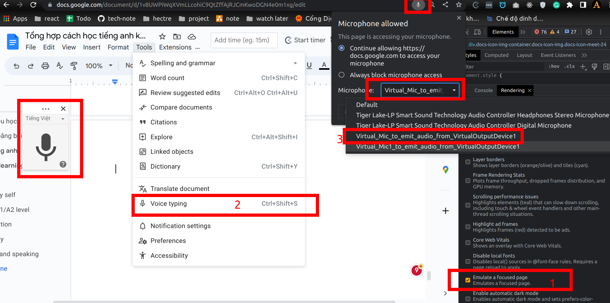

### 4.4.2. Setup using PulseAudio GUI

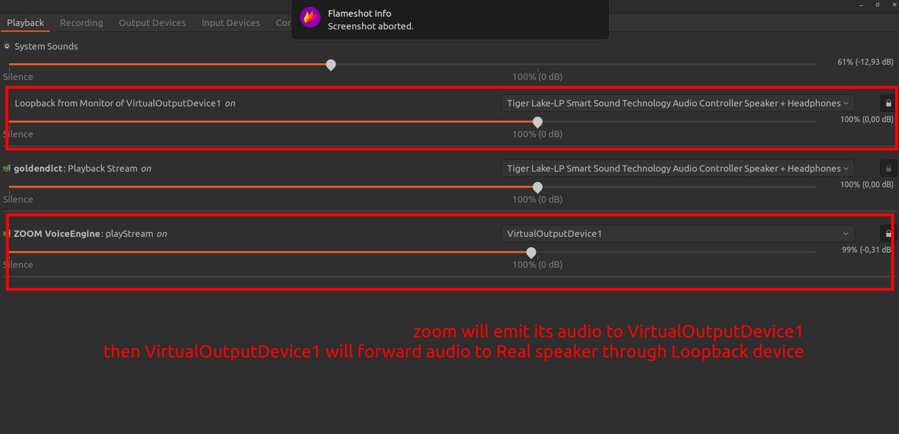


## 4.5. Other commands for troubleshooting

reset pulseaudio: `pulseaudio --kill && pulseaudio --start`

if you cannot hear from a real output device, using this command to check `alsamixer`

# 5. Permanently above setup

Add below lines to file: 

```shell
sudo cp /etc/pulse/default.pa /etc/pulse/default.pa.bk
sudo vim /etc/pulse/default.pa
```

```shell
load-module module-null-sink sink_name=VirtualOutputDevice1 sink_properties=device.description="VirtualOutputDevice1"

load-module module-virtual-source source_name=VirtualMicrophone master=VirtualOutputDevice1.monitor source_properties=device.description="Virtual_Mic_to_emit_audio_from_VirtualOutputDevice1"

# using module-combine-sink 
load-module module-combine-sink sink_name=VirtualOutputDevice1+RealOutputDevices sink_properties=device.description="VirtualOutputDevice1+RealOutputDevices" slaves=alsa_output.pci-0000_00_1f.3-platform-skl_hda_dsp_generic.HiFi__hw_sofhdadsp__sink,VirtualOutputDevice1

# using module-loopback
load-module module-loopback source=VirtualOutputDevice1.monitor sink="alsa_output.pci-0000_00_1f.3-platform-skl_hda_dsp_generic.HiFi__hw_sofhdadsp__sink" latency_msec=1

```

then run cmd:

```shell
pulseaudio -k
# or
pulseaudio --kill && pulseaudio --start
```

# 6. Reference

https://askubuntu.com/questions/257992/how-can-i-use-pulseaudio-virtual-audio-streams-to-play-music-over-skype

https://github.com/toadjaune/pulseaudio-config

https://endless.ersoft.org/pulseaudio-loopback/

https://www.freedesktop.org/wiki/Software/PulseAudio/About/

https://wiki.archlinux.org/title/PulseAudio/Examples

