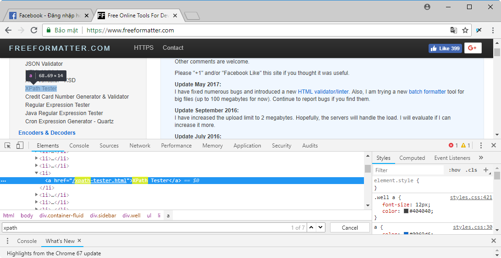

Selenium Webdriver 2: Selenium WebDriver Locators – xác định vị trí phần tử HTML
----------------------------------------------------------------------------------

- [1. Sử dụng Locators](#1-sử-dụng-locators)
  - [1.1. Theo ID](#11-theo-id)
  - [1.2. Theo Name](#12-theo-name)
  - [1.3. Theo class name](#13-theo-class-name)
  - [1.4. Theo tag name](#14-theo-tag-name)
  - [1.5. Bằng văn bản liên kết](#15-bằng-văn-bản-liên-kết)
  - [1.6. Bằng văn bản liên kết một phần](#16-bằng-văn-bản-liên-kết-một-phần)
  - [1.7. Theo CSS](#17-theo-css)
  - [1.8. XPath](#18-xpath)
- [2. Reference](#2-reference)

Định vị các phần tử trong Selenium WebDriver được thực hiện với sự trợ giúp của các phương thức **findElement()** và **findElements()** được cung cấp bởi lớp **WebDriver** và **WebElement**.

- **findElement()**: trả về một đối tượng WebElement dựa trên một tiêu chí tìm kiếm cụ thể hoặc ném một ngoại lệ nếu nó không tìm thấy bất kỳ phần tử nào phù hợp với tiêu chí tìm kiếm.
- **findElements()**: trả về một danh sách các WebElements khớp với các tiêu chí tìm kiếm. Nếu không tìm thấy phần tử nào, nó sẽ trả về một danh sách trống.
Bảng sau liệt kê tất cả cú pháp Java để định vị các phần tử trong Selenium WebDriver.

| Phương thức                    | Cú pháp                                             | Header3                                               |
| :----------------------------- | :-------------------------------------------------- | :---------------------------------------------------- |
| Theo ID                        | driver.findElement(By.id (<element ID>))            | Định vị một phần tử bằng thuộc tính ID                |
| Theo name                      | driver.findElement(By.name (<element name>))        | Định vị một phần tử bằng cách sử dụng thuộc tính Name |
| Theo class name                | driver.findElement(By.className (<element class>))  | Định vị một phần tử bằng thuộc tính Class             |
| Theo tag name                  | driver.findElement(By.tagName (<htmltagname>))      | Định vị một phần tử bằng cách sử dụng thẻ HTML        |
| Bằng văn bản liên kết          | driver.findElement(By.linkText (<linktext>))        | Tìm liên kết bằng văn bản liên kết                    |
| Bằng văn bản liên kết một phần | driver.findElement(By.partialLinkText (<linktext>)) | Định vị liên kết bằng văn bản một phần của liên kết   |
| Theo CSS                       | driver.findElement(By.cssSelector (<css selector>)) | Định vị một phần tử bằng cách sử dụng bộ chọn CSS     |
| Theo XPath                     | driver.findElement(By.xpath (<xpath>))              | Định vị một phần tử bằng cách sử dụng truy vấn XPath  |


# 1. Sử dụng Locators

Bây giờ chúng ta hãy hiểu cách sử dụng thực tế của mỗi phương pháp định vị, áp dụng trên trang https://facebook.com và https://www.freeformatter.com/.

## 1.1. Theo ID

Ở đây một đối tượng được truy cập với sự trợ giúp của các ID. Trong trường hợp này, nó là ID của hộp văn bản. Giá trị được nhập vào hộp văn bản bằng cách sử dụng phương thức sendkeys với sự trợ giúp của ID.

```java
driver.findElement(By.id("email")).sendKeys("tuttut@gmail.com");
```


## 1.2. Theo Name

Ở đây một đối tượng được truy cập với sự trợ giúp của các ID. Trong trường hợp này, nó là name của hộp văn bản. Giá trị được nhập vào hộp văn bản bằng cách sử dụng phương thức sendkeys với sự trợ giúp của name.

```java
driver.findElement(By.name("email")).sendKeys("tuttut@gmail.com");
```


## 1.3. Theo class name
Ở đây một đối tượng được truy cập với sự giúp đỡ của Class Names. Trong trường hợp này, nó là tên lớp của WebElement. Giá trị có thể được truy cập với sự trợ giúp của phương thức gettext.

```java
List<WebElement> byclass = driver.findElements(By.className("inputtext")));
```


## 1.4. Theo tag name

Tên thẻ DOM của phần tử có thể được sử dụng để định vị phần tử cụ thể đó trong WebDriver. Nó rất dễ dàng để xử lý các bảng với sự trợ giúp của phương thức này. Hãy xem mã sau đây.

```java
WebElement table = driver.findElement(By.id("content"));
List<WebElement> row = table.findElements(By.tagName("tr"));
int rowcount = row.size();
```

## 1.5. Bằng văn bản liên kết

Phương pháp này giúp xác định phần tử liên kết với văn bản hiển thị phù hợp.

```java
driver.findElement(By.linkText("JSON Formatter")).click();
```


## 1.6. Bằng văn bản liên kết một phần

Phương pháp này giúp định vị phần tử liên kết với văn bản có thể nhìn thấy một phần phù hợp.

```java
List<WebElement> listLinks = driver.findElements(By.partialLinkText("XPath"));
```



## 1.7. Theo CSS
CSS được sử dụng như một phương thức để xác định webobject, tuy nhiên KHÔNG phải tất cả các trình duyệt đều hỗ trợ nhận dạng CSS.

```java
WebElement loginButton = driver.findElement(By.cssSelector("input.login"));
```

## 1.8. XPath

XPath là viết tắt của ngôn ngữ đường dẫn XML. Nó là một ngôn ngữ truy vấn để chọn các node từ một tài liệu XML. XPath dựa trên biểu diễn cây của các tài liệu XML và cung cấp khả năng điều hướng xung quanh cây bằng cách chọn các node bằng cách sử dụng nhiều tiêu chí khác nhau. Đây là một sự lựa chọn phổ biến vì tính linh động của nó.

Bạn có thể sử dụng **ChroPath** plugin trên trình duyệt Firefox hoặc Chrome để xác định chuỗi XPath cho các phần tử HTML.

```java
driver.findElement(By.xpath("//a[@href='/json-formatter.html']"
        + "[contains(text(),'JSON Formatter')]")).click();
```


# 2. Reference

[http://viettuts.vn/selenium/selenium-webdriver-locators-xac-dinh-vi-tri-phan-tu-html](http://viettuts.vn/selenium/selenium-webdriver-locators-xac-dinh-vi-tri-phan-tu-html)