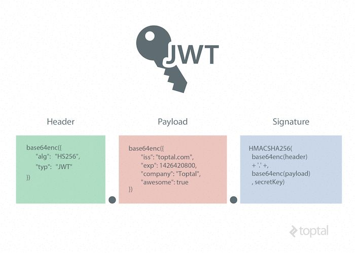
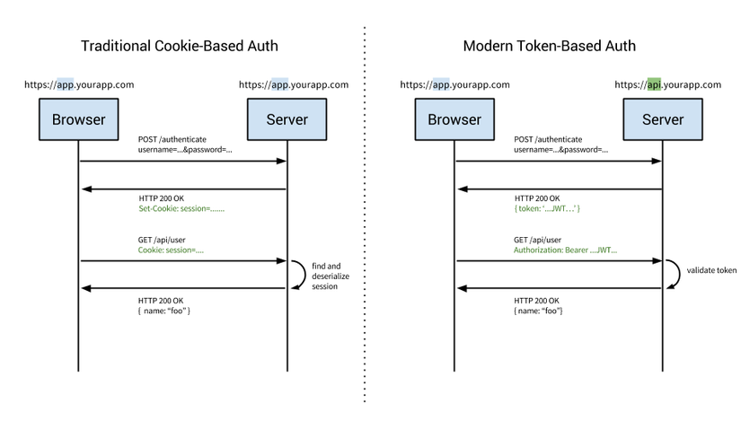
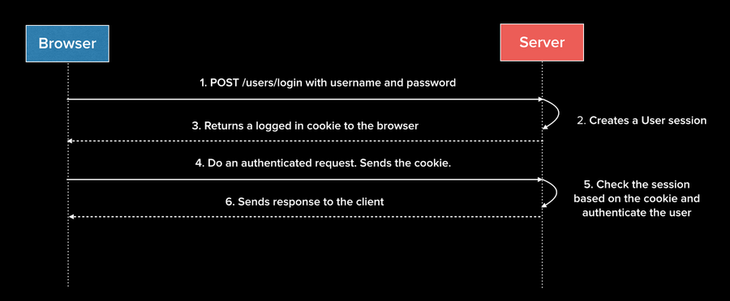
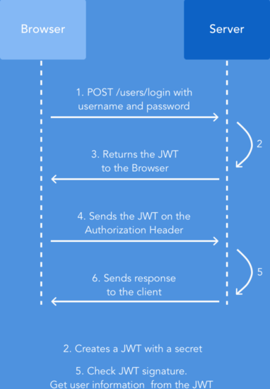

- [1. Token-based authentication là gì?](#1-token-based-authentication-là-gì)
- [2. JWT - JSON Web Token là gì?](#2-jwt---json-web-token-là-gì)
- [3. Cấu trúc của một JWT](#3-cấu-trúc-của-một-jwt)
  - [3.1. Header](#31-header)
  - [3.2. Payload](#32-payload)
  - [3.3. Signature](#33-signature)
- [4. Luồng xử lý của 1 hệ thống sử dụng bảo mật JWT](#4-luồng-xử-lý-của-1-hệ-thống-sử-dụng-bảo-mật-jwt)
  - [4.1. Sơ lược về luồng xử lý](#41-sơ-lược-về-luồng-xử-lý)
  - [4.2. Hệ thống Verify chuỗi JWT thế nào?](#42-hệ-thống-verify-chuỗi-jwt-thế-nào)
- [5. JWT vs Session](#5-jwt-vs-session)
  - [5.1. Authen bằng Cookie](#51-authen-bằng-cookie)
  - [5.2. Authen bằng JWT token](#52-authen-bằng-jwt-token)
- [6. Trả lời câu hỏi về JWT](#6-trả-lời-câu-hỏi-về-jwt)
- [7. References](#7-references)

# 1. Token-based authentication là gì?

- **Token-based authentication** là phương thức xác thực bằng chuỗi má hóa. 
- Một hệ thống sử dụng **Token-based authentication** cho phép người dùng nhập **user/password** (hoặc tương tự) để nhận về 1 chuỗi mã token. 
- Mã này được sử dụng để **"xác minh"** quyền truy cập vào tài nguyên mà không cần phải cung cấp lại **username/password** nữa. Đọc thêm [tại đây](https://www.w3.org/2001/sw/Europe/events/foaf-galway/papers/fp/token_based_authentication/)
- **JWT** là một loại **Token-based authentication**

# 2. JWT - JSON Web Token là gì?

- Hiểu đơn giản, ban đầu, chuỗi thông tin ấy là 1 chuỗi dạng JSON (easy readable) , sau đó bằng phương pháp mã hóa nào đó, nó trở thành 1 chuỗi ký tự lộn xộn ( có thể hiểu là như vậy ) mà mà mắt thường mình nhìn chả hiểu nó có những thông tin gì :d
- Định nghĩa chuẩn, **JSON Web Token (JWT)** là 1 tiêu chuẩn mở **(RFC 7519)** định nghĩa cách thức truyền tin an toàn giữa các thành viên bằng 1 đối tượng JSON. Thông tin này có thể được xác thực và đánh dấu tin cậy nhờ vào **"chữ ký"** của nó. Phần chữ ký của JWT sẽ được mã hóa lại bằng **HMAC** hoặc **RSA**
  
# 3. Cấu trúc của một JWT

Dưới đây là 1 JSON Web Token: 

```shell
eyJhbGciOiJIUzI1NiIsInR5cCI6IkpXVCJ9.
eyJzdWIiOiJuaHMzMTA4IiwiZXhwIjoxNTU4MDYzODM3fQ.
449KVmOFWcpOUjnYGm-f1QWhY8N-DerKDfTK0JQm1Nc
```

Tương ứng:

```shell
header.payload.signature
```

hay

```php
<base64-encoded header>.<base64-encoded payload>.<HMACSHA256(base64-encoded signature)>    
```



## 3.1. Header

Header bao gồm hai phần chính:

- **typ** - Loại token (mặc định là JWT - Thông tin này cho biết đây là một Token JWT)
- **alg** - Thuật toán đã dùng để mã hóa (HMAC SHA256 - HS256 hoặc RSA).

```json
{
  "alg": "HS256",
  "typ": "JWT"
}
```

## 3.2. Payload

Payload, nơi chứa các nội dung của thông tin (claim). Thông tin truyền đi có thể là mô tả của 1 thực thể (ví dụ như người dùng) hoặc cũng có thể là các thông tin bổ sung thêm cho phần Header. Chúng thuộc một trong 3 loại: **reserved**, **public** và **private**. [Xem tại đây]( https://tools.ietf.org/html/draft-ietf-oauth-json-web-token-32#section-4.1)

- **Reserved**: là những thông tin đã được quy định ở trong [IANA JSON Web Token Claims registry](https://tools.ietf.org/html/draft-ietf-oauth-json-web-token-32#section-4.1.1). Những thông tin này không có cái nào là bắt buộc cả. Tuy nhiên tùy vào từng ưng dụng bạn implement mà hãy ràng buộc yêu cầu bắt buộc đối với những thông tin cần thiết

  - **iss** (issuer): tổ chức phát hành token (không bắt buộc)
  - **sub** (subject): chủ đề của token (không bắt buộc)
  - **aud** (audience): đối tượng sử dụng token (không bắt buộc)
  - **exp** (expired time): thời điểm token sẽ hết hạn (không bắt buộc)
  - **nbf** (not before time): token sẽ chưa hợp lệ trước thời điểm này
  - **iat** (issued at): thời điểm token được phát hành, tính theo UNIX time
  - **jti**: JWT ID

- **Public**: Khóa có thể define tùy theo ý muốn của người sử dụng JWT. Tuy nhiên để tránh trùng lặp, khó nên được quy định ở trong IANA JSON Web Token Registry hoặc là 1 URI có chứa không gian tên không bị trùng lặp. Ví dụ:
`"https://www.techmaster.vn/jwt_claims/is_admin": true`

- **Private**: Phần thông tin thêm dùng để truyền qua giữa các máy thành viên. Ví dụ:
```json
{
  "sub": "1234567890",
  "name": "paduvi",
  "admin": true
}
```

ví dụ cho phần Payload như sau
```json
{
  "sub": "nhs3108",
  "exp": 1558065429
}
```

## 3.3. Signature

Phần chữ ký được tạo bằng cách kết hợp 2 phần Header + Payload, rồi mã hóa nó lại bằng 1 giải thuật encode nào đó, càng phức tạp thì càng tốt, ví dụ như HMAC SHA-256

Ta có thể xem lại công thức mà mình vừa nhắc ở đầu bài viết

```php
<base64-encoded header>.<base64-encoded payload>.<HMACSHA256(base64-encoded signature)>    
```

# 4. Luồng xử lý của 1 hệ thống sử dụng bảo mật JWT

## 4.1. Sơ lược về luồng xử lý


Nhìn vào sơ đồ, ta có thể thấy luồng đi như sau

    1. User thực hiện login bằng cách gửi id/password hay sử dụng các tài khoản mạng xã hội lên phía Authentication Server (Server xác thực)
    2. Authentication Server tiếp nhận các dữ liệu mà User gửi lên để phục vụ cho việc xác thực người dùng. Trong trường hợp thành công, Authentication Server sẽ tạo một JWT và trả về cho người dùng thông qua response.
    3. Người dùng nhận được JWT do Authentication Server vừa mới trả về làm "chìa khóa" để thực hiện các "lệnh" tiếp theo đối với Application Server.
    4. Application Server trước khi thực hiện yêu cầu được gọi từ phía User, sẽ verify JWT gửi lên. Nếu OK, tiếp tục thực hiện yêu cầu được gọi.

## 4.2. Hệ thống Verify chuỗi JWT thế nào?

Câu hỏi đặt ra ở đây là hệ thống Verify JWT thế nào:

- Chuỗi JWT có cấu trúc **Header.Payload.Signature** được **Client** gửi lên. **Server** sẽ làm tương tự như sau
    - Set S1 = S
    - Set S2 = HMAC(SHA256(H.P) vỡi secret key của hệ thống) (Giả sử hệ thống sử dụng encryption algorithms SHA256)
    - So sánh S1 == S2 ?
- Nếu S1 và S2 khớp nhau, tức là chữ ký hợp lệ, hệ thống mới tiếp decode payload và tục kiểm tra các data trong payload. Ví dụ trường exp (expiration date)
3.3. Luồng xử lý trong Securing Spring Boo

# 5. JWT vs Session

Trước khi chúng ta đi sâu hơn nữa, lại một lần nữa lướt lại flow làm việc của 2 hệ thống này. Sơ đồ dưới đây sẽ cho thấy sự khác biệt của 2 mô hình



## 5.1. Authen bằng Cookie

**Authen** dựa trên **Cookie** dựa trên các phương thức default. **tried-and-true** để xử lý việc authen trong một thời dài. Đây là phương thức **stateful**. Có nghĩa là một record authen ( có thể hiểu là **session**) sẽ phải được giữ cả 2 phía **client** và **server**. **Server** cần theo dõi **active session** trong DB, trong khi đó cookie được tạo ở phía front-end và giữ 1 session định danh. Hãy xem qua flow xử lý truyền thống của phương pháp này :



  1. **User** nhập thông tin đăng nhập
  2. **Server** xác minh các thông tin đó là chính xác và tạo 1 **session** lưu trong DB
  3. **Cookie** với **session** ID sẽ được lưu ở **browser**
  4. Các **request** tiếp theo, **session** ID sẽ được xác minh tại DB và nếu nó hợp lí, **request** sẽ được xư lý để truy cập các tài nguyên sâu hơn đc bảo vệ
  5. Khi **User** log out khỏi ứng dụng, **session** sẽ bị **destroy** ở cả 2 phía **client** và **server**.

## 5.2. Authen bằng JWT token

 Phương thức này là **stateless**. **Server** ko cần phải giữ bất kì **record** nào thê hiện **user** đã **log in** hay chưa ? Thay vì thế mọi **request** đều được tới **server** đều được đính kèm một **token** - cái này sẽ được **server** sử dụng để xác thực **authen** của **request** đó.



  1. **User** nhập thông tin đăng nhập
  2. **Server** xác minh thông tin đăng nhập chuẩn ko ? trả về **token** trong **response**
  3. **Token** lưu ở **client** - thương sẽ lưu ở storage local nhưng có thể lưu trong **sessions** **storage** or **cookie**.
  4. Các **request** tiếp theo đc gửi lên **server** sẽ chứa **token** , thường sẽ cho vào **header Authorization**
  5. **Server** decode JWTs và nếu **token** hợp lệ thì **request** đó sẽ đc pass qua authen
  6. Khi **user log out**, **token** sẽ bị **destroy** ở phía client, ko cần tương tác với bên server.


# 6. Trả lời câu hỏi về JWT

# 7. References

https://viblo.asia/p/jwt-tu-co-ban-den-chi-tiet-LzD5dXwe5jY

https://viblo.asia/p/json-web-tokens-jwt-vs-sessions-4dbZN0Mg5YM