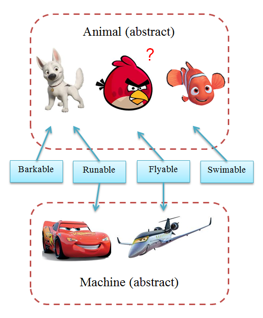
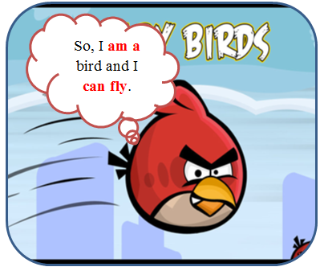

Interface và Abstract class trong OOP
---

- [1. Is-a và Can-do](#1-is-a-và-can-do)
- [2. Dùng Interface như một “bản thiết kế” của class?](#2-dùng-interface-như-một-bản-thiết-kế-của-class)
- [3. Bảng so sánh](#3-bảng-so-sánh)
- [4. Tham khảo](#4-tham-khảo)

Hiện nay mặc dù OOP đã rất phổ biến nhưng đa số vẫn còn khá mơ hồ trong việc phân biệt và định nghĩa hai khái niệm Interface và Abstract class. Có vẻ vấn đề này không được dạy rõ ràng ở trường, hoặc có thể các người dạy cũng chưa nắm rõ về nó. Ngoài ra, đây còn là một vấn đề cần giải quyết mà xác suất bạn nhận được khi đi phỏng vấn là khá cao.

# 1. Is-a và Can-do

Bỏ qua tất cả những phần về lý thuyết của việc tạo một **abstract class** và **interface**. Bạn không cần quan tâm nhiều đến việc **abstract** có thể khai báo những gì, hay **interface** có được phép định nghĩa nội dung phương thức hay không. Điểm cơ bản khi bạn được hỏi về sự khác biệt giữa chúng là gì? Đó chính là mục đích mà chúng được sử dụng:

- **Abstract class**: là một class cha cho tất cả các class có cùng bản chất. Bản chất ở đây được hiểu là kiểu, loại, nhiệm vụ của class. Hai class cùng hiện thực một **interface** có thể hoàn toàn khác nhau về bản chất.

- **Interface**: là một chức năng mà bạn có thể thêm và bất kì class nào. Từ chức năng ở đây không đồng nghĩa với phương thức (hoặc hàm). **Interface** có thể bao gồm nhiều hàm/phương thức và tất cả chúng cùng phục vụ cho một chức năng.

Vậy, bạn không nên nhầm lẫn khi nói về việc một class được **implement** hay **extend**. Nhiều người thường hay đồng nhất là không phân biệt hai từ này, nhưng chính chúng đã nói lên sự khác biệt giữa **interface** và **abstract class**. Bạn chỉ có thể thừa kế (**extend**) từ một class và chỉ có thể hiện thực (**implement**) các chức năng (**interface**) cho class của mình.

Theo cách ngắn gọn:

- quan hệ giữa một class khi thừa kế một **abstract class** được gọi là **is-a**,
- và một class khi hiện thực một **interface** được gọi là **can-do** (hoặc –able).
 
Hãy xem ví dụ sau, tôi có:
- **Interface**: Barkable, Runable, Flyable, Swimable.
- **abstract class** Animal và các sub class: Bolt, AngryBird và Nemo.
- **abstract class** Machine và các sub class: McQueen, Siddeley.

Như bạn thấy, mặc dù cả McQueen và Bolt đều được hiện thực interface Runable, nhưng chúng hoàn toàn thuộc hai loại khác nhau. Và tất nhiên một class có thể can-do nhiều thứ, ví dụ như Bolt có thể chạy và “bow wow”.

# 2. Dùng Interface như một “bản thiết kế” của class?

Đây là một điều thường được dùng để trả lời cho hai câu hỏi:
- **Interface** được dùng để làm gì?
- Tại sao không thể định nghĩa phần thân cho các phương thức của interface.

Xét ở một mức độ nào đó điều này là hợp lý, nhưng như đã nói ở phần trên, nó chỉ được dùng để mô tả một “bản thiết kế” cho một chức năng của class. Nếu muốn tạo một bản thiết kế, hãy sử dụng **abstract class**. Một bản thiết kế tất nhiên sẽ có những thứ đã được dựng sẵn và có những thứ là **abstract**.

Một câu trả lời có thể lý giải phần nào câu hỏi thứ hai là việc cho phép định nghĩa thân phương thức trong các **interface** có thể khiến cho hiệu suất bị giảm sút. Nguyên nhân là việc tìm kiếm các phương thức sẽ diễn ra lâu hơn vì phải duyệt qua các **interface**, thay vì chỉ cần phải tìm trong class cha của nó.

Về công dụng của **interface**, xét ở mức ứng dụng, các **interface** có thể được hiểu như các plugin hoặc thư viện/phần mềm third-party. Việc hiện thực một **interface** cho class cũng giống như cài thêm plugin cho một phần mềm vậy.

# 3. Bảng so sánh

Cuối cùng, cũng nên liệt kê các điểm khác biệt giữa hai khái niệm này để bạn có thể sử dụng được khi cần thiết. Các điểm khác biệt này có thể khác nhau tùy vào ngôn ngữ mà bạn sử dụng. Vì vậy bạn chỉ cần nhớ các điểm căn bản sau:

|                        |                                Interface                                |                Abstract class                 |
| ---------------------- | :---------------------------------------------------------------------: | :-------------------------------------------: |
| Multiple inheritance   |     Một class có thể hiện thực nhiều interface.(tạm coi là thừa kế)     |            Không hỗ trợ đa thừa kế            |
| Default implementation |          Không thể định nghĩa code xử lý, chỉ có thể khai báo.          | Có thể định nghĩa thân phương thức, property. |
| Access Modifiers       |            Mọi phương thức, property đều mặc định là public.            |           Có thể xác định modifier.           |
| Adding functionality   | Mọi phương thức, property của interface cần được hiện thực trong class. |               Không cần thiết.                |
| Fields and Constants   |                                  Không                                  |                      Có                       |

# 4. Tham khảo
[https://yinyangit.wordpress.com/2012/01/15/oop-interface-vs-abstract-class/](https://yinyangit.wordpress.com/2012/01/15/oop-interface-vs-abstract-class/)

