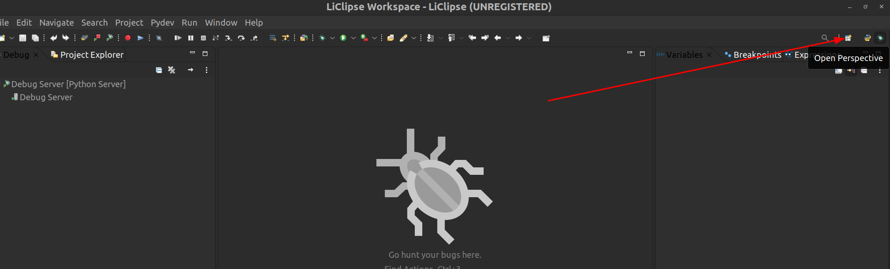
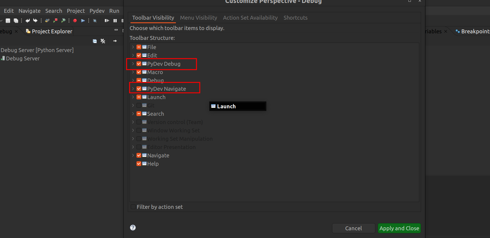
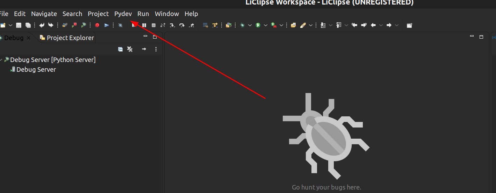

- [1. using LiClipse](#1-using-liclipse)
- [2. using Pydev and eclipse](#2-using-pydev-and-eclipse)
  - [2.1. Install eclipse](#21-install-eclipse)
  - [2.2. Install pydev](#22-install-pydev)
- [3. How to debug](#3-how-to-debug)
  - [3.1. Enable debug perspective](#31-enable-debug-perspective)
  - [3.2. Do debug](#32-do-debug)

# 1. using LiClipse

LiClipse is eclipse with already pydev integration, but there are some feature that need to pay

# 2. using Pydev and eclipse

## 2.1. Install eclipse

Install eclipse for java

## 2.2. Install pydev

Help > Install new software, click to Add button

# 3. How to debug

## 3.1. Enable debug perspective

These steps work for Eclipse and LiClipse as well. Now the most interesting part I think is the debugger. I have used the PyDev remote debugger https://www.pydev.org/manual_adv_remote_debugger.html
1. Open the debug perspective, there are 2 ways:
   1. there is an "Open Perspective" button on the right of the Eclipse toolbar, select "Debug" 
   2. That menu item should be present at the debug perspective and it can be enabled in other perspectives through Window > Perspective > Customize perspective > Tool Bar Visibility > PyDev debug.
2. Then use menu Pydev -> Start debug server 
3. Eclipse is now listening on localhost on the default port for incoming connections from any python process
4. Install the "pydevd" module on your system ("pip install pydevd")
5. Locate where it is installed (start the system python interpreter, then import pydevd, and see the value of pydevd.__file__)
6. You can have FreeCAD connect to the debugger, either by adding code in one of your python files, or in the FreeCAD python console
    - add the path to pydevd, for example sys.path.append('/usr/local/lib/python3.9/dist-packages/')
    - import pydevd
    - then run pydevd.settrace()

## 3.2. Do debug

https://www.pydev.org/manual_adv_remote_debugger.html

https://www.pydev.org/manual_adv_debugger.html
