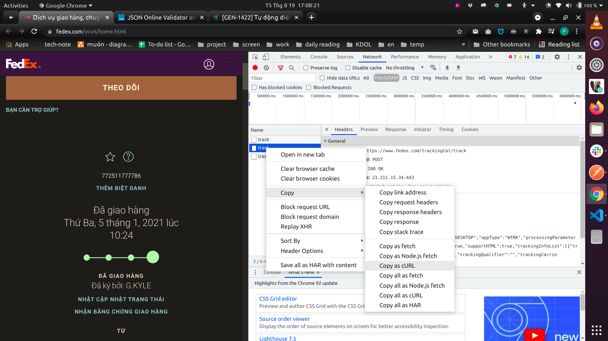
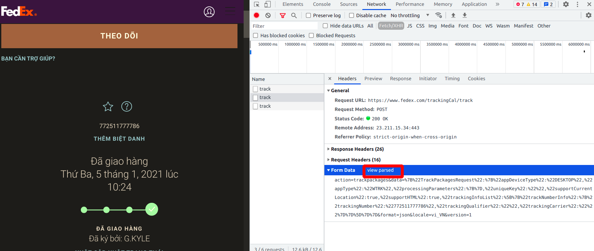
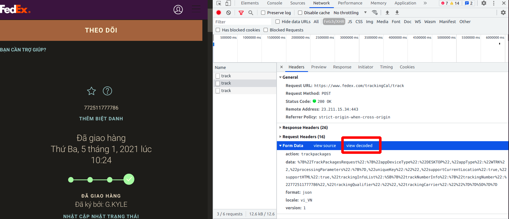
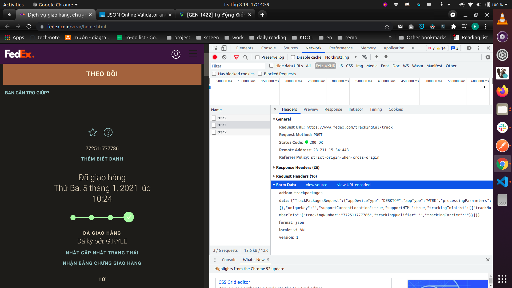

- [1. Request with body type is x-www-form-urlencoded](#1-request-with-body-type-is-x-www-form-urlencoded)


# 1. Request with body type is x-www-form-urlencoded

copy curl from browser



get result:

```
curl 'https://www.fedex.com/trackingCal/track' \
  -H 'Connection: keep-alive' \
  -H 'sec-ch-ua: "Chromium";v="92", " Not A;Brand";v="99", "Google Chrome";v="92"' \
  -H 'Accept: */*' \
  -H 'sec-ch-ua-mobile: ?0' \
  -H 'User-Agent: Mozilla/5.0 (X11; Linux x86_64) AppleWebKit/537.36 (KHTML, like Gecko) Chrome/92.0.4515.107 Safari/537.36' \
  -H 'Content-Type: application/x-www-form-urlencoded; charset=UTF-8' \
  -H 'Origin: https://www.fedex.com' \
  -H 'Sec-Fetch-Site: same-origin' \
  -H 'Sec-Fetch-Mode: cors' \
  -H 'Sec-Fetch-Dest: empty' \
  -H 'Referer: https://www.fedex.com/vi-vn/home.html' \
  -H 'Accept-Language: en,vi;q=0.9' \
  -H 'Cookie: fdx_cbid=30204579321629348449805930061001; Rbt=f0; bm_sz=33EF758E2AD4E0ECFD48F72763AAD1EF~YAAQPmYzuFl5cJ16AQAAGU68XAyId8oCrYP9M6v3kbCVSAQiFKqB+7dRO34JAlFHhhRTdWo/ewNenToZw4kd8lpkgSCPDOkBfM/d6uMNGdqkpElBC/x9KSwzyysQqp6L1Cdo+rk+TZEv4Bk8VRDS6yC/XMZjUljKj9lkrYOWszRw96fnuEE4cH5po1xsn9Vm1+exaejk0U1IJlC4xoRyLysKq7vovYVZNJwBTLWhmuaaO6BCYQwxhn1URvEdZREdSRkLpWiKCwl2EG8C0TucGWxpS+/r3Pk/97/8uz+QF2Cdiw==~3551538~3686981; gdl-clientId=9692a1a7-feac-4904-a89e-b84696ba4b31; g_sref=(direct); at_check=true; AMCVS_1E22171B520E93BF0A490D44%40AdobeOrg=1; s_ecid=MCMID%7C58631905526877409690280548786789136110; s_cc=true; xacc=VN; s_invisit=true; g_stime=1629357582318; s_vnum=1629392399999&vn=2; s_dfa=fedexglbl%2Cfedexapac; mboxEdgeCluster=38; gpv_pageName=fedex/home; AMCV_1E22171B520E93BF0A490D44%40AdobeOrg=359503849%7CMCIDTS%7C18859%7CMCMID%7C58631905526877409690280548786789136110%7CMCAAMLH-1629962383%7C3%7CMCAAMB-1629962383%7CRKhpRz8krg2tLO6pguXWp5olkAcUniQYPHaMWWgdJ3xzPWQmdj0y%7CMCOPTOUT-1629364783s%7CNONE%7CMCAID%7CNONE%7CMCSYNCSOP%7C411-18866%7CvVersion%7C5.0.1; SMIDENTITY=NtjnPT9tRAm+ltuJdOWEuAW1W593Odv0Xpn1cSnEd8wH5XVjJi+WjNoBV1z28QO8q/BPbnog+6ki+WxBUADKMoKNfR+wG5uLg4hJbrszPV8SA1C2MifaG3PXVYw0jhc9SL0nCKSOQtQo5t6Yq6ICzJPAN4Q5OVMtYCoN/hC2qXeUhXHqO8DoL8gqDxpLtVRNOv1PFh2qPTle1ZS4QASPKpUX3iY6waN01WcNsTZHrjVfCiBQYGl3pwlBFoTt2HWzPCbBRurg3ZslSNtKB3LYjUAp8f3g/W6Q3HLiLfVamZhYzkTmlFIwNwryZbcOElqBcnj4GsW07JXSGW78mFT6HRBII9XJa4BXqTavJ5Q7bGARMCoi8XmzhTzhAhOq2KbnqZg2jnToy8XoYxoMF+J/l/iC1CVoyc0EfrDSbyEmlGfMQFbuBXfZUr68YVfRKbqiJSZx4fw4an1eb0pX2NpRcTCr0Oj+GljXY7K26GmXE2COodV0cZhBcSONkhJMWFkIHTTNxKJW9t+0MiOwN2E3vdmvqq1kytCz; bm_mi=60BF6CC0F43E5CF1857F23395A6614FC~jWTeeLxFP94jJUc80OcKBxHm11TVThpbBCsob/2jTaVz92OS8v7W5grYEUWQS0+mhe4ZRSDK5PMI1tQhqxE41gb9/W94eBeA7Pj3qN9MG5UrmyV5tvJIAr6L9hAPA+vuceceCxldaxZ61+pe0TMDX2Emp/tujhMjT6M58NRPFSzmTMgTipxkM1qRkDLpSx/43H3ZdStqvK3uZl47JX+LA9ZNSuggvomjADdMO7TlvikZt+a9aabdPEqZHJOsFtQ9vjgGk4SSOZgi7zlpYaWaWZEKZ7Lfotvbuu4ya2Rib50=; mbox=PC#bedaa96a4cd34028a55b2c213675bd4d.38_0#1692603049|session#2f2a150d20cf45ebadc710491099b3c2#1629359444; _abck=32C7F4FF3F67FD86B572EC3C4167504F~0~YAAQHg/TF2ugOzt7AQAA2udRXQZJAl2Bcxn3p0vvswoqshGTXXlRdKrRTrGZOShx7elKjamL7FBet8FcqGMJLl7JEUlAHZNAY8/7hrIuOd1cSMDz0yetDuSsDIN8oiGBNi2InN1MtyiCgf9jd016hNcKcoa05OeY3Dvaq464a8A0biopebONMO+kP8FCsHG+SeOwvGfiLAZleCrGd54Go3gpqIINKIsLk1/3o13YIqTPA3xGddLPzY1q6yFr27yQEJccMOQkDyEFNsQsbssTzfaPuGdmazrSHV0o6qsHniR/DTzUZifGFpMHrqOEz+KrAmROT90Qb3FTqQOe6HCEWbhhdBcfCMv8jHhGX4GtvrEFssD3TDVunLx2zmBeqVFvmjnlvqecgt00kPvQzh5BHWKhCSi9tQ==~-1~-1~-1; ak_bmsc=3EB27EB76D99EFCB467AE76DD0BF7DF8~000000000000000000000000000000~YAAQHg/TF0mgOzt7AQAAkOVRXQxugRQwxqF/Gmy2Mi6iIe3GXUGne0eUwLW55lvK98va5jMyx24miqLz/JqGphwogbhYI37o3c2JJ9uHIxq1p0xlg62V4FQn2NV82Az1OPPH4o82+SjzDxNOIa8GB3UDLkUWC8EqE0U40+aO3s4T5wPeN/4RAzGbVDP6En0y1ydamWRBZGpeLwD6N2zwURMKce4puNoa7rNQlEvlYDxJctU00S9cudD9cQxFjyUIrOkgzM4XG8IkpA5phEWwiQzLfckuv8FoTBwYTykSGuITK9MqjR35bS+p1TldgVBHN/cx60KxCC3H560IijOXCgVPKkyiposEI04ftvuEvCRLQVjUnPr0p8ErkFsy6DfEoHuHoHaHYPvZ22kC38rjkpsJsU04f6GfzsGuC1gKR3hAuA==; SameSite=None; fdx_locale=en_VN; fdx_redirect=en-vn; cc_path=vn; aemserver=PROD-P-dotcom-c0016051.prod.cloud.fedex.com; isMobile=f; isTablet=f; isWireless=f; s_sq=fedexglbl%252Cfedexapac%3D%2526c.%2526a.%2526activitymap.%2526page%253Dfedex%25252Fhome%2526link%253DTHEO%252520D%2525C3%252595I%2526region%253DHomeTrackingApp%2526pageIDType%253D1%2526.activitymap%2526.a%2526.c; setLink=fedex/home^^hero|Track^^fedex/home%20|%20hero|Track^^false^^true; siteDC=wtc; ADRUM_BTa=R:37|g:4c00b4a4-345b-448c-9ca3-ca6650db75cd|n:fedex1_b2302943-9419-49fb-b06e-405cc744a61c; ADRUM_BT1=R:37|i:12552635|e:141; bm_sv=508E315B86C78FE4D673B70DE48909F9~1238Fl50TP89T/8+g2HB+cPf8J0Ry+jwTlOLTLYLFwalglIBtXsy0RkqoP6Uq6ufJBuelyzEqiUa2VtU9+6eWCwfWr0+bNMmJl3e+DqbA4ZyJZJty1WKajowVObQhmX6rwtw7O3eZUin2xliKW1JDlLu9pAeEfxmvw7xPAMHyCE=' \
  --data-raw 'action=trackpackages&data=%7B%22TrackPackagesRequest%22:%7B%22appDeviceType%22:%22DESKTOP%22,%22appType%22:%22WTRK%22,%22processingParameters%22:%7B%7D,%22uniqueKey%22:%22%22,%22supportCurrentLocation%22:true,%22supportHTML%22:true,%22trackingInfoList%22:%5B%7B%22trackNumberInfo%22:%7B%22trackingNumber%22:%22772511777786%22,%22trackingQualifier%22:%22%22,%22trackingCarrier%22:%22%22%7D%7D%5D%7D%7D&format=json&locale=vi_VN&version=1' \
  --compressed
```

how to convert `data-raw` to data in `requests` python package

get `data-raw` as below







now create a requests from python as below

```python
import json
import requests

form_data = {
            "action": "trackpackages",
            "format": "json",
            "local": "vi_VN",
            "version": 1,
            "data": json.dumps({
                "TrackPackagesRequest": {
                    "appDeviceType": "DESKTOP",
                    "appType": "WTRK",
                    "processingParameters": {},
                    "uniqueKey": "",
                    "supportCurrentLocation": True,
                    "supportHTML": True,
                    "trackingInfoList": [{
                        "trackNumberInfo": {
                            "trackingNumber": str(shipping_code),
                            "trackingQualifier": "",
                            "trackingCarrier": ""
                        }
                    }]
                }
            })
        }

        headers = {
            "Connection":"keep-alive",
            "sec-ch-ua":'"Chromium";v="92", " Not A;Brand";v="99", "Google Chrome";v="92"',
            "Accept":"*/*",
            "sec-ch-ua-mobile":"?0",
            "User-Agent":"Mozilla/5.0 (X11; Linux x86_64) AppleWebKit/537.36 (KHTML, like Gecko) Chrome/92.0.4515.107 Safari/537.36",
            "Content-Type":"application/x-www-form-urlencoded; charset=UTF-8",
            "Origin":"https://www.fedex.com",
            "Sec-Fetch-Site":"same-origin",
            "Sec-Fetch-Mode":"cors",
            "Sec-Fetch-Dest":"empty",
            "Referer":"https://www.fedex.com/vi-vn/home.html",
            "Accept-Language":"en,vi;q=0.9"
        }
        response = requests.post(url=BILL_STATUS_API, headers=headers, data=form_data)
```
