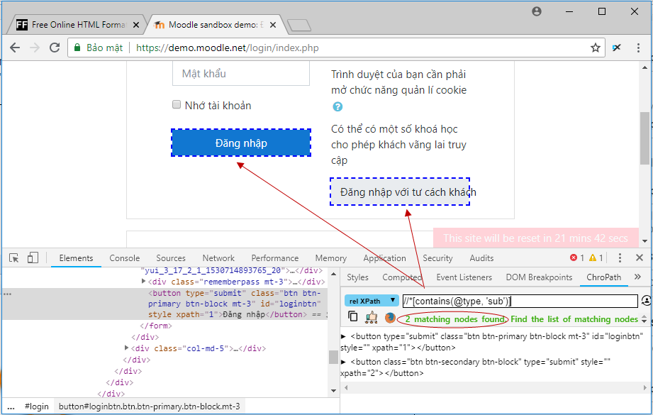
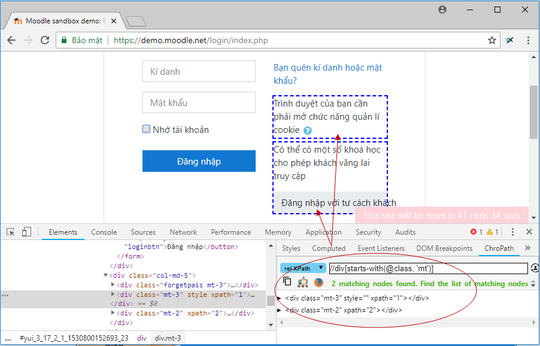

Selenium Webdriver 3: Xpath
------------------------------------
- [1. Giới thiệu](#1-giới-thiệu)
- [2. XPath là gì?](#2-xpath-là-gì)
- [3. Các loại XPath](#3-các-loại-xpath)
  - [3.1. XPath tuyệt đối](#31-xpath-tuyệt-đối)
  - [3.2. XPath tương đối](#32-xpath-tương-đối)
- [4. Sử dụng XPath xử lý các phần tử phức tạp và động trong Selenium](#4-sử-dụng-xpath-xử-lý-các-phần-tử-phức-tạp-và-động-trong-selenium)
  - [4.1. XPath cơ bản](#41-xpath-cơ-bản)
  - [4.2. Contains()](#42-contains)
  - [4.3. Sử dụng toán tử OR và ADD](#43-sử-dụng-toán-tử-or-và-add)
  - [4.4. Hàm starts-with() trong XPath](#44-hàm-starts-with-trong-xpath)
  - [4.5. Hàm text() trong XPath](#45-hàm-text-trong-xpath)
- [5. Reference](#5-reference)

# 1. Giới thiệu

Trong tự động hóa Selen, nếu các phần tử không được tìm thấy bởi các định vị chung như id, class, name, vv thì XPath trong Selenium WebDriver được sử dụng để tìm một phần tử trên trang web.

Trong hướng dẫn này, chúng ta sẽ tìm hiểu về biểu thức XPath và biểu thức XPath khác nhau để tìm ra các phần tử phức tạp hoặc phần tử động, mà các thuộc tính của nó thay đổi động khi tải lại trang hoặc bất kỳ hoạt động nào.

Trong hướng dẫn này, bạn sẽ học:

- XPath là gì?
- Các loại XPath
- Sử dụng XPath xử lý các phần tử phức tạp và động trong Selenium

Trong bài này, chúng ta sử dụng ChroPath plugin trên trình duyệt Chrome để xác định XPath.

# 2. XPath là gì?
XPath được định nghĩa là đường dẫn XML. Nó là một cú pháp hoặc ngôn ngữ để tìm kiếm bất kỳ phần tử nào trên trang web bằng cách sử dụng biểu thức XML path. XPath được sử dụng để tìm vị trí của bất kỳ phần tử nào trên trang web bằng cách sử dụng cấu trúc DOM HTML. Định dạng cơ bản của XPath được giải thích bên dưới.


Cú pháp XPath

XPath chứa đường dẫn của phần tử nằm ở trang web. Cú pháp chuẩn để tạo XPath là.

```xml
Xpath=//tagname[@attribute='value']
```

**//** : Chọn node hiện tại.
**Tagname**: Tên thẻ HTML của node cụ thể.
**@**: Select attribute.
**Attribute**: Tên thuộc tính của node.
**Value**: Giá trị của thuộc tính.

Như bạn đã biết có nhiều cách để xác định vị trí của phần tử HTML như đã học trong bài [Selenium WebDriver Locators]({{ site.url }}{{ site.baseurl }}/programming/selenium-webdriver-2) – xác định vị trí phần tử HTML.

# 3. Các loại XPath

Có 2 loại XPath:

XPath tuyệt đối.
XPath tương đối.

## 3.1. XPath tuyệt đối

Đây là cách trực tiếp để tìm phần tử, nhưng nhược điểm của XPath tuyệt đối là nếu có bất kỳ thay đổi nào được thực hiện trong đường dẫn của phần tử thì XPath sẽ bị lỗi.

Đặc điểm chính của XPath là nó bắt đầu bằng dấu gạch chéo đơn (/), có nghĩa là bạn có thể chọn phần tử từ nút gốc.

Dưới đây là ví dụ về biểu thức xpath tuyệt đối của phần tử được hiển thị trong màn hình dưới đây.

```xml
/html/body/div[2]/div[1]/div[1]/ul[2]/li[4]/a
```


## 3.2. XPath tương đối

Đối với Xpath tương đối, đường dẫn bắt đầu từ giữa cấu trúc DOM HTML. Nó bắt đầu bằng dấu gạch chéo kép (//), có nghĩa là nó có thể tìm kiếm phần tử ở bất kỳ đâu trên trang web.

Bạn có thể bắt đầu từ giữa cấu trúc DOM HTML và không cần phải viết xpath dài lê thê.

Dưới đây là ví dụ về biểu thức XPath tương đối của cùng một phần tử được hiển thị trong màn hình dưới đây. Đây là định dạng phổ biến được sử dụng để tìm phần tử thông qua XPath tương đối.

```xml
//a[@href='/xpath-tester.html']
```


# 4. Sử dụng XPath xử lý các phần tử phức tạp và động trong Selenium

## 4.1. XPath cơ bản

Biểu thức XPath chọn các ndoe hoặc danh sách các node trên cơ sở các thuộc tính như ID, name, class, vv từ tài liệu XML

Một số biểu thức xpath cơ bản hơn:

```xml
Xpath = //input[@type='text']
Xpath =    //label[@id='email']
Xpath =    //input[@value='Submit']
Xpath = //*[@class='city']
Xpath = //a[@href='http://viettuts.vn/']
Xpath = //img[@src='//images/home/java.png']
```

## 4.2. Contains()

**contains()** là một phương thức được sử dụng trong biểu thức XPath. Nó được sử dụng khi giá trị của bất kỳ thuộc tính nào thay đổi động, ví dụ như thông tin đăng nhập.

Tính năng **contain** có khả năng tìm phần tử có phần văn bản như trong ví dụ dưới đây.

Trong ví dụ này, chúng ta cố gắng xác định phần tử bằng cách chỉ sử dụng giá trị văn bản một phần của thuộc tính. Trong biểu thức XPath dưới đây, giá trị một phần ‘sub’ được sử dụng thay cho nút gửi. Nó có thể được quan sát thấy rằng các phần tử được tìm thấy thành công.

Giá trị của thuộc tính type là ‘submit’ nhưng chúng ta chỉ cần sử dụng chuỗi con của nó là ‘sub’.

```xml
Xpath=//*[contains(@type,'sub')]  
```

Ví dụ giá trị của thuộc tính name là ‘btnLogin’, nhưng chúng ta chỉ cần sử dụng một phần giá trị như sau:

```xml
Xpath=.//*[contains(@name,'btn')]
```



Các ví dụ khác:

```xml
Xpath = //*[contains(@id,'message')]
Xpath = //*[contains(text(),'Đăng nhập')]
Xpath = //*[contains(@href,'viettuts.vn')]    
```

## 4.3. Sử dụng toán tử OR và ADD

Trong biểu thức **OR**, hai điều kiện được sử dụng, cho dù điều kiện 1 HOẶC điều kiện thứ 2 có đúng không. Nó cũng được áp dụng nếu bất kỳ điều kiện nào là đúng hoặc có thể cả hai. Có nghĩa là bất kỳ điều kiện nào cũng đúng để tìm phần tử.

Trong biểu thức **XPath** dưới đây, nó xác định các phần tử có một hoặc cả hai điều kiện là đúng.

```xml
Xpath = //*[@type='submit' or @name='btnReset']
```

Trong biểu thức **AND**, hai điều kiện được sử dụng, cả hai điều kiện phải đúng để tìm phần tử. Nó không tìm thấy phần tử nếu bất kỳ một điều kiện nào là sai.

```xml
Xpath = //*[@type='submit' and @name='btnReset']
```

## 4.4. Hàm starts-with() trong XPath

Với các trang web động khi tải lại hoặc các hoạt động khác tương tự thì giá trị thuộc tính của các phần tử bị thay đổi. Trong trường hơp này, bạn nên sử dụng hàm này để tìm phần tử có thuộc tính thay đổi động. Bạn cũng có thể tìm thấy phần tử có giá trị thuộc tính là tĩnh (không thay đổi).

Ví dụ -: Giả sử ID của phần tử cụ thể thay đổi động như:

  Id = “message12”

  Id = “message345”

  Id = “message8769”

Trong đó, các ký tự bắt đầu giống thì giống nhau.

Ví dụ sau tìm thấy 2 phần tử trên trang web [https://demo.moodle.net/login/index.php](https://demo.moodle.net/login/index.php)



```xml
Xpath = //div[starts-with(@class, 'mt')]
```

## 4.5. Hàm text() trong XPath
Với phương thức này, chúng ta có thể tìm thấy phần tử có văn bản khớp với văn bản được chỉ định. Ví dụ sau tìm phần tử có text = ‘Nhớ tài khoản’.


```xml
Xpath = //*[text()='Nhớ tài khoản']
```

Hàm text() có thể kết hợp với hàm **contains()**. Ví dụ:

```xml
Xpath = //*[contains(text(), 'Nhớ tài khoản')]
```

# 5. Reference

[http://viettuts.vn/selenium/xpath-trong-selenium-webdriver](http://viettuts.vn/selenium/xpath-trong-selenium-webdriver)