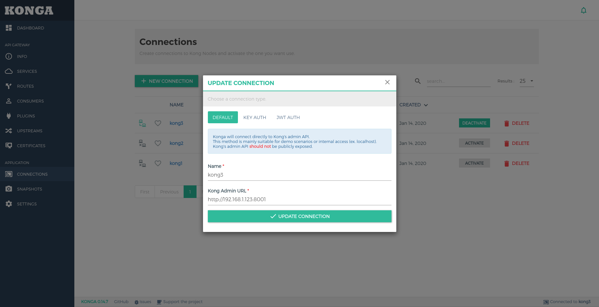
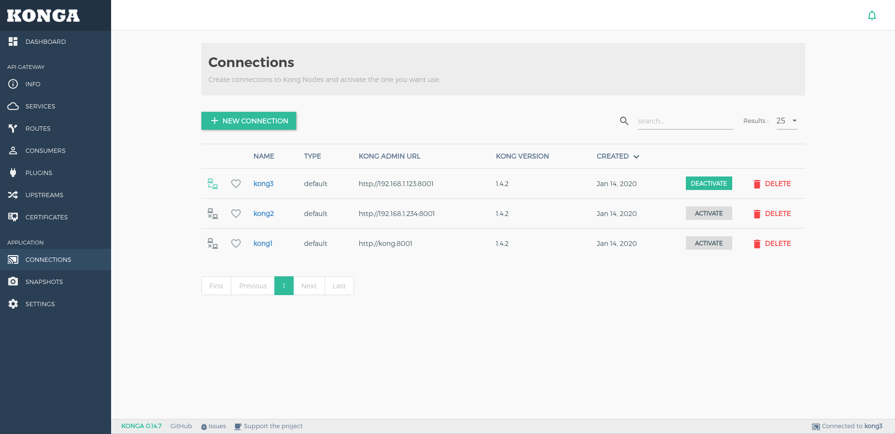
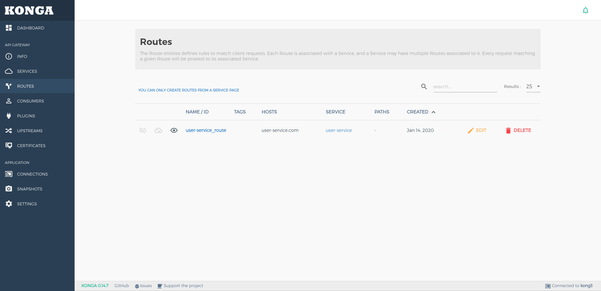
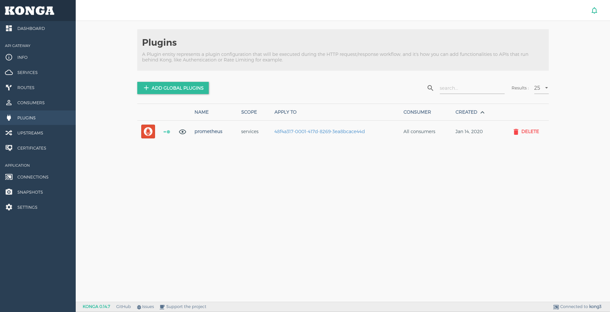
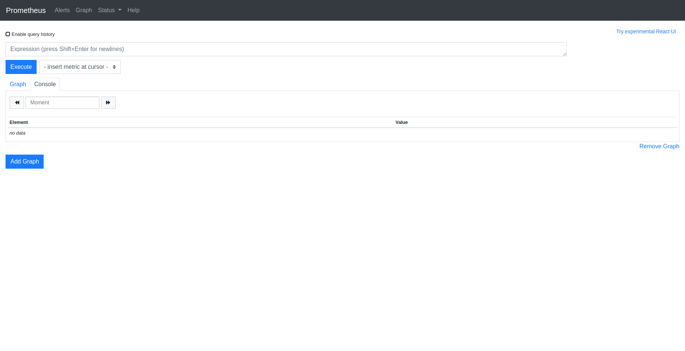
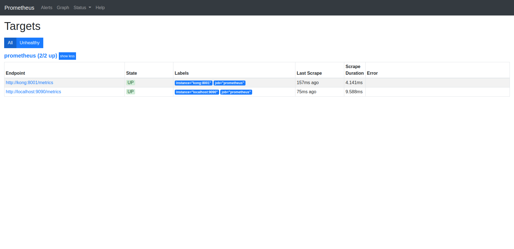
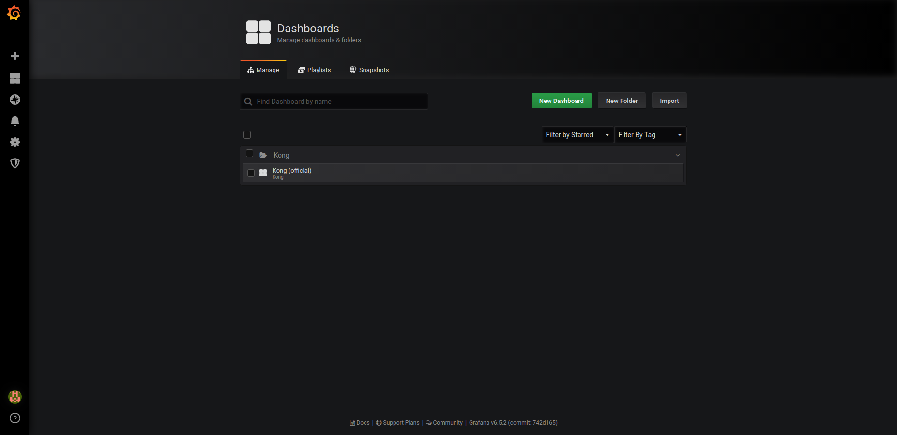
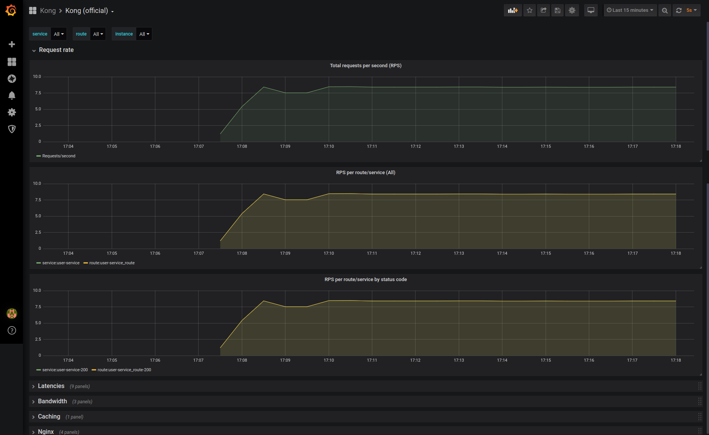

Monitor and statistic kong traffic using prometheus and grafana

- [1. Start up service](#1-start-up-service)
- [2. Start up kong](#2-start-up-kong)
- [3. Start up konga](#3-start-up-konga)
- [4. Config service in kong](#4-config-service-in-kong)
- [5. Enable prometheus plugin for above service](#5-enable-prometheus-plugin-for-above-service)
- [6. Start up prometheus](#6-start-up-prometheus)
- [7. Start up grafana](#7-start-up-grafana)

# 1. Start up service

```shell
docker-compose up -d user-service
make test-service-directly
```

# 2. Start up kong

```shell
docker-compose up -d kong-database kong-migration kong
make kong-test-services
```

# 3. Start up konga

Konga help to manage kong using web ui

```shell
docker-compose up -d konga-prepare konga
```

Access konga url: http://localhost:1337

Add connection
**NOTE**: kong url must be external ip, not using localhost




Thick click **Active**

# 4. Config service in kong

```shell
make kong-add-service
make kong-add-route
```

See result on konga




Test new service call through kong

```shell
make kong-test-user-service
```

# 5. Enable prometheus plugin for above service

```shell
make kong-prometheus-enable
```

Check on konga: http://localhost:1337/#!/plugins



Genarate traffic to service to test plugin

```shell
make kong-prometheus-generate-traffic
```

Get metrics

```shell
make kong-prometheus-get-metrics
```

# 6. Start up prometheus

Change **targets** address on file [prometheus.yml](prometheus.yml)

```shell
docker-compose up -d prometheus
```

Web console: http://localhost:9090/graph



To check Prometheus is connected to targets on file [prometheus.yml](prometheus.yml) , access http://localhost:9090/targets



# 7. Start up grafana

Change url to prometheus datasource on file [datasources.yml](grafana/provisioning/datasources/datasources.yml)

```shell
docker-compose up -d grafana
```

Access http://localhost:3000/login

Login with account admin/admin

Access http://localhost:3000/dashboards



Click to Kong dashboard

Change time to **Last 15 menutes** and **Refresh after 5s** to see result


