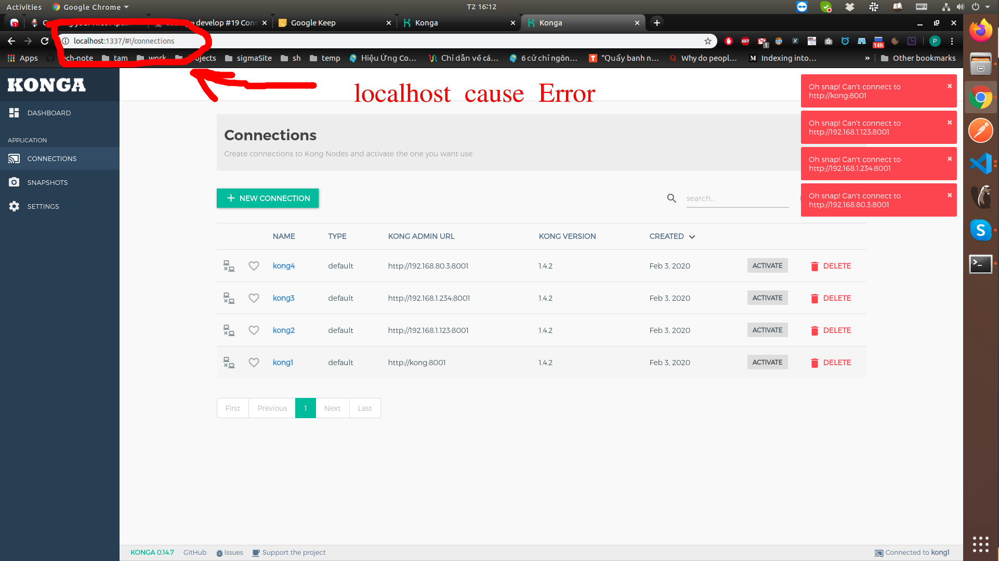

Monitor and statistic kong traffic using prometheus and grafana

- [1. Start up service](#1-start-up-service)
- [2. Prepare database for kong and konga](#2-prepare-database-for-kong-and-konga)
- [3. Start up kong and konga](#3-start-up-kong-and-konga)
- [4. Config service in kong](#4-config-service-in-kong)
- [5. Enable prometheus plugin for above service](#5-enable-prometheus-plugin-for-above-service)
- [6. Start up prometheus](#6-start-up-prometheus)
- [7. Start up grafana](#7-start-up-grafana)

# 1. Start up service

```shell
make service-up
```

# 2. Prepare database for kong and konga

```shell
make kong-database
```

# 3. Start up kong and konga

Konga help to manage kong using web ui

```shell
make kong-konga-up
```

Access konga url: http://192.168.1.234:1337

**NOTE**: konga url must be external ip, not using http://localhost:1337, if not you will encounter below error:

` Oh snap! Can't connect to http://192.168.80.3:8001`





Add kong connection/url, can using external ip, docker's ip, hostname of kong service:


Thick click **Active**


# 4. Config service in kong

```shell
make kong-add-service
make kong-add-route
```

See result on konga


Test new service call through kong

```shell
make kong-test-user-service
```

# 5. Enable prometheus plugin for above service

```shell
make kong-prometheus-enable
```

Check on konga: http://localhost:1337/#!/plugins


Genarate traffic to service to test plugin

```shell
make kong-prometheus-generate-traffic
```

Get metrics

```shell
make kong-prometheus-get-metrics
```

# 6. Start up prometheus

Change **targets** address on file [prometheus.yml](prometheus.yml)

```shell
docker-compose up -d prometheus
```

Web console: http://localhost:9090/graph


To check Prometheus is connected to targets on file [prometheus.yml](prometheus.yml) , access http://localhost:9090/targets


# 7. Start up grafana

Change url to prometheus datasource on file [datasources.yml](grafana/provisioning/datasources/datasources.yml)

```shell
docker-compose up -d grafana
```

Access http://localhost:3000/login

Login with account admin/admin

Access http://localhost:3000/dashboards


Click to Kong dashboard

Change time to **Last 15 menutes** and **Refresh after 5s** to see result


