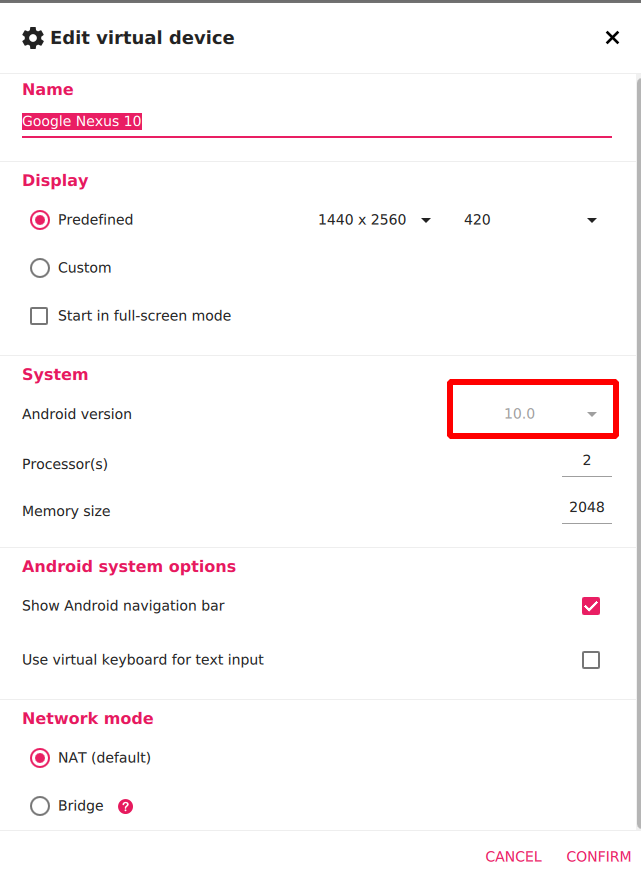
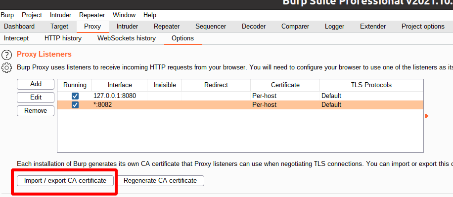
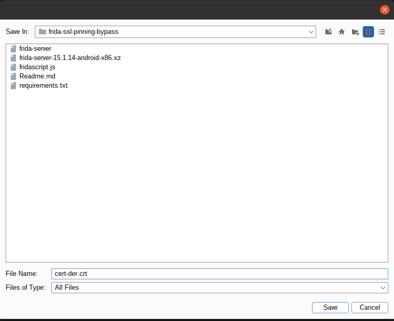

- [1. prepare](#1-prepare)
  - [1.1. install python environment](#11-install-python-environment)
  - [1.2. install burp suite](#12-install-burp-suite)
  - [1.3. install genymotion and create device](#13-install-genymotion-and-create-device)
  - [2. connect to device](#2-connect-to-device)
  - [3. Download frida server for supported android device’s arch version](#3-download-frida-server-for-supported-android-devices-arch-version)
  - [4. Install the target application in the device.](#4-install-the-target-application-in-the-device)
  - [5. Frida Server Setup](#5-frida-server-setup)
- [6. Setup BurpSuite’s certificate](#6-setup-burpsuites-certificate)
  - [6.1. export certificate](#61-export-certificate)
  - [6.2. Configuring Burp Suite With Android Nougat or lower](#62-configuring-burp-suite-with-android-nougat-or-lower)
  - [6.3. Configuring Burp Suite With Android Nougat or higher](#63-configuring-burp-suite-with-android-nougat-or-higher)
    - [6.3.1. Install Burp CA as a system-level trusted CA](#631-install-burp-ca-as-a-system-level-trusted-ca)
    - [6.3.2. Install burp suite as user CA and modifying and repackaging your app](#632-install-burp-suite-as-user-ca-and-modifying-and-repackaging-your-app)
- [7. Script injection to bypass SSL pinning](#7-script-injection-to-bypass-ssl-pinning)
  - [7.1. Push fridascript.js and burp suite to device into devices](#71-push-fridascriptjs-and-burp-suite-to-device-into-devices)
  - [7.2. Check and run frida server in device](#72-check-and-run-frida-server-in-device)
  - [7.3. List all running processes on device](#73-list-all-running-processes-on-device)
  - [7.4. Locate your application’s package name](#74-locate-your-applications-package-name)
  - [7.5. Hook fridascript.js into target application](#75-hook-fridascriptjs-into-target-application)
  - [7.6. Bypassed](#76-bypassed)
- [8. next time run](#8-next-time-run)


# 1. prepare

## 1.1. install python environment

```shell
python 3.8.0
venv-create
source_python_venv
pip install -r requirements.txt
```

## 1.2. install burp suite

## 1.3. install genymotion and create device 

the best way to do this is using rooted device, so we will install genymotion and create device with configurations as below



## 2. connect to device

We need to connect our device to adb to run commands on device. But first goto settings >> Developer options and enable debugging mode in device so that adb can communicate with the device.

test:

```shell
alias adb=/opt/genymobile/genymobile/tools/adb
adb connect 192.168.56.105:5555

adb devices
# You should see ip of your device along with device name. as below
List of devices attached
192.168.56.105:5555	device
```

## 3. Download frida server for supported android device’s arch version

We need to download the frida server package for our android device according to our device’s arch version.

https://github.com/frida/frida/releases/

To find out the arch version of the device, run following command.

```shell
adb shell getprop ro.product.cpu.abi
```

In this example, I use frida-server-15.1.14-android-x86.xz 

## 4. Install the target application in the device.

Install your application who’s SSL pinning has to be bypassed in our device. Open the application and keep it running in the background.

## 5. Frida Server Setup

We need to run frida server into device before injection our script. Follow the steps below:

```shell
unxz frida-server-*-android-x86.xz
adb push frida-server-*-android-x86 /data/local/tmp/frida-server
adb shell chmod 777 /data/local/tmp/frida-server
```

# 6. Setup BurpSuite’s certificate

## 6.1. export certificate

click export :

choose der format :

click select file :

choose folder and file name as below :


## 6.2. Configuring Burp Suite With Android Nougat or lower

push above exported certificates to android then configure certificates as [link](https://portswigger.net/support/installing-burp-suites-ca-certificate-in-an-android-device
)

```shell
adb push cert-der.crt /sdcard/Download/cert-der.crt
```

or follow 2 step below :

    1. connect device through burp suite proxy :
    https://portswigger.net/support/configuring-an-android-device-to-work-with-burp

    2. then get certificates and add to android as link 
    https://portswigger.net/support/installing-burp-suites-ca-certificate-in-an-android-device


## 6.3. Configuring Burp Suite With Android Nougat or higher

There are 2 ways to configure, choose one below :

[Reference here](https://blog.ropnop.com/configuring-burp-suite-with-android-nougat/)

### 6.3.1. Install Burp CA as a system-level trusted CA

If you have rooted device, choose this way

```shell
openssl x509 -inform DER -in cert-der.crt -out cacert.pem
hash_str=$(openssl x509 -inform PEM -subject_hash_old -in cacert.pem |head -1)
mv cacert.pem ${hash_str}.0

adb root
adb remount
adb push ${hash_str}.0 /system/etc/security/cacerts/
adb shell "chmod 644 /system/etc/security/cacerts/${hash_str}.0"
```

### 6.3.2. Install burp suite as user CA and modifying and repackaging your app

If you don't have rooted device, choose this way

To get around this, it involves:

    Disassembling the APK
    Adding a new XML resource to define a network security profile
    Modifying AndroidManifest.xml
    Repackaging and self-signing the APK

Disassemble and modify the APK Start by using [apktool](https://ibotpeaches.github.io/Apktool/) to disassemble the APK

```shell
apktool d TestApp.apk
```

Next, add a new network security config by creating the file network_security_config.xml in the res/xml directory:

```shell
vim TestApp\res\xml\network_security_config.xml
```

```xml
<network-security-config> 
    <base-config> 
        <trust-anchors> 
            <!-- Trust preinstalled CAs --> 
            <certificates src="system" /> 
            <!-- Additionally trust user added CAs --> 
            <certificates src="user" /> 
        </trust-anchors> 
    </base-config> 
</network-security-config>
```

Finally, we have to define the network security config in AndroidManifest.xml. In the <application> tag, add the android:networkSecurityConfig attribute pointing to the new XML file:

```xml
<application android:allowBackup="true" android:networkSecurityConfig="@xml/network_security_config" ...etc...>
```

Reassemble and Sign Finally, the APK must now be rebuilt and signed in order to be installed. Using apktool b, a new build will be created in the dist/ directory:

```shell
apktool b TestApp
```

To self-sign the app, use keytool to create a new keystore and key, then jarsigner to sign the new APK:

```shell
keytool -genkey -v -keystore test.keystore -storepass password -alias android -keypass password -keyalg RSA -keysize 2048 -validity 10000

jarsigner.exe -verbose -keystore test.keystore -storepass password -keypass password TestApp\dist\TestApp.apk android
```

Lastly, install the new APK with adb:

```shell
adb install TestApp\dist\TestApp.apk
```

# 7. Script injection to bypass SSL pinning

Now its time for real magic. we will inject ‘fridascript.js’ into the target application.

## 7.1. Push fridascript.js and burp suite to device into devices

```shell
adb push fridascript.js /data/local/tmp
adb push cert-der.crt /data/local/tmp/cert-der.crt
```

## 7.2. Check and run frida server in device

open another terminal and run commands

```shell
alias adb=/opt/genymobile/genymobile/tools/adb
adb shell /data/local/tmp/frida-server
# adb shell /data/local/tmp/frida-server &
```
This will run frida-server into device. Maybe you will not get any output of this command in terminal.

## 7.3. List all running processes on device

Now, we need to find out id of our target application. We will list all running services on devices including your application process.

Open new terminal and type following command.

```shell
# install command install by pip, it will list all process running on android device
frida-ps -U
```

output

```shell
3647  Chrome                                         
4137  Email                                          
4025  File Manager                                   
2868  Genetica Test  <=============== this is app we need to unpinning                                
3687  Gmail                                          
2240  Google Play Store                              
4099  Phone                                          
3832  Screen Recorder HD                             
3521  Slack                                          
 355  adbd                                           
 269  android.hardware.audio@2.0-service             
 270  android.hardware.camera.provider@2.4-service   
 271  android.hardware.cas@1.1-service               
... 
```

## 7.4. Locate your application’s package name

there are many ways, using one of below commands:

```shell
# https://android.stackexchange.com/a/72942
adb shell "pm list packages | grep gene"
# package:com.genefriendway.nightly

adb shell "ls /data/app | grep gene"
# com.genefriendway.nightly-M2ZNuzVDZzvI_HORJmn5mQ==
```

## 7.5. Hook fridascript.js into target application

Finally, we will hook fridascript.js into the native application with the following command:

```shell
# frida is installed by pip
# frida -U -f <your_application_package_name> -l <path_to_fridascript.js_on_your_computer> --no-paus
frida -U -f com.genefriendway.nightly -l fridascript.js --no-paus
```

## 7.6. Bypassed

Once all things go smooth, all traffic of the target app will get intercepted into BurpSuite. We need to keep frida server on as long as we are intercepting traffic into BurpSuite.

# 8. next time run

next time, just :

   1. open burp suite
   2. connect device through burp suite proxy
   3. open app as normal and see requests/responses on tab Proxy/HTTP History

when app is updated :

```shell
alias adb=/opt/genymobile/genymobile/tools/adb
adb shell /data/local/tmp/frida-server &
# then 
# frida is installed by pip
frida -U -f com.genefriendway.nightly -l fridascript.js --no-paus
```